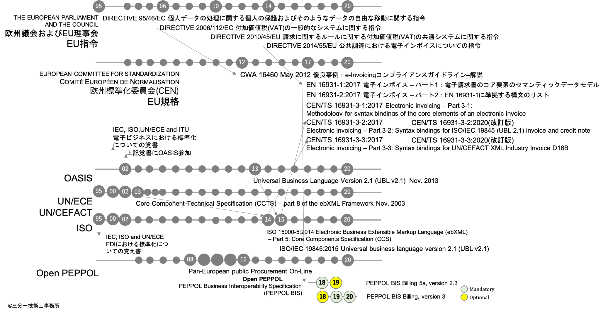

# 規格制定の歴史

[クリエイティブ・コモンズ 表示 - 継承 3.0 非移植 ライセンス](http://creativecommons.org/licenses/by-sa/3.0/deed.ja)
## 参考  
* [MoU on electronic business between IEC, ISO, ITU, and UN/ECE](https://www.itu.int/en/ITU-T/ebusiness/Pages/mou/default.aspx)
* [OASIS Joins International Alliance of Standards-Setting Bodies for Electronic Business](https://www.oasis-open.org/news/pr/oasis-joins-international-alliance-of-standards-setting-bodies-for-electronic-business)  
UBL2.1 in OASIS mailing list  
[Subject: Re: 【ubl】 UBL at the MoU/MG meeting](https://lists.oasis-open.org/archives/ubl/200111/msg00021.html)  
From: Tim McGrath To: Jon Bosak Date: Tue, 27 Nov 2001 14:55:24 +0800  
* [PEPPOL Final Report](https://peppol.eu/wp-content/uploads/2016/08/20121205_PEPPOL_final_report_v2_4_web.pdf)
# 資料
| 資料 | ファイル / URL
| ---- | ----
| CWA 16460（抜粋） | [CWA_16460_抜粋.md](CWA_16460_抜粋.md)
| EU指令 2014/55/EU（一部翻訳） | 電子インボイスに関係するArticle 233 ( 233条 )のみ翻訳 [EU指令_2014_55_EU.md](EU指令_2014_55_EU.md])
| CWA 16460（翻訳） | [CWA_16460_翻訳.md](CWA_16460_翻訳.md)
| CWA 16460（英語） | Good Practice: e-Invoicing Compliance Guidelines - The Commentary [CWA_16460.pdf](CWA_16460.pdf)
| EU指令 2010/45/EU | 請求に関するルールに関する付加価値税の共通システムに関する指令 amending Directive 2006/112/EC on the common system of value added tax as regards the rules on invoicing [EU法令サイト EUR-Lex](https://eur-lex.europa.eu/legal-content/EN/TXT/PDF/?uri=CELEX:32010L0045&from=EN)
| EU指令 2014/55/EU | 公共調達における電子インボイスについての指令 on electronic invoicing in public procurement [EU法令サイト EUR-Lex](https://eur-lex.europa.eu/legal-content/EN/TXT/HTML/?uri=CELEX:32014L0055&from=EN)

EN 16931は、１２種類の業務パターン、コア要素、ビジネスコントロールについての規則、の他  
そのパート3では、UBL 2.1及びUN/CEFACTなどとの対応表を規定している。  
入手は、CENのサイトから。
| 資料 | ファイル / URL
| ---- | ----
| EN 16931-1:2017 | 電子インボイス – パート1：電子請求書のコア要素のセマンティックデータモデル [CEN/TC 434 - Electronic Invoicing – Part 1: Semantic data model of the core elements  of an electronic invoice](https://standards.cen.eu/dyn/www/f?p=204:110:0::::FSP_PROJECT,FSP_ORG_ID:60602,1883209&cs=104E4C4FA3744A8DEA8E98A7B500306FD)
| EN 16931-2:2017 | 電子インボイス – パート2：EN 16931-1に準拠する構文のリスト [CEN/TC 434 - Electronic Invoicing - Part 2: List of syntaxes that comply with EN 16931-1](https://standards.cen.eu/dyn/www/f?p=204:110:0::::FSP_PROJECT:60603&cs=10D168BCA9F3F058F649A272825D6E580)
| CEN/TS 16931-3-1:2017 | 電子インボイスのコア要素の構文バインディングの方法論 [CEN/TC 434 - Electronic invoicing – Part 3-1: Methodology for syntax bindings of the core elements of an electronic invoice](https://standards.cen.eu/dyn/www/f?p=204:110:0::::FSP_PROJECT:63739&cs=174FEF71188CFDC66ACA987E63654BEF3)
| CEN/TS 16931-3-2:2020 | ISO/IEC 19845（UBL 2.1）の電子インボイスおよびクレジットノートの構文対応規定　（　[部分](図/TS-16931-3-2.png)　） [CEN/TC 434 - Electronic invoicing – Part 3-2: Syntax bindings for ISO/IEC 19845 (UBL 2.1) invoice and credit note](https://standards.cen.eu/dyn/www/f?p=204:110:0::::FSP_PROJECT:66718&cs=11C6E317DF61446350759AB0B8C0BA78B)
 | CEN/TS 16931-3-3:2020 | UN/CEFACT XML 業界の電子インボイス D16Bの構文対応規定 （　[部分](図/TS-16931-3-3.png)　） [CEN/TC 434 - Electronic invoicing – Part 3-3: Syntax bindings for UN/CEFACT XML Industry Invoice D16B](https://standards.cen.eu/dyn/www/f?p=204:110:0::::FSP_PROJECT:66719&cs=1025C4D8F1D8727856076051C74A8EC14)

国会図書館リサーチナビ[EN規格 〜欧州の統一規格〜](https://rnavi.ndl.go.jp/research_guide/entry/theme-honbun-400383.php) より抜粋  
> EN規格は独自に出版されることはなく、欧州各国の国家規格として入手します。 たとえば、「EN 10002-1」という番号のEN規格を入手したい場合は、BS EN 10002-1　...英国規格協会(BSI)が発行する英国の国家規格（BS規格）DIN EN 10002-1 ...ドイツ規格協会(DIN)が発行するドイツの国家規格（DIN規格）等の国家規格として発行・販売されているものを利用することになります。これらはEN規格「EN 10002-1」が、両国で国家規格として採用されたものです。本文の言語は各国の言語にあわせて翻訳されていますが、内容は同一です。  

オランダ規格協会（Netherlands Standardisation Institute：NEN）からの購入がおすすめです。  
[NEN EN 16931-1](https://www.nen.nl/Searchresults.htm?q=EN+16931-1)  
[CEN/TS 16931-3-n](https://www.nen.nl/Searchresults.htm?q=TS+16931-3)  
