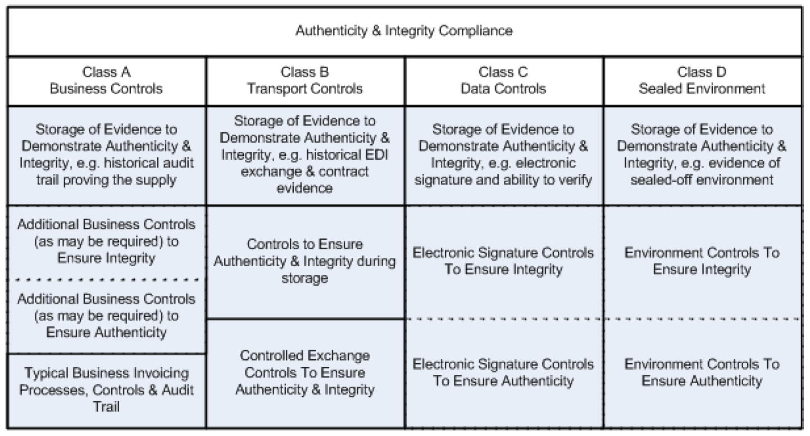
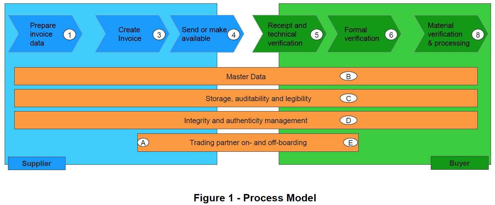
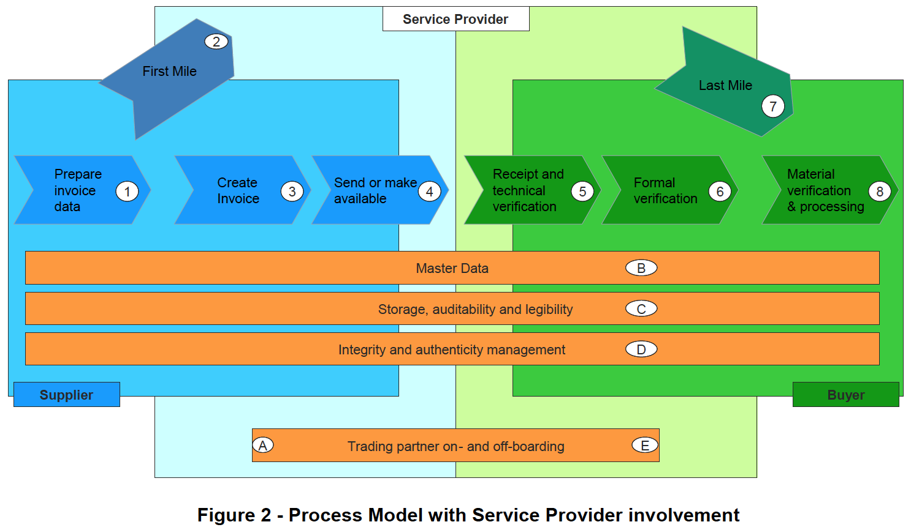

# CWA 16460:2012(E)  
## Good Practice: e-Invoicing Compliance Guidelines - The Commentary (優良事例：電子インボイス　コンプライアンス　ガイドライン　-　解説)

## 1. Scope ( 1. スコープ )  

### 1.1 General ( 1.1 一般 )  

The guidance set out in this CWA addresses electronic invoicing within the scope of VAT. In practice, this includes the majority of business-to-business sales/purchase transactions, but other types of transactions may also be involved. The regulatory background for the practices set out herein is the EU VAT Directive 2006/112/EC (1) as amended by Directive 2011/45/EU (2). Geographically, the practices set out herein are aimed at relevant invoices governed by at least one Member State’s law transposing this Directive. The authors of this CWA document do not exclude that this CWA can be used to enhance or ensure compliance with similar requirements in other countries; however caution should be exercised in drawing parallels between EU rules and those of countries outside the EU.  

Omitted below  

このCWAで設定されたガイダンスは、VATの範囲内での電子インボイスに対応している。 実際には、これにはB2B販売/購入トランザクションの大部分が含まれるが、他のタイプのトランザクションも含まれる場合がある。 ここに記載されている規制のプラクティスの背景は、2011/45 / EU指令（2）によって修正されたEU VAT指令2006/112 / EC（1）である。 地理的には、ここに記載したプラクティスは、この指令を（国内法に）置換えた少なくとも1つの加盟国の法律が適用される関連するインボイスを対象としている。 このCWA文書の作成者は、このCWAを使用して他の国の同様の要件への準拠を強化または保証できることを排除していない。 ただし、EUの規則とEU以外の国の規則との類似点を描く際には注意が必要である。  

以下省略  

## 2. Introduction ( 2. 導入 )  

### 2.1 Overall Summary ( 2.1 全体の概要 )  

This section summarizes the key principles and recommended practices for the sending, receiving and storage of electronic invoices in the European Union with a view to maintaining a robust normative foundation on which both taxable persons and tax administrations can build their processes and coordinate their interactions in a cost- and time-effective manner.  

この箇条では、課税対象事業者と税務当局の両者がプロセスを費用対効果が高く期間対効果も高いい方法で構築し、相互に調整できる堅牢な規範的な基盤を維持することを目的として、EUにおける電子インボイスの送信、受信、および保存に関する主要な原則と推奨される手法を要約する。  

An invoice must correctly reflect the actual supply of goods and/or services. This is achieved through business controls establishing a reliable audit trail linking invoices and supplies.  

（電子）インボイスには、商品やサービスの実際に提供されたものを正確に反映する必要がある。 これは、インボイスと提供されたものを関連づける信頼性の高い監査証跡を確立するビジネスコントロールを通じて達成される。  

Those same business controls establishing reliable audit trails linking invoices and supplies may also meet the requirement of the authenticity of origin and integrity of content of the electronic invoice.　

電子インボイスと提供されたものを関連づける信頼できる監査証跡を確立するビジネスコントロールが電子インボイスの内容の発行元の真正性と完全性の要件も満たすこともある。

In some circumstances, the business controls used by a taxpayer may not be enough to demonstrate the authenticity of the origin and integrity of content of the electronic invoice.　　

状況によっては、納税事業者が使用するビジネスコントロールでは、電子インボイスの発行元の真正性とその内容の完全性を証明するには不十分な場合がある。

The authenticity of the origin and integrity of content of the electronic invoice may also be demonstrated by other means, such as those mentioned in Article 233 (2).　　

電子インボイスの発行元の真正性と内容の完全性は、第233条（2）で言及されているような他の手段によって示される場合もある。

### 2.2 Core Principles ( 2.2 コア原則 )  

<b>Legislative compliance:</b> Electronic invoicing solutions must comply with the relevant legislation. In the EU, the primary legislation is Directive 2006/112/EC (1) (as amended by 2010/45/EU (2)), specifically Articles 233 and 247. In essence; the authenticity of origin, the integrity of content, and legibility must be ensured for the life of an invoice and the use of an electronic invoice shall be subject to acceptance by the recipient. In practical terms this will mean that a business will have:  
* An invoice which supports either an amount of VAT payable to or recoverable from a tax administration.
* Evidence to demonstrate authenticity of origin of the invoice.
* Evidence to demonstrate integrity of content of the invoice.
* Measures to ensure legibility of the invoice.  

<b>法令遵守：</b> 電子インボイス ソリューションは、関連する法律に準拠する必要がある。 EUでは、主要な法律は、指令2006/112 / EC（1）（2010/45 / EU（2）により修正）、具体的には第233条と第247条である。 発行元の真正性、内容の完全性、および可読性は、電子インボイスの存続期間にわたって保証されなければならず、電子インボイスの使用は、受信者による承認の対象となるものとする。 実際には、これは事業者が次のことを維持することを意味する。  
* 税務当局に支払うか、税務当局から還付されるVATの金額を裏付ける電子インボイス。
* 電子インボイスの真正性を証明する証拠。
* 電子インボイスの内容の完全性を証明する証拠。
* 電子インボイスの可読性を確保するための措置。

<b>Technology neutrality:</b> Use of particular technologies is not a precursor to adoption of electronic invoicing and no indication should be given that one technology is favoured over another. Trading parties have freedom of choice over current and future electronic invoicing solutions to meet their specific business needs consistently with the applicable legislative obligations.  

<b>テクノロジーの中立性：</b> 特定のテクノロジーの使用は、電子インボイスの採用の前提ではなく、あるテクノロジーが別のテクノロジーよりも有利であることを示すべきではない。 取引当事者は、特定のビジネスニーズと適用される法的義務とを一貫して満たすために、現在および将来の電子請求ソリューションから自由に選択できる。  

<b>Auditability:</b> Businesses should be able to demonstrate and explain within a reasonable time their administrative and control capability to meet legal requirements. Businesses should maintain a legally compliant audit trail, including the underlying transaction data and any relevant supporting documentation and data, which must be accessible towards external auditors, both statutory and tax.  

<b>監査能力：</b> 企業は、法的要件を満たすための管理能力と管理能力を妥当な時間内に実証および説明できる必要があります。 企業は、基になるトランザクションデータと関連するサポートドキュメントおよびデータを含む、法的に準拠した監査証跡を維持する必要があります。これらは、法定および税務の両方の外部監査人がアクセスできる必要があります。  

<b>Proportionality:</b> Businesses should not be required to implement control measures for audit and/or compliance purposes that are disproportionate to their individual circumstances. Circumstances that must be taken into account include, but should not be limited to, the size of a company, the nature of its business, the value and frequency of its transactions, its number of trading partners and the stability of its trading partner network.  

<b>投資バランス：</b> 事業者は、監査やコンプライアンスの目的で、個々の状況に不釣り合いなコントロール手段を実装するように要求されるべきではない。 考慮しなければならない状況には、会社の規模、ビジネスの性質、取引の価値と頻度、取引パートナーの数、取引パートナーネットワークの安定性などがあるが、これらに限定されない。  

### 2.3 Ensuring Authenticity & Integrity ( 2.3 真正性と完全性の確保 )  

"Authenticity of the origin" of an E-Invoice means the assurance of the identity of the supplier or the issuer of the invoice.  

電子インボイスの「発行元の真正性」とは、電子インボイスの提供者または発行者の身元の保証を意味する。  

"Integrity of content" of an E-Invoice means that the content required according to Directive 2010/45/EU Article 233 (2) has not been altered.  

電子インボイスの「内容の完全性」とは、指令2010/45 / EU第233条（2）に従って要求されるようにして、内容が変更されていないことを意味する。  

In the EU, Directive 2010/45/EU (2) art. 233 states that “Each taxable person shall determine the way to ensure the authenticity of the origin, the integrity of the content and the legibility of the invoice”. There are many way in which this can be achieved. The Directive gives three examples of approaches that can be used:  
* Business controls which create a reliable audit trail between an invoice and a supply of goods or services.
* Electronic data interchange (EDI).
* Qualified electronic signature.  

EU指令2010/45 / EU（2）233条は、「各課税事業者は、発行元の真正性、内容の完全性、および電子インボイスの可読性を保証する方法を決定するものとする」と述べている。 これを実現する方法はたくさんある。この指令では、使用できるアプローチの3つの例を示す。
* 電子インボイスと商品またはサービスの提供との間に信頼できる監査証跡を作成するビジネスコントロール。
* 電子データ交換（EDI）。
* 適格な電子署名。

For reference purposes this and related documents categorise different approaches to ensuring authenticity and integrity by their inherent characteristics. Current categories are below (and more detailed description can be found elsewhere in this document):  
* Class A - business controls which create a reliable audit trail between an invoice and a supply of goods or services.
* Class B – controls over data exchange process, i.e. EDI.
* Class C – data level control, i.e. advanced / qualified electronic signatures.
* Class D – sealed environments.  

参考のために、本文書と関連文書で、固有の特性によって信頼性と整合性を確保するためのさまざまなアプローチを分類する。 現在のカテゴリは次のとおり（詳細な説明はこの文書の他の場所にある）。  
* クラスA - 電子インボイスと商品またはサービスの提供との間に信頼できる監査証跡を作成するビジネスコントロール。
* クラスB – データ交換プロセス、つまりEDIでのコントロール。
* クラスC – データレベルのコントロール、つまり高度な/認定された電子署名。
* クラスD – 封印された環境。  

The following diagram illustrates the relative considerations for ensuring authenticity and integrity for each of these classes.  

  

次の図に、これらの各クラスの信頼性と整合性を確保するための相対的な考慮事項を示す。  

真正性と完全性の確保  
| クラスA ビジネスコントロール | クラスB データ交換時のコントロール | クラスC データレベルのコントロール | クラスD 封印された環境  
| ---- | ---- | ---- | ----
| 真正性と完全性を実証するための証拠の保管。 例：提供してきた監査証跡の保管 |	真正性と完全性を実証するための証拠の保管。 例：EDIでのメッセージ交換と契約証拠の保管 |	真正性と完全性を実証するための証拠の保管。 例：電子署名とその検証能力 |	真正性と完全性を実証するための証拠の保管。 例：封印された環境の証拠
| 完全性を確保するための（必要とされるかもしれない）追加的なビジネスコントロール 
真正性を確保するための（必要とされるかもしれない）追加的なビジネスコントロール | データ保存期間中の真正性と完全性を確保するためのコントロール |	完全性を確保するための電子署名コントロール 
真正性を確保するための電子署名コントロール | 完全性を確保するための封印された環境のコントロール 
真正性を確保するための封印された環境のコントロール
| プロセス、コントロール、監査証跡を含む典型的なビジネスコントロール | コントロールされたメッセージ交換 真正性と完全性を確保するためのコントロール |	 |  

An electronic invoicing solution does not need to fit entirely within one of the above classes to be compliant.  
For example, it would be perfectly reasonable for trading partners to agree to use class A for authenticity and class C for integrity. In such a case, applying the proportionality principle, a qualified electronic signature as defined in the Directive might be disproportionate and a ‘lesser’ electronic signature would be sufficient to ensure integrity. Likewise, the business controls would only need to be evaluated in respect to their contribution towards authenticity.  

電子インボイス ソリューションは、上記のクラスのいずれかに完全に適合する必要はない。  
たとえば、ト取引先が信頼性のためにクラスAを使用し、整合性のためにクラスCを使用することに同意することは完全に合理的である。 このような場合、比例原則を適用すると、EU指令で定義された適格な電子署名は(投資に対して)不均衡になる可能性があり、完全性を確保するには「弱い」電子署名で十分である。 同様に、ビジネスコントロールは、真正性への貢献に関してのみ評価する必要がある。  

### 2.4 Ensuring Legibility ( 2.4 可読性の確保 )  

To be legible an invoice must be human-readable, which means an auditor (e.g. Tax Administration or accountant) is able to interpret the content of an E-Invoice.  

電子インボイスの可読性では、人が読み取れる必要がある。つまり、監査人（税務管理者や会計士など）は電子インボイスの内容を解釈できることが必要である。  

An invoice must be legible, in particular for auditors including tax administrations. Businesses should maintain software that is capable of rendering an electronic invoice legible. Legibility is a precondition for acceptance by the recipient and auditability. Legibility of an electronic invoice can be achieved either because the file format was meant to enable human-readability in connection with desktop software, or through the application of viewer software in case of invoice formats meant for machine-to-machine communications.  

電子インボイスは、特に税務当局を含む監査人にとって、可読性を持たなければならない。 企業は、電子インボイスを読むことができるソフトウェアを維持する必要がある。 可読性は、（電子インボイスの）受信者による承認と監査能力の前提条件である。 電子インボイスの可読性は、ファイル形式をデスクトップソフトウェアに関連させて人が読めるようにすることを意図するか、またはマシン間の通信用の電子インボイス形式の場合は、ビューアソフトウェアのアプリケーションを介して達成できる。  

## 3. Comprehensive Guidance ( 3. 包括的なガイダンス )  

### 3.1 Introduction ( 3.1 導入 )  

In the absence of implementation-relevant rules emanating from tax administrations and standards bodies, it is hard for companies and solution providers to make any value judgment as to how “compliant” E-Invoicing processes are. Service providers, solution vendors and their corporate customers that are taking steps to develop and implement VAT-compliant services naturally have a desire to be recognised, but very few Tax Administrations provide accreditation services or self-assessment programmes to assist Service Providers or businesses to ascertain that E-Invoicing systems are VAT compliant.  

税務行政や標準化団体から発せられる実装関連のルールがない場合、企業やソリューションプロバイダーは、準拠」した電子インボイス　プロセスについてのどのような価値判断も困難になる。 VATに準拠したサービスを開発および実装するための措置を講じているサービスプロバイダー、ソリューションベンダー、およびそれらの法人顧客は、当然のことながら認証されることを望んでいるが、サービスプロバイダーまたは企業が認証するのを支援する認証サービスまたは自己評価プログラムを提供する税務当局はほとんどない。 電子インボイス システムはVATに準拠している。  

The Compliance Matrix was originally developed from the Dutch language draft of the Fiscalis “Business Process Analysis (BPA) matrix e-invoicing” document, developed by the Netherlands Tax Administration (Belastingdienst) for the Fiscalis2 E-Audit Project Group. It is addressed to Tax Administrations for the audit of VAT invoice solutions. The BPA Matrix has been modified and complemented with input from Task Group members, Fiscalis members and stakeholders having provided comments in the CEN process to make the Guidelines applicable to all EU Member States' practices and to aspects of good practice that are unique to Service Providers.  

コンプライアンスマトリックスは、Fiscalis2 E-Audit Project Group向けにオランダ税務局（Belastingdienst）が開発した、Fiscalisの「ビジネスプロセス分析(BPA)マトリックス電子インボイス」文書のオランダ語草稿から最初に開発された。 これは、VAT電子インボイス ソリューションの監査のために税務当局に宛てられている。 BPAマトリックスが変更され、タスクグループメンバー、Fiscalisメンバー、および関係者からの情報提供によりCENプロセスでコメントを提供して、ガイドラインをすべてのEU加盟国の慣行およびサービスプロバイダーに固有の優良慣行の側面に適用できるようにした。  

The Guidelines should make it possible for all parties involved to check whether their E-Invoicing processes, in-house or outsourced, are likely to be VAT-compliant, and if not, what corrective measures are available.  

このガイドラインにより、関係するすべての関係者が、自社または外部委託の電子インボイス プロセスがVATに準拠している可能性が高いかどうか、およびそうでない場合はどのような是正措置が利用できるかを確認できるようにする必要がある。  

The Guidelines identify the main issues in question at each processing step during the E-Invoice life cycle for different invoicing methods (direct invoicing from Supplier to Customer as well as self-billing) and provide detailed process guidance for a variety of implementation options, the use of various methods for ensuring integrity and authenticity and the storage of electronic invoices. For each discrete processing step, the Guidelines define the ‘Risks’ (of inappropriate practices to companies and tax administrations); ‘Requirements’ (for companies to mitigate the risk); and ‘Controls’ (from which companies can choose to meet the requirements).  

ガイドラインでは、さまざまな請求方法（サプライヤから顧客への直接請求および自己請求）の電子インボイス ライフサイクルの各処理ステップで問題となっている主要な問題を特定し、さまざまな実装オプションの詳細なプロセスガイダンスを提供する。 完全性と真正性を確保するためのさまざまな方法の使用、および電子インボイスの保管。 個別の処理ステップごとに、ガイドラインは「リスク」（企業や税務当局にとって不適切な慣行のリスク）、「要件」（企業がリスクを軽減するため） および「コントロール」（企業は要件から選択することができる）を定義する。  

Filters have been added within the Compliance Matrix to allow the user to select a specific process or subprocess for a more detailed view – for example: What are good practices for a Supplier in a self-billing process? What should Customers and Suppliers need to take into consideration when starting exchanging E-Invoices? Use of the Compliance Matrix and the Interactive User Interface is addressed in section 3.9 below and in the Introduction of the Matrix document.  

フィルターがコンプライアンスマトリックス内に追加され、ユーザーが特定のプロセスまたはサブプロセスを選択して、より詳細なビューを表示できるようになった。例：自己請求プロセスにおけるサプライヤーの推奨事項は何か？ 電子請求書の交換を開始するときに、顧客とサプライヤーは何を考慮する必要があるか？ コンプライアンスマトリックスとインタラクティブユーザーインターフェイスの使用については、以下のセクション3.9およびマトリックスの概要のドキュメントで説明している。  

The issues surrounding self-billing are presented in more detail in section 3.8.1, as this way of invoicing is being introduced more frequently at present, but the issues and problems are not always clearly understood by the parties concerned.  

この請求方法は現在より頻繁に導入されているため、self-billing（自己請求）をめぐる問題はセクション3.8.1で詳しく説明されているが、問題や問題は関係者によって必ずしも明確に理解されているわけではない。  

### 3.2 Process Model ( 3.2 プロセスモデル )
The process model that has been used to analyse different steps in the E-Invoice life cycle is shown below.  
It represents the different steps in the information flow from Supplier, on the left, to the Customer on the right.  

電子インボイス ライフサイクルのさまざまなステップの分析に使用されたプロセスモデルを以下に示す。  
これは、左側の売手から右側の顧客への情報フローのさまざまなステップを表している。  

This model is used as a tool for analysing the requirements and describing the controls recommended for EInvoicing.  
It does not imply that an implementation of the Guidelines must follow this process sequence. It is only an aid to relate the recommendations in the Guidelines to the real life processes that typically constitute in an invoicing system. In particular, certain aspects of the process steps described in the Guidelines may be carried out in a different order or may not be relevant in some implementations.  

このモデルは、要件を分析し、電子インボイスに推奨されるコントロールを説明するためのツールとして使用される。  
ガイドラインの実装がこのプロセスシーケンスに従う必要があることを意味するものではない。 これは、ガイドラインの推奨事項を、通常の請求システムで構成される実際のプロセスに関連付けるための補助にすぎない。 特に、ガイドラインに記載されているプロセス手順の特定の側面は、異なる順序で実行される場合や、一部の実装では関連しない場合がある。  

Figure 1 represents the process model without involving Service Providers; Figure 2 introduces the concept of Service Provider (or providers) into the model. The labelling on the figures is referenced in the Compliance Matrix and the Interactive User Interface.  

  

  

図1は、サービスプロバイダーを含まないプロセスモデルを表す。 図2は、サービスプロバイダー（またはプロバイダー）の概念をモデルに導入したもの。 図のラベルは、コンプライアンスマトリックスとインタラクティブユーザーインターフェイスで参照される。  

In the case that one or both trading partners use Service Providers, then the flow passes through the ‘first mile’ between the Supplier and the Service Provider, and the ‘last mile’ between the Service Provider and the Customer.  

一方または両方の取引相手がサービスプロバイダーを使用する場合、フローは売手とサービスプロバイダー間の「ファーストマイル」、およびサービスプロバイダーと顧客間の「ラストマイル」を通過する。  

In the case of self-billing, the E-Invoice is issued by the Customer (or his Service Provider) and flows in the reverse direction to the Supplier or via the Supplier’s Service Provider. The following sub-sections provide an explanation of the steps in the above figures.  

elf-billing(自己請求)の場合、電子インボイスは顧客（またはそのサービスプロバイダー）によって発行され、逆方向に売手に流れる、あるいは売手のサービスプロバイダーを経由して流れる。 次の細分箇条では、上記の図の手順について説明する。  

### 3.2.1 Objectives in the context of the Process Model　( 3.2.1 プロセスモードのコンテキストでの目的 )

In order to meet the high level objectives specified in section 4.1 above throughout the appropriate phases of an E-Invoice life cycle, the following specific objectives need to be taken into account for any E-Invoicing process:  

上記の電子インボイス ライフサイクルの適切なフェーズ全体にわたって、箇条4.1で指定された高次の目標を達成するために、電子インボイス プロセスでは、次の特定の目標を考慮する必要がある。  

    i) When preparing the sales invoice.  
    i）販売インボイスを準備するとき  

        a) Continuity and consistency between the information used in an invoice and its source (e.g. sales orders, delivery notes, contracts).  

        a）電子インボイスで使用される情報とそのソース（たとえば、注文書、納品書、契約書）との間の継続性と一貫性。  

    ii) When creating the sales invoice.  
    ii）販売インボイスを作成するとき  

        a) Ensure that the authenticity of the invoice will be verifiable by the customer  
        b) Ensure that the integrity of the invoice will be verifiable by the customer and supplier  

        a）電子インボイスの真正性が顧客によって検証可能であることを確認する  
        b）電子インボイスの完全性が顧客と売手によって検証可能であることを確認する  

    iii) When sending invoices or making them available
    iii）電子インボイスを送信するとき、または利用可能にするとき

        a) Authenticity of the invoice remains verifiable upon receipt
        b) Integrity of the invoice remains verifiable upon receipt  

        a）電子インボイスの真正性は受領時に検証可能なままとする
        b）電子インボイスの完全性は受領時に検証可能なままとする

    iv) When receiving an invoice and processing it
    iv）電子インボイスを受け取って処理するとき

        a) Continuity between all steps of the process concerned with handling a received invoice
        b) Authenticity of the invoice is verified and maintained
        c) Integrity of the invoice verified and maintained  

        a）受け取った電子インボイスの処理に関連するプロセスのすべてのステップ間の継続性
        b）電子インボイスの真正性が検証され、維持されている
        c）検証および維持された電子インボイスの完全性

    v) When storing an invoice and during the storage period
    v）電子インボイス保管するとき、および保管期間中

        a) Data continuity between invoice creation or receipt and its storage
        b) Verifiable authenticity of the invoice ensured throughout storage period
        c) Verifiable integrity of the invoice ensured throughout storage period
        d) An invoice must be presentable in a legible form.  

        a）電子インボイス作成または受領とその保管の間のデータの継続性
        b）保管期間全体にわたって保証される電子インボイスの検証可能な真正性
        c）保管期間を通じて保証される電子インボイスの検証可能な完全性
        d）電子インボイスは読みやすい形式で提示できる必要がある

    vi) Across the invoicing process
    vi）電子インボイス プロセス全体

        a) Invoices are handled in accordance with applicable law throughout every stage of their life cycle  

        a）電子インボイスは、ライフサイクルのすべての段階を通して法令に従って処理される

### 3.2.2 (On and Off) Boarding steps ( 3.2.2（オンおよびオフ）搭乗ステップ )

Prior to exchanging E-Invoices, the trading partners first have to agree on the legal basics, then on the specific types of electronic invoices to be exchanged; in particular they will have to agree on formats, on exchanging mechanisms and on methods to ensure Authenticity, Integrity and Legibility. This process called “on-boarding” may span from being very simple (e.g. just a click on a tick box) to very complex, including technical, procedural and legal basics of the E-Invoicing relationship. Similarly, specific “off-boarding” procedures should be ensured, to wind down the relationship in good order when it becomes necessary. If one or more Service Providers are involved, the on- and off-boarding processes are extended into the relevant trading partner relationship with such Service Provider(s).  

電子インボイスを交換する前に、取引相手双方はまず法的基本事項について合意し、次に交換する特定のタイプの電子インボイスについて合意する必要がある。 特に、真正性、完全性、可読性を保証するために、形式、交換メカニズム、および方法について合意する必要がある。 「乗車」と呼ばれるこのプロセスは、非常に単純なもの（たとえば、チェックボックスをクリックするだけ）から、電子インボイス関係の技術的、手続き的、法的基本を含む非常に複雑なものまで多岐にわたる。 同様に、特定の「降車」手順を確実にして、必要になったときに関係を適切な順序で整理する必要がある。 1つ以上のサービスプロバイダーが関与している場合、乗車プロセスと降車プロセスは、そのようなサービスプロバイダーとの関連する取引相手双方の関係に拡張される。  

#### A. Trading partner on-boarding
#### A. 取引相手の乗車  

On-boarding is the process of enabling a trading partner to interchange electronic invoices with another trading partner. This will include contracting, identification, and, where applicable connecting the trading partners to the technical infrastructure and applications used (this may include setting up web access or connectivity to the back-office system, format mapping, conversion, process reengineering, testing, support, E-invoicing-specific contracting and/or training). Where one or more Service Providers act for the trading partners, the on-boarding process is aimed at setting up an end-to-end coherent structure and processes that enable appropriate auditability. Among other things, this step is necessary to give the E-Invoice issuer reasonable confidence that the recipient will accept the E-Invoice, as envisaged by Directive 2006/112/EC art. 232 (1) as amended by Directive 2010/45/EU (2).  

乗車とは、取引相手が電子インボイスを別の取引相手と交換できるようにするプロセス。 これには、契約、識別、および該当する場合は取引相手と使用される技術インフラストラクチャおよびアプリケーションの接続が含まれる（これには、バックオフィスシステムへのWebアクセスまたは接続の設定、フォーマットマッピング、変換、プロセスリエンジニアリング、テスト、サポート、電子インボイス固有の契約および/またはトレーニングが含まれる場合がある）。 1つ以上のサービスプロバイダーが取引相手を代行する場合、乗車プロセスは、適切な監査性を可能にするエンドツーエンドの一貫した構造とプロセスをセットアップすることを目的としている。 とりわけ、このステップは、EU指令2006/112 / EC 232（1）条（指令2010/45 / EU（2）によって修正）で想定されているように、受信者が電子インボイスを受け入れるという合理的な信頼を電子インボイス発行者に与えるために必要となる。  

#### E. Trading partner off-boarding
#### E. 取引相手の降車

Off-boarding is the process of terminating an E-Invoicing relationship. The parties terminating the relationship should ensure a winding-down of the relationship that preserves the trading partners’ ability to maintain the required authenticity, integrity, legibility and auditability of their E-Invoices until the end of the storage period. The complexity of the off-boarding process can span from practically nil to a complicated process, in particular if the off-boarding procedure involves a service provider.  

降車は、電子インボイス関係を終了するプロセス。 関係を終了する当事者は、保管期間が終了するまで、電子インボイスの必要な真正性、完全性、可読性、および監査能力を維持するト取引相手の能力を維持する関係の整理を確実にする必要がある。 降車プロセスの複雑さは、特に降車手順にサービスプロバイダーが関与している場合は、実質的にゼロから複雑なプロセスまで及ぶ可能性がある。  

### 3.2.3 Processing steps ( 3.2.3処理ステップ )

The processing steps in the exchange of the E-Invoice are expanded upon below. Labelling is the same as is used in the Compliance Matrix the Interactive User Interface.  

電子インボイスの交換の処理ステップは、以下に拡張されている。 ラベル付けは、インタラクティブマトリックスのコンプライアンスマトリックスで使用されているものと同じ。

#### 1. Prepare invoice data ( 1.電子インボイスデータの準備 )

Based on source transaction data, the Supplier will prepare the invoice data required to issue an invoice in the Agreed Format or a format that can be converted into the Agreed Format.  

元となるトランザクションデータに基づいて、売手は、合意された形式または合意された形式に変換できる形式で電子インボイスを発行するために必要な電子インボイスデータを準備する。  

The nature of this step depends on how automated the supply chain is. The Supplier provides invoice data via online data entry forms or directly exported from back-office systems. Data captured manually has to be screened and checked to avoid errors occurring in subsequent processes or even later. In a back-office application, the same data will be obtained from data processed in other modules, order handling, shipping, etc. Missing data or exceptions will be complemented after proper screening for correctness.  

このステップの性質は、サプライチェーンがどの程度自動化されているかによって異なる。 売手は、オンラインデータ入力フォームを介して、またはバックオフィスシステムから直接エクスポートされた請求書データを提供する。手動で捉まえられたデータは、後続のプロセスで発生するエラーを回避するために、またはさらに後でスクリーニングおよびチェックする必要がある。 バックオフィスアプリケーションでは、同じデータが他のモジュール、注文処理、配送などで処理されたデータから取得される。欠落データまたは例外は、正確性を適切にスクリーニングした後に補完される。  

#### ( 2. は、サービスプロバイダー固有のプロセスで後述 )

#### 3. Creation of the E-Invoice ( 3. 電子インボイスデータの作成 )

Starting with data prepared in step 1, the E-Invoices will be created in step 3 in the Agreed Format.　Prior to creating the invoice, the Supplier should have performed all the controls required to ensure that the resulting E-Invoice will be complete and accurate.  

ステップ1で準備されたデータから始めて、電子インボイスはステップ3で合意されたフォーマットで作成される。 電子インボイスを作成する前に、売手は、作成された電子インボイスが完全かつ正確であることを保証するために必要なすべての管理を実行している必要がある。  

#### 4. Send or make E-Invoice available ( 4. 電子インボイスを送信または使用可能にする )

This step consists of the exchange or depositing of the E-Invoice for collection by the receiving party.  
This is commonly known as “issuing the E-invoice. The Supplier or its Service Provider will often start this process by initiating technical controls that should be checked by the Recipient or its Service Provider in order to correctly complete the technical receipt of the E-Invoice.  

このステップは、受信者に受け取り可能とするための電子インボイスの交換または預託で構成される。  
これは一般に「電子インボイスの発行」として知られている。 売手またはそのサービスプロバイダーは、電子インボイスの技術的な受領を正しく完了するために、受信者またはそのサービスプロバイダーが確認する必要のある技術的管理を開始することにより、このプロセスを開始することがよくある。  

#### 5. Receipt and technical verification of E-Invoices ( 5.電子インボイスの受領と技術的検証 )

In this step, the E-Invoice has entered into the control of the Recipient, who will perform certain technical checks pertaining to e.g. the termination of secure transmission protocols, electronic signatures and/or – in automated systems - syntax checks and controls such as control counts, missing mandatory data (segments, data elements) defined at syntax level. Anomalies will generally be recorded and signalled to the Recipient’s system controller. Only technically correct files/invoices will be passed to the next processing step. In case of a technical problem, the Issuer will be notified that there was an error detected during reception or processing of the E-Invoice and that it should be corrected and re-sent.  

このステップでは、電子インボイスが受信者の管理下に入る、受信者は、以下に関する技術的なチェックを実施する。たとえば、 安全な送信プロトコル、電子署名、および/または自動システムの終了、制御カウントおよび制御、構文レベルで定義された必須データ（セグメント、データ要素）の欠落などの構文チェック。 通常、異常は記録され、受信者のシステムコントローラに通知される。 技術的に正しいファイル/電子インボイスのみが次の処理ステップに渡され。 技術的な問題が発生した場合、発行者には、電子インボイスの受信または処理中にエラーが検出されたことが通知され、修正して再送信する必要がある。  

#### 6. Formal verification of E-Invoices ( 電子インボイスの形式検証 )

Technically correct E-Invoice will be passed for formal verification, the extent of which depends on the capacity of the software and data available during this processing step; e.g. invoice date check, trading partner identification and addresses, availability of mandatory or conditionally required data, vat numbers, product and service codes, etc.  

技術的に正しい電子インボイスが形式の検証のために次のステップに渡される。検証の範囲は、この処理ステップ中に利用可能なソフトウェアとデータの容量に依存する。 例えば 、電子インボイスの日付の確認、取引相手の識別と住所、必須または条件付きで必要なデータの可用性、VAT番号、製品およびサービスコード、その他。  

Only formally correct files/invoices will be passed to the next processing step. If a formal problem occurs the Issuer will be notified that the E-Invoice could not be accepted and a corrected E-Invoice should be sent.  

正しい形式のファイル/電子インボイスのみが次の処理ステップに渡される。 形式上の問題が発生した場合、発行者には電子インボイスを受け入れることができなかったことが通知され、（その場合は）修正した電子インボイスを送信する必要がある。  

#### （ 7. は、サービスプロバイダー固有のプロセスで後述 ）

#### 8. Material verification and processing ( 8. 内容の検証と処理 )

In this step, further verification of the E-Invoice is carried out in the back office application, including checking and reconciling against all the necessary files available for invoice handling; e.g. Customer order to the Supplier, goods receipt, price calculation, product file, contract or Supplier catalogue information, Supplier information, etc. differences identified in quantities, product specification, material or services, prices, conditions, payment terms, delivery terms, vat rates, etc. will have to be notified and resolved with the Supplier.  

このステップでは、バックオフィスアプリケーションで電子インボイスのさらなる検証が行われる。これには、電子インボイス処理に使用できるすべての必要なファイルの確認と調整が含まれる。 例えば 売手への顧客の注文、入庫、価格計算、製品ファイル、契約または売手のカタログ情報、売手情報など、数量、製品仕様、材料またはサービス、価格、条件、支払条件、配達条件、付加価値税で識別される差異があれば、売手に通知され、解決される必要がある。  

All E-Invoices in this step are processed. Only materially correct E-Invoices will be accepted for payment and further processing in the Recipient’s application.  

このステップのすべての電子インボイスが処理される。 正しい内容の電子インボイスのみが、支払いおよび受領者のアプリケーションでのさらなる処理のために受け入れられる。  

If an error is detected at this level, the Issuer will be notified that the E-Invoice was not correct and that a credit note or other corrective document will be required to balance the accounting books such as the general ledger.  

このレベルでエラーが検出された場合、発行者には電子インボイスが正しくなかったことが通知され、総勘定元帳などの会計帳簿の貸借を一致させるためにクレジットノートまたはその他の修正のための文書が必要になる。  

### 3.2.4 Service Provider-specific processes ( 3.2.4サービスプロバイダー固有のプロセス )

#### 2. First mile ( 2.ファーストマイル )

In this step (applicable only to cases in which a Service Provider is involved), the invoice data will be communicated to a Service Provider to whom the function of issuing the Invoices and/or providing other services supporting E-Invoicing has been outsourced. The invoice data will typically be communicated through a secure communication channel.  

このステップでは（サービスプロバイダーが関与する場合にのみ該当）、電子インボイスデータは、電子インボイスを発行する機能、および/または電子インボイスをサポートする他のサービスを提供する機能がアウトソーシングされているサービスプロバイダーに通知される。 通常、電子インボイスデータは安全な通信チャネルを介して通信される。  

#### 7. Last mile ( 7.ラストマイル )

In this step (applicable only to cases in which a Service Provider is involved), the E-Invoice will be communicated by the last Service Provider involved in the processing of the E-Invoice to the Recipient’s in-house application for further processing. The E-Invoice will typically be communicated through a secure channel.  

このステップでは（サービスプロバイダーが関与する場合にのみ該当）、電子インボイスは、電子インボイスの処理に関与した最後のサービスプロバイダーから受信者の社内アプリケーションに通知され、さらに処理される。 電子インボイスは通常、安全なチャネルを介して通信される。  

### 3.2.5 Supporting business processes ( 3.2.5ビジネスプロセスのサポート )

#### B. Master Data ( B.マスタデータ )

Master data are data that are stable over longer periods of time such as the names, addresses, and identifications, e.g. VAT numbers, DUNS number, GS1 GLN numbers. For product or services, Master Data may include product names, descriptions, tax category, and identifications such as GS1 GTIN identifier.  

マスタデータは、名前、住所、IDなど、長期間にわたって安定しているデータである。 VAT番号、DUNS番号、GS1 GLN番号。 製品またはサービスの場合、マスタデータには、製品名、説明、税カテゴリ、GS1 GTIN識別子などのIDが含まれる場合がある。  

#### C. Storage and auditability ( C. ストレージと監査能力 )

Both parties must store the E-Invoice for the storage period. The storage may be either at a Trading Partner or at a Service Provider. During the storage period, a competent tax administration has the right to audit stored Invoices. Invoices may (sometimes subject to additional requirements e.g. notification or authorization) be stored in another country. Some Member States may permit the storage of E-Invoices in a non-EU Member State, for example provided that they comply with data privacy laws. If the E-Invoice is not stored within the Member State of the relevant trading partner, the latter as taxable person must ensure that the tax administration can access and audit the E-Invoice online within a reasonable time.  

両当事者は、保管期間の電子インボイスを保管する必要がある。 ストレージは、取引相手またはサービスプロバイダにある。 保管期間中、有能な税務当局は保管された請求書を監査する権利を持つ。 電子インボイスは（通知や承認などの追加要件の対象となる場合がある）別の国に保管される場合がある。 一部の加盟国は、たとえばデータプライバシー法に準拠している場合、非EU加盟国での電子インボイスの保管を許可する場合がある。 電子インボイスが関連する取引先の加盟国に保管されていない場合、課税対象者としての後者は、税務当局が妥当な時間内にオンラインで電子請求書にアクセスして監査できることを確認する必要がある。  

#### D. Integrity, authenticity and legibility management ( D. 完全性、真正性、可読性の管理 )

This concerns the management of technology, policies, documentation and processes addressed to the assurance and long-term evidencing of integrity and authenticity of E-Invoices. Such assurances can be provided through two types of approach: using data-level methods whereby the long-term proof of integrity and authenticity remains technically verifiable as part of the audit of a stored EInvoice; or using process-level controls whereby evidence is provided by referring to audit trails, documents, reproducible computer logic and/or reproducible conversions.  

これは、電子インボイスの完全性と真正性の保証と長期証拠に対処するための技術、ポリシー、文書化、プロセスの管理に関係する。 このような保証は、2種類のアプローチで提供できる。保存された電子インボイスの監査の一環として、完全性と真正性の長期的な証明が技術的に検証可能なデータレベルの方法を使用する。 または、監査証跡、ドキュメント、再現可能なコンピューターロジック、および/または再現可能な変換を参照して証拠を提供するプロセスレベルのコントロールを使用する。  

Legibility is required to be maintained up to the end of the E-Invoice storage period. It cannot be ensured by the methods implemented to ensure Authenticity and Integrity.  

電子インボイスの保管期間が終了するまで、可読性を維持する必要がある。 これは、真正性と完全性を保証するために実装された手法では保証できない。  

The following issues should be taken into account:  
    1) Adoption of E-Invoice formats that are likely not to host malware able to change the document content and presentation;
    2) Adoption of formats for which long term maintenance can be assured.   
If either of the above are not met, it will be necessary to perform a format conversion that shall be implemented in a way to create a reliable audit trail.

次の問題を考慮する必要がある。  
    1）文書の内容と表示を変更できるマルウェアをホストしないような電子インボイスフォーマットの採用
    2）長期保守が保証できるフォーマットの採用
上記のいずれかが満たされない場合、信頼できる監査証跡を作成する方法で実装されるフォーマット変換を実行する必要がある。

### 3.3 Categorisation of Business Implementations ( 3.3ビジネス実装の分類 )

These Guidelines allow for the use of a wide choice of alternative controls to meet the Core Principles identified in section 2.2. Whilst a broad spectrum of business solutions supporting E-invoicing is possible through the Guidelines, they can be broadly categorised into four classes to which the controls recommended in the Guidelines may be related.

