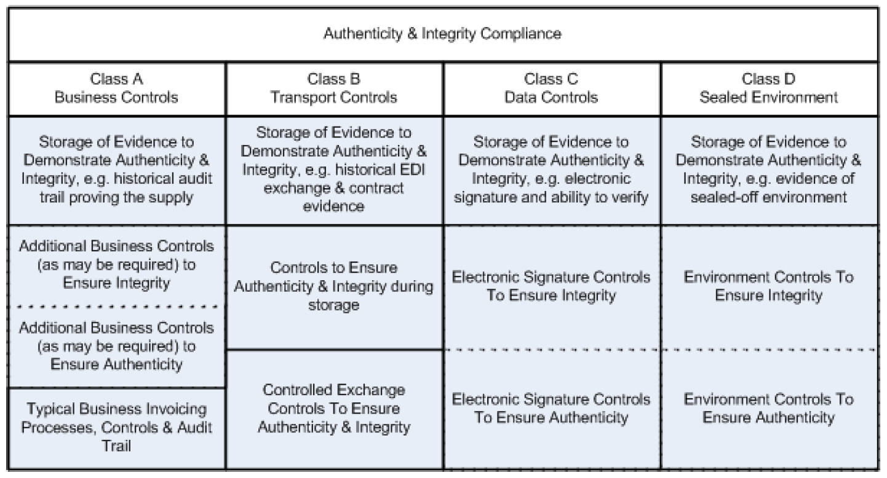
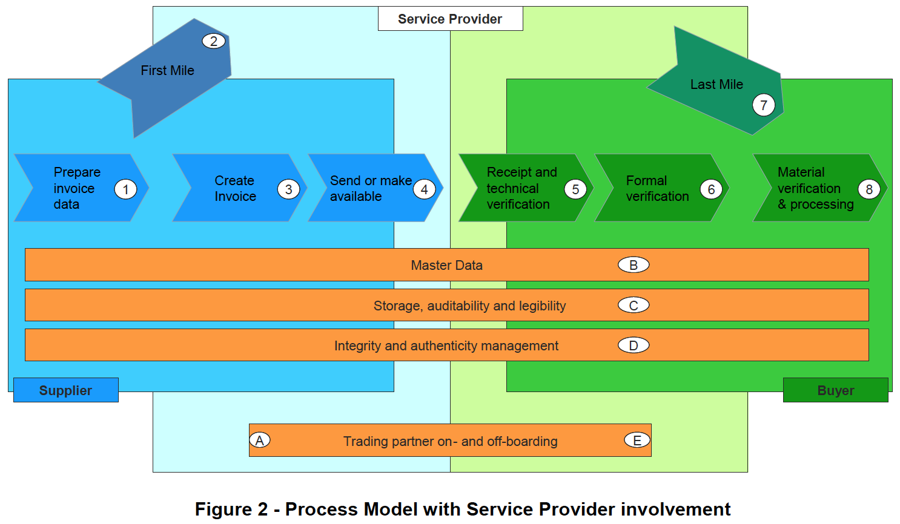

# CWA 16460:2012(E)  
## Good Practice: e-Invoicing Compliance Guidelines - The Commentary (優良事例：電子インボイス　コンプライアンス　ガイドライン　-　解説)

翻訳：三分一　信之

## 1. Scope ( 1. スコープ )  

### 1.1 General ( 1.1 一般 )  

The guidance set out in this CWA addresses electronic invoicing within the scope of VAT. In practice, this includes the majority of business-to-business sales/purchase transactions, but other types of transactions may also be involved. The regulatory background for the practices set out herein is the EU VAT Directive 2006/112/EC (1) as amended by Directive 2011/45/EU (2). Geographically, the practices set out herein are aimed at relevant invoices governed by at least one Member State’s law transposing this Directive. The authors of this CWA document do not exclude that this CWA can be used to enhance or ensure compliance with similar requirements in other countries; however caution should be exercised in drawing parallels between EU rules and those of countries outside the EU.  

Omitted below  

このCWAで設定されたガイダンスは、VATの範囲内での電子インボイスに対応している。 実際には、これにはB2B販売/購入トランザクションの大部分が含まれるが、他のタイプのトランザクションも含まれる場合がある。 ここに記載されている規制のプラクティスの背景は、2011/45 / EU指令（2）によって修正されたEU VAT指令2006/112 / EC（1）である。 地理的には、ここに記載したプラクティスは、この指令を（国内法に）置換えた少なくとも1つの加盟国の法律が適用される関連するインボイスを対象としている。 このCWA文書の作成者は、このCWAを使用して他の国の同様の要件への準拠を強化または保証できることを排除していない。 ただし、EUの規則とEU以外の国の規則との類似点を描く際には注意が必要である。  

以下省略  

## 2. Introduction ( 2. 導入 )  

### 2.1 Overall Summary ( 2.1 全体の概要 )  

This section summarizes the key principles and recommended practices for the sending, receiving and storage of electronic invoices in the European Union with a view to maintaining a robust normative foundation on which both taxable persons and tax administrations can build their processes and coordinate their interactions in a cost- and time-effective manner.  

この箇条では、課税対象事業者と税務当局の両者がプロセスを費用対効果が高く期間対効果も高いい方法で構築し、相互に調整できる堅牢な規範的な基盤を維持することを目的として、EUにおける電子インボイスの送信、受信、および保存に関する主要な原則と推奨される手法を要約する。  

An invoice must correctly reflect the actual supply of goods and/or services. This is achieved through business controls establishing a reliable audit trail linking invoices and supplies.  

（電子）インボイスには、商品やサービスの実際に提供されたものを正確に反映する必要がある。 これは、インボイスと提供されたものを関連づける信頼性の高い監査証跡を確立するビジネスコントロールを通じて達成される。  

Those same business controls establishing reliable audit trails linking invoices and supplies may also meet the requirement of the authenticity of origin and integrity of content of the electronic invoice.　

電子インボイスと提供されたものを関連づける信頼できる監査証跡を確立するビジネスコントロールが電子インボイスの内容の発行元の真正性と完全性の要件も満たすこともある。

In some circumstances, the business controls used by a taxpayer may not be enough to demonstrate the authenticity of the origin and integrity of content of the electronic invoice.　　

状況によっては、納税事業者が使用するビジネスコントロールでは、電子インボイスの発行元の真正性とその内容の完全性を証明するには不十分な場合がある。

The authenticity of the origin and integrity of content of the electronic invoice may also be demonstrated by other means, such as those mentioned in Article 233 (2).　　

電子インボイスの発行元の真正性と内容の完全性は、第233条（2）で言及されているような他の手段によって示される場合もある。

### 2.2 Core Principles ( 2.2 コア原則 )  

<b>Legislative compliance:</b> Electronic invoicing solutions must comply with the relevant legislation. In the EU, the primary legislation is Directive 2006/112/EC (1) (as amended by 2010/45/EU (2)), specifically Articles 233 and 247. In essence; the authenticity of origin, the integrity of content, and legibility must be ensured for the life of an invoice and the use of an electronic invoice shall be subject to acceptance by the recipient. In practical terms this will mean that a business will have:  
* An invoice which supports either an amount of VAT payable to or recoverable from a tax administration.
* Evidence to demonstrate authenticity of origin of the invoice.
* Evidence to demonstrate integrity of content of the invoice.
* Measures to ensure legibility of the invoice.  

<b>法令遵守：</b> 電子インボイス ソリューションは、関連する法律に準拠する必要がある。 EUでは、主要な法律は、指令2006/112 / EC（1）（2010/45 / EU（2）により修正）、具体的には第233条と第247条である。 発行元の真正性、内容の完全性、および可読性は、電子インボイスの存続期間にわたって保証されなければならず、電子インボイスの使用は、受信者による承認の対象となるものとする。 実際には、これは事業者が次のことを維持することを意味する。  
* 税務当局に支払うか、税務当局から還付されるVATの金額を裏付ける電子インボイス。
* 電子インボイスの真正性を証明する証拠。
* 電子インボイスの内容の完全性を証明する証拠。
* 電子インボイスの可読性を確保するための措置。

<b>Technology neutrality:</b> Use of particular technologies is not a precursor to adoption of electronic invoicing and no indication should be given that one technology is favoured over another. Trading parties have freedom of choice over current and future electronic invoicing solutions to meet their specific business needs consistently with the applicable legislative obligations.  

<b>テクノロジーの中立性：</b> 特定のテクノロジーの使用は、電子インボイスの採用の前提ではなく、あるテクノロジーが別のテクノロジーよりも有利であることを示すべきではない。 取引当事者は、特定のビジネスニーズと適用される法的義務とを一貫して満たすために、現在および将来の電子請求ソリューションから自由に選択できる。  

<b>Auditability:</b> Businesses should be able to demonstrate and explain within a reasonable time their administrative and control capability to meet legal requirements. Businesses should maintain a legally compliant audit trail, including the underlying transaction data and any relevant supporting documentation and data, which must be accessible towards external auditors, both statutory and tax.  

<b>監査能力：</b> 企業は、法的要件を満たすための管理能力と管理能力を妥当な時間内に実証および説明できる必要があります。 企業は、基になるトランザクションデータと関連するサポート文書およびデータを含む、法的に準拠した監査証跡を維持する必要があります。これらは、法定および税務の両方の外部監査人がアクセスできる必要があります。  

<b>Proportionality:</b> Businesses should not be required to implement control measures for audit and/or compliance purposes that are disproportionate to their individual circumstances. Circumstances that must be taken into account include, but should not be limited to, the size of a company, the nature of its business, the value and frequency of its transactions, its number of trading partners and the stability of its trading partner network.  

<b>投資バランス：</b> 事業者は、監査やコンプライアンスの目的で、個々の状況に不釣り合いなコントロール手段を実装するように要求されるべきではない。 考慮しなければならない状況には、会社の規模、ビジネスの性質、取引の価値と頻度、取引パートナーの数、取引パートナーネットワークの安定性などがあるが、これらに限定されない。  

### 2.3 Ensuring Authenticity & Integrity ( 2.3 真正性と完全性の確保 )  

"Authenticity of the origin" of an E-Invoice means the assurance of the identity of the supplier or the issuer of the invoice.  

電子インボイスの「発行元の真正性」とは、電子インボイスの提供者または発行者の身元の保証を意味する。  

"Integrity of content" of an E-Invoice means that the content required according to Directive 2010/45/EU Article 233 (2) has not been altered.  

電子インボイスの「内容の完全性」とは、指令2010/45 / EU第233条（2）に従って要求されるようにして、内容が変更されていないことを意味する。  

In the EU, Directive 2010/45/EU (2) art. 233 states that “Each taxable person shall determine the way to ensure the authenticity of the origin, the integrity of the content and the legibility of the invoice”. There are many way in which this can be achieved. The Directive gives three examples of approaches that can be used:  
* Business controls which create a reliable audit trail between an invoice and a supply of goods or services.
* Electronic data interchange (EDI).
* Qualified electronic signature.  

EU指令2010/45 / EU（2）233条は、「各課税事業者は、発行元の真正性、内容の完全性、および電子インボイスの可読性を保証する方法を決定するものとする」と述べている。 これを実現する方法はたくさんある。この指令では、使用できるアプローチの3つの例を示す。
* 電子インボイスと商品またはサービスの提供との間に信頼できる監査証跡を作成するビジネスコントロール。
* 電子データ交換（EDI）。
* 適格な電子署名。

For reference purposes this and related documents categorise different approaches to ensuring authenticity and integrity by their inherent characteristics. Current categories are below (and more detailed description can be found elsewhere in this document):  
* Class A - business controls which create a reliable audit trail between an invoice and a supply of goods or services.
* Class B – controls over data exchange process, i.e. EDI.
* Class C – data level control, i.e. advanced / qualified electronic signatures.
* Class D – sealed environments.  

参考のために、本文書と関連文書で、固有の特性によって信頼性と整合性を確保するためのさまざまなアプローチを分類する。 現在のカテゴリは次のとおり（詳細な説明はこの文書の他の場所にある）。  
* クラスA - 電子インボイスと商品またはサービスの提供との間に信頼できる監査証跡を作成するビジネスコントロール。
* クラスB – データ交換プロセス、つまりEDIでのコントロール。
* クラスC – データレベルのコントロール、つまり高度な/認定された電子署名。
* クラスD – 封印された環境。  

The following diagram illustrates the relative considerations for ensuring authenticity and integrity for each of these classes.  

  

次の図に、これらの各クラスの信頼性と整合性を確保するための相対的な考慮事項を示す。  

真正性と完全性の確保  
| クラスA ビジネスコントロール | クラスB データ交換時のコントロール | クラスC データレベルのコントロール | クラスD 封印された環境  
| ---- | ---- | ---- | ----
| 真正性と完全性を実証するための証拠の保管。 例：提供してきた監査証跡の保管 |	真正性と完全性を実証するための証拠の保管。 例：EDIでのメッセージ交換と契約証拠の保管 |	真正性と完全性を実証するための証拠の保管。 例：電子署名とその検証能力 |	真正性と完全性を実証するための証拠の保管。 例：封印された環境の証拠
| 完全性を確保するための（必要とされるかもしれない）追加的なビジネスコントロール 
真正性を確保するための（必要とされるかもしれない）追加的なビジネスコントロール | データ保存期間中の真正性と完全性を確保するためのコントロール |	完全性を確保するための電子署名コントロール 
真正性を確保するための電子署名コントロール | 完全性を確保するための封印された環境のコントロール 
真正性を確保するための封印された環境のコントロール
| プロセス、コントロール、監査証跡を含む典型的なビジネスコントロール | コントロールされたメッセージ交換 真正性と完全性を確保するためのコントロール |	 |  

An electronic invoicing solution does not need to fit entirely within one of the above classes to be compliant.  
For example, it would be perfectly reasonable for trading partners to agree to use class A for authenticity and class C for integrity. In such a case, applying the proportionality principle, a qualified electronic signature as defined in the Directive might be disproportionate and a ‘lesser’ electronic signature would be sufficient to ensure integrity. Likewise, the business controls would only need to be evaluated in respect to their contribution towards authenticity.  

電子インボイス ソリューションは、上記のクラスのいずれかに完全に適合する必要はない。  
たとえば、取引先が信頼性のためにクラスAを使用し、整合性のためにクラスCを使用することに同意することは完全に合理的である。 このような場合、比例原則を適用すると、EU指令で定義された適格な電子署名は(投資に対して)不均衡になる可能性があり、完全性を確保するには「弱い」電子署名で十分である。 同様に、ビジネスコントロールは、真正性への貢献に関してのみ評価する必要がある。  

### 2.4 Ensuring Legibility ( 2.4 可読性の確保 )  

To be legible an invoice must be human-readable, which means an auditor (e.g. Tax Administration or accountant) is able to interpret the content of an E-Invoice.  

電子インボイスの可読性では、人が読み取れる必要がある。つまり、監査人（税務管理者や会計士など）は電子インボイスの内容を解釈できることが必要である。  

An invoice must be legible, in particular for auditors including tax administrations. Businesses should maintain software that is capable of rendering an electronic invoice legible. Legibility is a precondition for acceptance by the recipient and auditability. Legibility of an electronic invoice can be achieved either because the file format was meant to enable human-readability in connection with desktop software, or through the application of viewer software in case of invoice formats meant for machine-to-machine communications.  

電子インボイスは、特に税務当局を含む監査人にとって、可読性を持たなければならない。 企業は、電子インボイスを読むことができるソフトウェアを維持する必要がある。 可読性は、（電子インボイスの）受信者による承認と監査能力の前提条件である。 電子インボイスの可読性は、ファイル形式をデスクトップソフトウェアに関連させて人が読めるようにすることを意図するか、またはマシン間の通信用の電子インボイス形式の場合は、ビューアソフトウェアのアプリケーションを介して達成できる。  

## 3. Comprehensive Guidance ( 3. 包括的なガイダンス )  

### 3.1 Introduction ( 3.1 導入 )  

In the absence of implementation-relevant rules emanating from tax administrations and standards bodies, it is hard for companies and solution providers to make any value judgment as to how “compliant” E-Invoicing processes are. Service providers, solution vendors and their corporate customers that are taking steps to develop and implement VAT-compliant services naturally have a desire to be recognised, but very few Tax Administrations provide accreditation services or self-assessment programmes to assist Service Providers or businesses to ascertain that E-Invoicing systems are VAT compliant.  

税務行政や標準化団体から発せられる実装関連のルールがない場合、企業やソリューションプロバイダーは、準拠」した電子インボイス　プロセスについてのどのような価値判断も困難になる。 VATに準拠したサービスを開発および実装するための措置を講じているサービスプロバイダー、ソリューションベンダー、およびそれらの法人買い手は、当然のことながら認証されることを望んでいるが、サービスプロバイダーまたは企業が認証するのを支援する認証サービスまたは自己評価プログラムを提供する税務当局はほとんどない。 電子インボイス システムはVATに準拠している。  

The Compliance Matrix was originally developed from the Dutch language draft of the Fiscalis “Business Process Analysis (BPA) matrix e-invoicing” document, developed by the Netherlands Tax Administration (Belastingdienst) for the Fiscalis2 E-Audit Project Group. It is addressed to Tax Administrations for the audit of VAT invoice solutions. The BPA Matrix has been modified and complemented with input from Task Group members, Fiscalis members and stakeholders having provided comments in the CEN process to make the Guidelines applicable to all EU Member States' practices and to aspects of good practice that are unique to Service Providers.  

コンプライアンスマトリックスは、Fiscalis2 E-Audit Project Group向けにオランダ税務局（Belastingdienst）が開発した、Fiscalisの「ビジネスプロセス分析(BPA)マトリックス電子インボイス」文書のオランダ語草稿から最初に開発された。 これは、VAT電子インボイス ソリューションの監査のために税務当局に宛てられている。 BPAマトリックスが変更され、タスクグループメンバー、Fiscalisメンバー、および関係者からの情報提供によりCENプロセスでコメントを提供して、ガイドラインをすべてのEU加盟国の慣行およびサービスプロバイダーに固有の優良慣行の側面に適用できるようにした。  

The Guidelines should make it possible for all parties involved to check whether their E-Invoicing processes, in-house or outsourced, are likely to be VAT-compliant, and if not, what corrective measures are available.  

このガイドラインにより、関係するすべての当事者が、自社または外部委託の電子インボイス プロセスがVATに準拠している可能性が高いかどうか、およびそうでない場合はどのような是正措置が利用できるかを確認できるようにする必要がある。  

The Guidelines identify the main issues in question at each processing step during the E-Invoice life cycle for different invoicing methods (direct invoicing from Supplier to Customer as well as self-billing) and provide detailed process guidance for a variety of implementation options, the use of various methods for ensuring integrity and authenticity and the storage of electronic invoices. For each discrete processing step, the Guidelines define the ‘Risks’ (of inappropriate practices to companies and tax administrations); ‘Requirements’ (for companies to mitigate the risk); and ‘Controls’ (from which companies can choose to meet the requirements).  

ガイドラインでは、さまざまな請求方法（サプライヤから買い手への直接請求および自己請求）の電子インボイス ライフサイクルの各処理ステップで問題となっている主要な問題を特定し、さまざまな実装オプションの詳細なプロセスガイダンスを提供する。 完全性と真正性を確保するためのさまざまな方法の使用、および電子インボイスの保管。 個別の処理ステップごとに、ガイドラインは「リスク」（企業や税務当局にとって不適切な慣行のリスク）、「要件」（企業がリスクを軽減するため） および「コントロール」（企業は要件から選択することができる）を定義する。  

Filters have been added within the Compliance Matrix to allow the user to select a specific process or subprocess for a more detailed view – for example: What are good practices for a Supplier in a self-billing process? What should Customers and Suppliers need to take into consideration when starting exchanging E-Invoices? Use of the Compliance Matrix and the Interactive User Interface is addressed in section 3.9 below and in the Introduction of the Matrix document.  

フィルターがコンプライアンスマトリックス内に追加され、利用者が特定のプロセスまたはサブプロセスを選択して、より詳細なビューを表示できるようになった。例：自己請求プロセスにおける売り手の推奨事項は何か？ 電子インボイスの交換を開始するときに、買い手と売り手は何を考慮する必要があるか？ コンプライアンスマトリックスとインタラクティブユーザーインターフェイスの使用については、以下の箇条3.9およびマトリックスの概要の文書で説明している。  

The issues surrounding self-billing are presented in more detail in section 3.8.1, as this way of invoicing is being introduced more frequently at present, but the issues and problems are not always clearly understood by the parties concerned.  

この請求方法は現在より頻繁に導入されているため、self-billing（自己請求）をめぐる問題は箇条3.8.1で詳しく説明されているが、問題や問題は当事者によって必ずしも明確に理解されているわけではない。  

### 3.2 Process Model ( 3.2 プロセスモデル )
The process model that has been used to analyse different steps in the E-Invoice life cycle is shown below.  
It represents the different steps in the information flow from Supplier, on the left, to the Customer on the right.  

電子インボイス ライフサイクルのさまざまなステップの分析に使用されたプロセスモデルを以下に示す。  
これは、左側の売り手から右側の買い手への情報フローのさまざまなステップを表している。  

This model is used as a tool for analysing the requirements and describing the controls recommended for EInvoicing.  
It does not imply that an implementation of the Guidelines must follow this process sequence. It is only an aid to relate the recommendations in the Guidelines to the real life processes that typically constitute in an invoicing system. In particular, certain aspects of the process steps described in the Guidelines may be carried out in a different order or may not be relevant in some implementations.  

このモデルは、要件を分析し、電子インボイスに推奨されるコントロールを説明するためのツールとして使用される。  
ガイドラインの実装がこのプロセスシーケンスに従う必要があることを意味するものではない。 これは、ガイドラインの推奨事項を、通常の請求システムで構成される実際のプロセスに関連付けるための補助にすぎない。 特に、ガイドラインに記載されているプロセス手順の特定の側面は、異なる順序で実行される場合や、一部の実装では関連しない場合がある。  

Figure 1 represents the process model without involving Service Providers; Figure 2 introduces the concept of Service Provider (or providers) into the model. The labelling on the figures is referenced in the Compliance Matrix and the Interactive User Interface.  

  

  

図1は、サービスプロバイダーを含まないプロセスモデルを表す。 図2は、サービスプロバイダー（またはプロバイダー）の概念をモデルに導入したもの。 図のラベルは、コンプライアンスマトリックスとインタラクティブユーザーインターフェイスで参照される。  

In the case that one or both trading partners use Service Providers, then the flow passes through the ‘first mile’ between the Supplier and the Service Provider, and the ‘last mile’ between the Service Provider and the Customer.  

一方または両方の取引相手がサービスプロバイダーを使用する場合、フローは売り手とサービスプロバイダー間の「ファーストマイル」、およびサービスプロバイダーと買い手間の「ラストマイル」を通過する。  

In the case of self-billing, the E-Invoice is issued by the Customer (or his Service Provider) and flows in the reverse direction to the Supplier or via the Supplier’s Service Provider. The following sub-sections provide an explanation of the steps in the above figures.  

elf-billing(自己請求)の場合、電子インボイスは買い手（またはそのサービスプロバイダー）によって発行され、逆方向に売り手に流れる、あるいは売り手のサービスプロバイダーを経由して流れる。 次の細分箇条では、上記の図の手順について説明する。  

### 3.2.1 Objectives in the context of the Process Model　( 3.2.1 プロセスモードのコンテキストでの目的 )

In order to meet the high level objectives specified in section 4.1 above throughout the appropriate phases of an E-Invoice life cycle, the following specific objectives need to be taken into account for any E-Invoicing process:  

上記の電子インボイス ライフサイクルの適切なフェーズ全体にわたって、箇条4.1で指定された高次の目標を達成するために、電子インボイス プロセスでは、次の特定の目標を考慮する必要がある。  

    i) When preparing the sales invoice.  
    i）販売インボイスを準備するとき  

        a) Continuity and consistency between the information used in an invoice and its source (e.g. sales orders, delivery notes, contracts).  

        a）電子インボイスで使用される情報とそのソース（たとえば、注文書、納品書、契約書）との間の継続性と一貫性。  

    ii) When creating the sales invoice.  
    ii）販売インボイスを作成するとき  

        a) Ensure that the authenticity of the invoice will be verifiable by the customer  
        b) Ensure that the integrity of the invoice will be verifiable by the customer and supplier  

        a）電子インボイスの真正性が買い手によって検証可能であることを確認する  
        b）電子インボイスの完全性が買い手と売り手によって検証可能であることを確認する  

    iii) When sending invoices or making them available
    iii）電子インボイスを送信するとき、または利用可能にするとき

        a) Authenticity of the invoice remains verifiable upon receipt
        b) Integrity of the invoice remains verifiable upon receipt  

        a）電子インボイスの真正性は受領時に検証可能なままとする
        b）電子インボイスの完全性は受領時に検証可能なままとする

    iv) When receiving an invoice and processing it
    iv）電子インボイスを受け取って処理するとき

        a) Continuity between all steps of the process concerned with handling a received invoice
        b) Authenticity of the invoice is verified and maintained
        c) Integrity of the invoice verified and maintained  

        a）受け取った電子インボイスの処理に関連するプロセスのすべてのステップ間の継続性
        b）電子インボイスの真正性が検証され、維持されている
        c）検証および維持された電子インボイスの完全性

    v) When storing an invoice and during the storage period
    v）電子インボイス保管するとき、および保管期間中

        a) Data continuity between invoice creation or receipt and its storage
        b) Verifiable authenticity of the invoice ensured throughout storage period
        c) Verifiable integrity of the invoice ensured throughout storage period
        d) An invoice must be presentable in a legible form.  

        a）電子インボイス作成または受領とその保管の間のデータの継続性
        b）保管期間全体にわたって保証される電子インボイスの検証可能な真正性
        c）保管期間を通じて保証される電子インボイスの検証可能な完全性
        d）電子インボイスは読みやすい形式で提示できる必要がある

    vi) Across the invoicing process
    vi）電子インボイス プロセス全体

        a) Invoices are handled in accordance with applicable law throughout every stage of their life cycle  

        a）電子インボイスは、ライフサイクルのすべての段階を通して法令に従って処理される

### 3.2.2 (On and Off) Boarding steps ( 3.2.2（オンおよびオフ）ボーディングステップ )

Prior to exchanging E-Invoices, the trading partners first have to agree on the legal basics, then on the specific types of electronic invoices to be exchanged; in particular they will have to agree on formats, on exchanging mechanisms and on methods to ensure Authenticity, Integrity and Legibility. This process called “on-boarding” may span from being very simple (e.g. just a click on a tick box) to very complex, including technical, procedural and legal basics of the E-Invoicing relationship. Similarly, specific “off-boarding” procedures should be ensured, to wind down the relationship in good order when it becomes necessary. If one or more Service Providers are involved, the on- and off-boarding processes are extended into the relevant trading partner relationship with such Service Provider(s).  

電子インボイスを交換する前に、取引相手双方はまず法的基本事項について合意し、次に交換する特定のタイプの電子インボイスについて合意する必要がある。 特に、真正性、完全性、可読性を保証するために、形式、交換メカニズム、および方法について合意する必要がある。 「オンボーディング」と呼ばれるこのプロセスは、非常に単純なもの（たとえば、チェックボックスをクリックするだけ）から、電子インボイス関係の技術的、手続き的、法的基本を含む非常に複雑なものまで多岐にわたる。 同様に、特定の「オフボーディング」手順を確実にして、必要になったときに関係を適切な順序で整理する必要がある。 1つ以上のサービスプロバイダーが関与している場合、オンボーディングプロセスとオフボーディングプロセスは、そのようなサービスプロバイダーとの関連する取引相手双方の関係に拡張される。  

#### A. Trading partner on-boarding
#### A. 取引相手のオンボーディング  

On-boarding is the process of enabling a trading partner to interchange electronic invoices with another trading partner. This will include contracting, identification, and, where applicable connecting the trading partners to the technical infrastructure and applications used (this may include setting up web access or connectivity to the back-office system, format mapping, conversion, process reengineering, testing, support, E-invoicing-specific contracting and/or training). Where one or more Service Providers act for the trading partners, the on-boarding process is aimed at setting up an end-to-end coherent structure and processes that enable appropriate auditability. Among other things, this step is necessary to give the E-Invoice issuer reasonable confidence that the recipient will accept the E-Invoice, as envisaged by Directive 2006/112/EC art. 232 (1) as amended by Directive 2010/45/EU (2).  

オンボーディングとは、取引相手が電子インボイスを別の取引相手と交換できるようにするプロセス。 これには、契約、識別、および該当する場合は取引相手と使用される技術インフラストラクチャおよびアプリケーションの接続が含まれる（これには、バックオフィスシステムへのWebアクセスまたは接続の設定、フォーマットマッピング、変換、プロセスリエンジニアリング、テスト、サポート、電子インボイス固有の契約および/またはトレーニングが含まれる場合がある）。 1つ以上のサービスプロバイダーが取引相手を代行する場合、オンボーディングプロセスは、適切な監査性を可能にするエンドツーエンドの一貫した構造とプロセスをセットアップすることを目的としている。 とりわけ、このステップは、EU指令2006/112 / EC 232（1）条（指令2010/45 / EU（2）によって修正）で想定されているように、受信者が電子インボイスを受け入れるという合理的な信頼を電子インボイス発行者に与えるために必要となる。  

#### E. Trading partner off-boarding
#### E. 取引相手のオフボーディング

Off-boarding is the process of terminating an E-Invoicing relationship. The parties terminating the relationship should ensure a winding-down of the relationship that preserves the trading partners’ ability to maintain the required authenticity, integrity, legibility and auditability of their E-Invoices until the end of the storage period. The complexity of the off-boarding process can span from practically nil to a complicated process, in particular if the off-boarding procedure involves a service provider.  

オフボーディングは、電子インボイス関係を終了するプロセス。 関係を終了する当事者は、保管期間が終了するまで、電子インボイスの必要な真正性、完全性、可読性、および監査能力を維持する取引相手の能力を維持する関係の整理を確実にする必要がある。 オフボーディングプロセスの複雑さは、特にオフボーディング手順にサービスプロバイダーが関与している場合は、実質的にゼロから複雑なプロセスまで及ぶ可能性がある。  

### 3.2.3 Processing steps ( 3.2.3処理ステップ )

The processing steps in the exchange of the E-Invoice are expanded upon below. Labelling is the same as is used in the Compliance Matrix the Interactive User Interface.  

電子インボイスの交換の処理ステップは、以下に拡張されている。 ラベル付けは、インタラクティブマトリックスのコンプライアンスマトリックスで使用されているものと同じ。

#### 1. Prepare invoice data ( 1.電子インボイスデータの準備 )

Based on source transaction data, the Supplier will prepare the invoice data required to issue an invoice in the Agreed Format or a format that can be converted into the Agreed Format.  

元となるトランザクションデータに基づいて、売り手は、合意された形式または合意された形式に変換できる形式で電子インボイスを発行するために必要な電子インボイスデータを準備する。  

The nature of this step depends on how automated the supply chain is. The Supplier provides invoice data via online data entry forms or directly exported from back-office systems. Data captured manually has to be screened and checked to avoid errors occurring in subsequent processes or even later. In a back-office application, the same data will be obtained from data processed in other modules, order handling, shipping, etc. Missing data or exceptions will be complemented after proper screening for correctness.  

このステップの性質は、サプライチェーンがどの程度自動化されているかによって異なる。 売り手は、オンラインデータ入力フォームを介して、またはバックオフィスシステムから直接エクスポートされた電子インボイスデータを提供する。手動で捉まえられたデータは、後続のプロセスで発生するエラーを回避するために、またはさらに後でスクリーニングおよびチェックする必要がある。 バックオフィスアプリケーションでは、同じデータが他のモジュール、注文処理、配送などで処理されたデータから取得される。欠落データまたは例外は、正確性を適切にスクリーニングした後に補完される。  

#### ( 2. は、サービスプロバイダー固有のプロセスで後述 )

#### 3. Creation of the E-Invoice ( 3. 電子インボイスデータの作成 )

Starting with data prepared in step 1, the E-Invoices will be created in step 3 in the Agreed Format.　Prior to creating the invoice, the Supplier should have performed all the controls required to ensure that the resulting E-Invoice will be complete and accurate.  

ステップ1で準備されたデータから始めて、電子インボイスはステップ3で合意されたフォーマットで作成される。 電子インボイスを作成する前に、売り手は、作成された電子インボイスが完全かつ正確であることを保証するために必要なすべての管理を実行している必要がある。  

#### 4. Send or make E-Invoice available ( 4. 電子インボイスを送信または使用可能にする )

This step consists of the exchange or depositing of the E-Invoice for collection by the receiving party.  
This is commonly known as “issuing the E-invoice. The Supplier or its Service Provider will often start this process by initiating technical controls that should be checked by the Recipient or its Service Provider in order to correctly complete the technical receipt of the E-Invoice.  

このステップは、受信者に受け取り可能とするための電子インボイスの交換または預託で構成される。  
これは一般に「電子インボイスの発行」として知られている。 売り手またはそのサービスプロバイダーは、電子インボイスの技術的な受領を正しく完了するために、受信者またはそのサービスプロバイダーが確認する必要のある技術的管理を開始することにより、このプロセスを開始することがよくある。  

#### 5. Receipt and technical verification of E-Invoices ( 5.電子インボイスの受領と技術的検証 )

In this step, the E-Invoice has entered into the control of the Recipient, who will perform certain technical checks pertaining to e.g. the termination of secure transmission protocols, electronic signatures and/or – in automated systems - syntax checks and controls such as control counts, missing mandatory data (segments, data elements) defined at syntax level. Anomalies will generally be recorded and signalled to the Recipient’s system controller. Only technically correct files/invoices will be passed to the next processing step. In case of a technical problem, the Issuer will be notified that there was an error detected during reception or processing of the E-Invoice and that it should be corrected and re-sent.  

このステップでは、電子インボイスが受信者の管理下に入る、受信者は、以下に関する技術的なチェックを実施する。たとえば、 安全な送信プロトコル、電子署名、および/または自動システムの終了、制御カウントおよび制御、構文レベルで定義された必須データ（セグメント、データ要素）の欠落などの構文チェック。 通常、異常は記録され、受信者のシステムコントローラに通知される。 技術的に正しいファイル/電子インボイスのみが次の処理ステップに渡され。 技術的な問題が発生した場合、発行者には、電子インボイスの受信または処理中にエラーが検出されたことが通知され、修正して再送信する必要がある。  

#### 6. Formal verification of E-Invoices ( 電子インボイスの形式検証 )

Technically correct E-Invoice will be passed for formal verification, the extent of which depends on the capacity of the software and data available during this processing step; e.g. invoice date check, trading partner identification and addresses, availability of mandatory or conditionally required data, vat numbers, product and service codes, etc.  

技術的に正しい電子インボイスが形式の検証のために次のステップに渡される。検証の範囲は、この処理ステップ中に利用可能なソフトウェアとデータの容量に依存する。 例えば 、電子インボイスの日付の確認、取引相手の識別と住所、必須または条件付きで必要なデータの可用性、VAT番号、製品およびサービスコード、その他。  

Only formally correct files/invoices will be passed to the next processing step. If a formal problem occurs the Issuer will be notified that the E-Invoice could not be accepted and a corrected E-Invoice should be sent.  

正しい形式のファイル/電子インボイスのみが次の処理ステップに渡される。 形式上の問題が発生した場合、発行者には電子インボイスを受け入れることができなかったことが通知され、（その場合は）修正した電子インボイスを送信する必要がある。  

#### （ 7. は、サービスプロバイダー固有のプロセスで後述 ）

#### 8. Material verification and processing ( 8. 内容の検証と処理 )

In this step, further verification of the E-Invoice is carried out in the back office application, including checking and reconciling against all the necessary files available for invoice handling; e.g. Customer order to the Supplier, goods receipt, price calculation, product file, contract or Supplier catalogue information, Supplier information, etc. differences identified in quantities, product specification, material or services, prices, conditions, payment terms, delivery terms, vat rates, etc. will have to be notified and resolved with the Supplier.  

このステップでは、バックオフィスアプリケーションで電子インボイスのさらなる検証が行われる。これには、電子インボイス処理に使用できるすべての必要なファイルの確認と調整が含まれる。 例えば 売り手への買い手の注文、入庫、価格計算、製品ファイル、契約または売り手のカタログ情報、売り手情報など、数量、製品仕様、材料またはサービス、価格、条件、支払条件、配達条件、付加価値税で識別される差異があれば、売り手に通知され、解決される必要がある。  

All E-Invoices in this step are processed. Only materially correct E-Invoices will be accepted for payment and further processing in the Recipient’s application.  

このステップのすべての電子インボイスが処理される。 正しい内容の電子インボイスのみが、支払いおよび受領者のアプリケーションでのさらなる処理のために受け入れられる。  

If an error is detected at this level, the Issuer will be notified that the E-Invoice was not correct and that a credit note or other corrective document will be required to balance the accounting books such as the general ledger.  

このレベルでエラーが検出された場合、発行者には電子インボイスが正しくなかったことが通知され、総勘定元帳などの会計帳簿の貸借を一致させるためにクレジットノートまたはその他の修正のための文書が必要になる。  

### 3.2.4 Service Provider-specific processes ( 3.2.4サービスプロバイダー固有のプロセス )

#### 2. First mile ( 2.ファーストマイル )

In this step (applicable only to cases in which a Service Provider is involved), the invoice data will be communicated to a Service Provider to whom the function of issuing the Invoices and/or providing other services supporting E-Invoicing has been outsourced. The invoice data will typically be communicated through a secure communication channel.  

このステップでは（サービスプロバイダーが関与する場合にのみ該当）、電子インボイスデータは、電子インボイスを発行する機能、および/または電子インボイスをサポートする他のサービスを提供する機能がアウトソーシングされているサービスプロバイダーに通知される。 通常、電子インボイスデータは安全な通信チャネルを介して通信される。  

#### 7. Last mile ( 7.ラストマイル )

In this step (applicable only to cases in which a Service Provider is involved), the E-Invoice will be communicated by the last Service Provider involved in the processing of the E-Invoice to the Recipient’s in-house application for further processing. The E-Invoice will typically be communicated through a secure channel.  

このステップでは（サービスプロバイダーが関与する場合にのみ該当）、電子インボイスは、電子インボイスの処理に関与した最後のサービスプロバイダーから受信者の社内アプリケーションに通知され、さらに処理される。 電子インボイスは通常、安全なチャネルを介して通信される。  

### 3.2.5 Supporting business processes ( 3.2.5ビジネスプロセスのサポート )

#### B. Master Data ( B.マスタデータ )

Master data are data that are stable over longer periods of time such as the names, addresses, and identifications, e.g. VAT numbers, DUNS number, GS1 GLN numbers. For product or services, Master Data may include product names, descriptions, tax category, and identifications such as GS1 GTIN identifier.  

マスタデータは、名前、住所、IDなど、長期間にわたって安定しているデータである。 VAT番号、DUNS番号、GS1 GLN番号。 製品またはサービスの場合、マスタデータには、製品名、説明、税カテゴリ、GS1 GTIN識別子などのIDが含まれる場合がある。  

#### C. Storage and auditability ( C. ストレージと監査能力 )

Both parties must store the E-Invoice for the storage period. The storage may be either at a Trading Partner or at a Service Provider. During the storage period, a competent tax administration has the right to audit stored Invoices. Invoices may (sometimes subject to additional requirements e.g. notification or authorization) be stored in another country. Some Member States may permit the storage of E-Invoices in a non-EU Member State, for example provided that they comply with data privacy laws. If the E-Invoice is not stored within the Member State of the relevant trading partner, the latter as taxable person must ensure that the tax administration can access and audit the E-Invoice online within a reasonable time.  

両当事者は、保管期間の電子インボイスを保管する必要がある。 ストレージは、取引相手またはサービスプロバイダにある。 保管期間中、有能な税務当局は保管された電子インボイスを監査する権利を持つ。 電子インボイスは（通知や承認などの追加要件の対象となる場合がある）別の国に保管される場合がある。 一部の加盟国は、たとえばデータプライバシー法に準拠している場合、非EU加盟国での電子インボイスの保管を許可する場合がある。 電子インボイスが関連する取引先の加盟国に保管されていない場合、課税対象者としての後者は、税務当局が妥当な時間内にオンラインで電子インボイスにアクセスして監査できることを確認する必要がある。  

#### D. Integrity, authenticity and legibility management ( D. 完全性、真正性、可読性の管理 )

This concerns the management of technology, policies, documentation and processes addressed to the assurance and long-term evidencing of integrity and authenticity of E-Invoices. Such assurances can be provided through two types of approach: using data-level methods whereby the long-term proof of integrity and authenticity remains technically verifiable as part of the audit of a stored EInvoice; or using process-level controls whereby evidence is provided by referring to audit trails, documents, reproducible computer logic and/or reproducible conversions.  

これは、電子インボイスの完全性と真正性の保証と長期証拠に対処するための技術、ポリシー、文書化、プロセスの管理に関係する。 このような保証は、2種類のアプローチで提供できる。保存された電子インボイスの監査の一環として、完全性と真正性の長期的な証明が技術的に検証可能なデータレベルの方法を使用する。 または、監査証跡、文書、再現可能なコンピューターロジック、および/または再現可能な変換を参照して証拠を提供するプロセスレベルのコントロールを使用する。  

Legibility is required to be maintained up to the end of the E-Invoice storage period. It cannot be ensured by the methods implemented to ensure Authenticity and Integrity.  

電子インボイスの保管期間が終了するまで、可読性を維持する必要がある。 これは、真正性と完全性を保証するために実装された手法では保証できない。  

The following issues should be taken into account:  
    1) Adoption of E-Invoice formats that are likely not to host malware able to change the document content and presentation;
    2) Adoption of formats for which long term maintenance can be assured.   
If either of the above are not met, it will be necessary to perform a format conversion that shall be implemented in a way to create a reliable audit trail.

次の問題を考慮する必要がある。  
    1）文書の内容と表示を変更できるマルウェアをホストしないような電子インボイスフォーマットの採用
    2）長期保守が保証できるフォーマットの採用
上記のいずれかが満たされない場合、信頼できる監査証跡を作成する方法で実装されるフォーマット変換を実行する必要がある。

### 3.3 Categorisation of Business Implementations ( 3.3ビジネス実装の分類 )

These Guidelines allow for the use of a wide choice of alternative controls to meet the Core Principles identified in section 2.2. Whilst a broad spectrum of business solutions supporting E-invoicing is possible through the Guidelines, they can be broadly categorised into four classes to which the controls recommended in the Guidelines may be related.  

これらのガイドラインでは、箇条2.2で特定されたコア原則を満たすために、幅広い選択肢を使用できるようにしている。 電子インボイスをサポートする幅広いビジネスソリューションがガイドラインを通じて可能だが、ガイドラインで推奨されているコントロールが関連する4つのクラスに大きく分類できる。  

The following categorisation assumes and builds on a minimum level of basic E-Invoicing processes. These basic processes, which every company will have in place, tie an E-Invoicing process to a sales/purchase transaction and include normal content checking against orders, contracts etc. In addition to such basic controls, organizations should focus on the following “classes” of control mechanisms to ensure auditability:  

以下の分類は、最低限のレベルの基本的な電子インボイスプロセスを想定して組み立てている。 すべての企業が実施するこれらの基本的なプロセスは、電子インボイスプロセスを販売/購入トランザクションに結び付け、注文、契約などに対する通常のコンテンツチェックを含む。このような基本的な制御に加えて、組織は監査性を確保するための制御メカニズムの次の「クラス 」にフォーカスしなければならない：  

    A) Class A is the “business controls that create a reliable audit trail between invoice and supply” as per Directive 2006/112/EC (1) Art. 233, as amended by 2010/45/EU (2);  

    A）クラスAは、指令2006/112/EC（1）（2010/45/EU（2）で修正）233条に従った、「電子インボイスと提供の間に信頼できる監査証跡を作成するビジネスコントロール」;

    B) Business solutions augmented by controlled data exchanges (e.g. EDI) to ensure the integrity and authenticity of E-Invoices between trading partners;  

    B）取引相手間の電子インボイスの完全性と真正性を保証するために、制御されたデータ交換（EDIなど）によって強化されたビジネスソリューション;

    C) Business solutions augmented by data level controls (e.g. Qualified Electronic Signatures) to ensure the integrity and authenticity of E-Invoices throughout their full life-cycle;  

    C）ライフサイクル全体にわたって電子インボイスの完全性と真正性を確保するために、データレベルの制御（認定電子署名など）によって強化されたビジネスソリューション;

    D) Business solutions augmented by central "safe-keeping" of E-Invoices to ensure the integrity and authenticity of E-Invoices throughout their full life-cycle;

    D）電子インボイスの完全なライフサイクル全体にわたってE-Invoiceの完全性と真正性を保証するための電子インボイスの「安全な保管」によって強化されたビジネスソリューション;

Further classes may be added as business practices are identified or evolve. Please note that the above classes are only defined to make the matrix and interface more accessible. In practice compliance methodologies could fall into multiple classes.  

ビジネス慣行が識別または進化するにつれて、さらにクラスが追加される場合がある。 上記のクラスは、マトリックスとインターフェースをよりアクセスしやすくするためにのみ定義されていることに注意。 実際には、コンプライアンス手法は複数のクラスに分類される可能性がある。  

These classes are considered from the perspective of the parties involved in the VAT-able sales transaction.  

これらのクラスは、VAT対象の販売トランザクションに関与する当事者の観点から考慮される。  

Business solutions in practice can be mixed and matched from the above classes – for example, a Supplier could use solution class D (the Invoice does not move from the "safe-keeping" environment) while the Customer uses a class A solution (exclusive reliance on process controls). It is nevertheless important that the manner in which the Invoices are exchanged is clearly agreed between the parties in order to avoid mismatches.  

実際のビジネスソリューションは、上記のクラスと組み合わせることができる。たとえば、売り手はソリューションクラスDを使用し（電子インボイスは「安全な」環境から移動しない）、買い手はクラスAソリューション（プロセスコントロールに排他的依存）を使用する。 それにもかかわらず、不一致を回避するために、電子インボイスの交換方法が当事者間で明確に合意されていることが重要である。  

As described in section 3.9, for each control (requirement) described in the Matrix or Interactive User Interface, it is indicated whether it is applicable as a Class A business control, Class B Controlled data exchange, Class C data level control or Class D outsourced “safe-keeping”.  

箇条3.9で説明されているように、マトリックスまたはインタラクティブユーザーインターフェイスで説明されている各コントロール（要件）について、クラスA　ビジネスコントロール、クラスB　コントロールされたデータ交換、クラスC　データレベルのコントロール、またはクラスD　アウトソーシング "保管"がそれぞれ適用できるかどうかが示される。  

### 3.4 Class A: Business controls creating a reliable audit trail between invoice and supply
### 3.4　クラスA：　電子インボイスと提供の間で信頼できる監査証跡を作成するビジネスコントロール　　

#### 3.4.1 Definitions ( 3.4.1 定義 )

    (a) Business Control: The COSO3 Model defines “business control” as:
    a process, effected by an entity’s board of directors, management and other personnel, designed to　provide reasonable assurance regarding the achievement of objectives in effectiveness and　efficiency of operations, reliability of financial reporting, and compliance with applicable laws and　regulations.

    （a）ビジネスコントロール：COSO3モデルでは、「ビジネスコントロール」を次のように定義している。
     企業の取締役会、経営陣、およびその他の構成員によって実施されるプロセス。運用の有効性と効率性の目的の達成、財務報告の信頼性、および適用される法律と規制の遵守に関する合理的な保証を提供するように設計されている。

     (b) Audit Trail: An audit trail is:
     a paper and/or electronic record that gives a step by step documented history of a transaction, which can validate or invalidate accounting entries. Components of an audit trail include: (i) source records, (ii) list of transactions processed and (iii) transaction identifiers so that reference can be made to the source of a transaction.  

     (b) 監査証跡：監査証跡とは
     会計エントリを検証または無効化できる、トランザクションの履歴を段階的に文書化した紙および/または電子記録。 監査証跡のコンポーネントには、（i）源となるレコード、（ii）処理された一連のトランザクション、および（iii）トランザクションの源を参照可能とするトランザクションID。

### 3.4.2 Introduction ( 3.4.2 導入 )

An invoice must correctly reflect the actual supply of goods and/or services. This is achieved through business controls establishing a reliable audit trail linking invoices and supplies. Those same business controls may also meet the requirements of the authenticity of origin and integrity of content of the electronic invoice. This section examines practical examples, based on established business processes and controls, which fulfil these requirements. These business processes and controls are based on those already used for paper invoicing.  

電子インボイスには、商品やサービスの実際の提供を正確に反映する必要がある。 これは、電子インボイスと提供品を関連づける信頼性の高い監査証跡を確立するビジネスコントロールを通じて達成される。 この同じビジネスコントロールは、電子インボイスの発行元の真正性と内容の完全性の要件も満たす場合がある。 この箇条では、確立されたビジネスプロセスとコントロールに基づいて、これらの要件を満たす実用的な例を検討する。 これらのビジネスプロセスとコントロールは、紙のインボイスですでに使用されているものに基づいている。

Legibility is treated separately within this CWA as the issue is common whatever mechanism is used to achieving authenticity and integrity.  

このCWA内では、真正性と完全性を実現するために使用されるメカニズムが何であれ、一般的な問題であるため、可読性はこれらとは別に扱う。

### 3.4.3 Reliable Audit Trail ( 3.4.3 信頼できる監査証跡 )

Directive 2010/45/EU references the use of reliable audit trails between invoice and supply as a means of also demonstrating invoice authenticity and integrity for electronic invoices. Examples of different types of audit trail that contribute to fulfilling this purpose include:  

指令2010/45/EUは、電子インボイスの真正性と電子インボイスの完全性を実証する手段として、電子インボイスと提供品との間の信頼できる監査証跡の使用を参照している。 この目的の達成に寄与するさまざまなタイプの監査証跡の例には、次のものがある。

    (i) The audit trail of documents produced by an ERP (Enterprise Resource Planning application software) or any application software that provided the type of business processing discussed therein, i.e. billing systems, procurement systems, financial systems, etc (henceforth the term ERP will be used to represent all these systems). It presumes the existence of cross-referencing between the audit trail documents.
    (ii) An audit log of changes made to the ERP documents mentioned above during their life cycle.
    (iii) An audit log of changes made to ERP master data that is reference during invoicing processing.
    (iv) An audit log of activities performed by the ERP, such as the act of matching a purchase order with an invoice.  

    （i）ERP、またはそこで議論されるビジネス処理のタイプを提供するアプリケーションソフトウェア（電子インボイスシステム、調達システム、金融システムなど）によって作成された文書の監査証跡（以降、ERPという用語は これらすべてのシステムを表すために使用される）。 監査証跡文書間の相互参照の存在を想定している。
    （ii）上記のERP文書のライフサイクル中に行われた変更の監査ログ。
    （iii）請求処理中に参照されるERPマスターデータに加えられた変更の監査ログ。
    （iv）ERPによって実行されたアクティビティの監査ログ（注文書と電子インボイスを照合する行為など）。

The purposes of these audit trails are to:

    * Confirm that an invoice represents an actual supply.  
    * Provide independent verification of authenticity of an invoice and its representation in the ERP.  
    * Provide independent verification of integrity of content of an invoice and its representation in the ERP.  

これらの監査証跡の目的は次のとおり

    * 電子インボイスが実際の提供品についてのものであることを確認する。  
    * 電子インボイスの真正性をERPでのその表現と独立して検証可能とする。  
    * 電子インボイスの内容の完全性をERPでの表現と独立して検証可能とする。  

The practical application of these audit trails and what they need to contain will be examined in more detail later in this section.  

これらの監査証跡の実際の適用とそれらに含める必要があるものについては、この箇条の後半で詳しく説明するする。  

For an audit trail to be reliable there are two main considerations:  

    (i) The data and documents contained within it. These need to be of sufficient detail to ensure that the audit trail is fit for purpose. In terms of this CWA a specific purpose is to ensure authenticity and integrity.

    (ii) The quality of the data within the audit trail. This quality - can be achieved through any of the following means:

        * Reference to third party documents, e.g. bank statements.
        * Reference to second party documents, e.g. order or goods movement documents, contracts signed by both parties.
        * Internal controls creating independence between documents in the audit trail, e.g. segregation of duties or procedural controls such as purchase orders being created in advance of receipt of invoice

監査証跡を信頼できるものにするためには、主に2つの考慮事項がある。  

     （i）その中に含まれるデータと文書。 これらは、監査証跡が目的に適合していることを保証するのに十分に詳細である必要がある。 このCWAに関して、特定の目的は、真正性と完全性を保証することである。

     （ii）監査証跡内のデータの品質。 この品質　-　次のいずれかの方法で達成できる。

        *　第三者の文書への参照。 銀行取引明細書など。
        *　第三者の文書への参照。 注文または在庫移動の文書、両当事者によって署名された契約など。
        *　監査証跡内の文書間の独立性を生み出す内部統制。 電子インボイスの受領に先立って作成される注文書などの職務の分離または手続き上の管理など。

The applications of these techniques for ensuring audit trail reliability will vary depending on a business’ individual circumstance and the systems and processes in use. A billing system reliant on master data to accurately produce invoices will need business controls to ensure that the standing/master data is correctly maintained. Whereas, for processes with less scope for business internal controls greater reliance will need to be placed on third and second party documents.  

監査証跡の信頼性を確保するためのこれらの手法の適用は、ビジネスの個々の状況と使用中のシステムとプロセスによって異なる。 電子ンボイスを正確に作成するために、マスターデータに依存する課金システムでは、スタンディング/マスターデータを正しく維持するビジネスコントロールが必要になる。 一方、ビジネス内部統制の範囲が狭いプロセスの場合、第三者および取引先の文書に、より大きな信頼を置く必要がある。

### 3.4.4 Typical business processes ( 3.4.4　典型的なビジネスプロセス )

Business controls and/or audit trails are a function of business processes and their contribution to E-Invoice authenticity & integrity should be considered within the context of the business process. Most business processes that result in the issue of an E-Invoice, or process an E-Invoice received, can be grouped into representative types that have shared characteristics from the perspective of invoice authenticity and integrity. These representative types, described below, are separated into sales and purchasing processes (self-billing is outside-the-scope of this section):  

ビジネスコントロールおよび/または監査証跡はビジネスプロセスの機能であり、電子インボイスの真正性と完全性に対するそれらの貢献は、ビジネスプロセスのコンテキスト内で検討する必要がある。 電子インボイスの発行、または受信した電子インボイスの処理につながるほとんどのビジネスプロセスは、電子インボイスの真正性と完全性の観点から特性を共有する代表的なタイプにグループ化できまる。 以下に説明するこれらの典型的なタイプは、販売プロセスと購入プロセスに分かれる（自己請求はこの箇条の範囲外）。

Sales processes　　

    - Order-to-Cash (goods)
      * This represents the process that supports sales of inventoried goods, typically:  
      sales　order → goods dispatch note → sales invoice → payment receipt.
    - Order-to-Cash (services)
      * This represents the process that supports billing of services supplied, typically:  
      service contract → billing schedule → sales invoice → payment receipt.
    - Invoice-to-Cash
      * This represents the process that supports billing of supplies not covered by the above examples, typically:  
      invoice requisition → invoice → payment receipt.  
      These　are often supplies outside the usual supply chain.

販売プロセス　　

    - 発注から現金（商品）
      *　これは、在庫商品の販売をサポートするプロセスを表す。通常は、  
      販売注文　→　商品発送通知　→　販売電子インボイス　→　領収書。
    - 発注から現金（サービス）
      *　これは、提供されるサービスの請求をサポートするプロセスを表す。通常は、  
      サービス契約　→　請求スケジュール　→　販売電子インボイス　→　支払い領収書。
    - 電子インボイスから現金
      *　これは、上記の例でカバーされていないサプライ品の請求をサポートするプロセスを表す。通常、  
      電子インボイス要求　→　電子インボイス　→　支払い領収書。  
      これらは、通常のサプライチェーンの外にあることがよくある。  　　
Purchasing processes　　

    - Procure-to-Pay (3-way matching)
      * This represents the process that supports purchase of goods or services where the　3-way match control is implemented, typically:  
      purchase order → goods received　note/service received note → purchase invoice → payment.
    - Procure-to-Pay (2-way matching)　
      * This represents the process that supports purchase of goods or services where the　2-way match control is implemented, typically:  
      purchase order → purchase invoice →　payment.
    - Invoice-to-Pay
      * This represents the process for procurement of supplies where neither 3-way nor 2-way matching is used, typically:  
      purchase invoice → payment.

購入プロセス

    -　調達から支払い（3ウェイマッチング）
       *　これは、3ウェイマッチコントロールが実装されている商品またはサービスの購入をサポートするプロセスを表す。通常：  
       注文書　→　品目受領書/サービス受領書　→　購入電子インボイス　→　支払い。
    -　調達から支払い（2ウェイマッチング）
       *　これは、2ウェイマッチコントロールが実装されている商品またはサービスの購入をサポートするプロセスを表す。通常、  
       注文書　→　購入電子インボイス　→　支払い。
    - 電子インボイス払い
      *　これは、3ウェイマッチングも2ウェイマッチングも使用されないサプライ品の調達プロセスを表す。通常、  
      購入電子インボイス　→　支払い。

Each of these processes consists of a sequence of events, as described. The description uses generic terminology and the event may well be referred to differently within a particular organisation but the purpose will be equivalent. Table 11 provides a list of all events referred to with a description of the event’s function as an aid to identifying equivalence. Also, an organisation may have additional events within their processes that can also contribute to demonstrating authenticity and integrity. Other equivalent alternative events may exist that do not leave an audit trail, for example verbal orders. In these cases particular attention should be paid to other trailing events in the process chain.  

説明したように、これらの各プロセスは一連のイベントで構成される。 説明では一般的な用語を使用しており、イベントは特定の組織内では別様に呼ばれることもあるが、目的は同等。 表11は、参照されているすべてのイベントのリストと、同等性を識別するための補助としてのイベントの機能の説明を提供する。 また、組織はプロセス内に追加のイベントを持っている可能性があり、これは真正性と完全性の実証にも貢献できる。 口頭の命令など、監査証跡を残さない他の同等の代替イベントが存在する場合がある。 これらの場合、プロセスチェーンの他の後続イベントに特に注意を払う必要がある。  

An electronic record of each of these events will usually be created in the ERP system. This record may directly contain values relating to the event, e.g. quantities, or reference master data to provide or derive content, e.g. pricing. It is this record of the sequence of events in the process that contributes to an audit trail. An audit trail will consist of documents outside the ERP and a transaction record within the ERP. For example, the audit trail for the ‘procure-to-pay’ cycle will often take the following form.  

これらの各イベントの電子記録は通常、ERPシステムで作成される。 このレコードには、イベントに関連する値を直接含めることができる。 数量、またはコンテンツを提供または導出するためのマスターデータの参照。 価格。 監査証跡に寄与するのは、プロセス内の一連のイベントのこのレコードである。 監査証跡は、ERP外のドキュメントとERP内のトランザクションレコードで構成される。 たとえば、「調達から支払い」サイクルの監査証跡は、多くの場合、次の形式になる。  

  

The equivalent audit trail for an ‘order-to-cash’ cycle is.  

「注文から現金」サイクルに相当する監査証跡は次のとおり。  

  

Within the audit trail an invoice exists as an invoice in it own right and as a representation of the invoice’s content within the invoice record in the ERP system. The ERP invoice record will not only contain data derived from the invoice but also supplementary data created by the ERP. This supplementary data is independent of the invoice and can therefore be used within authenticity and integrity verification. However, those parts of the ERP invoice record that contain the VAT content of an invoice are derived directly from the invoice and are therefore not independent, thus they cannot be used for authenticity and integrity verification.  

監査証跡内では、電子インボイスはそれ自体の請求書として、およびERPシステムの請求書レコード内の請求書の内容の表現として存在する。 ERP請求書レコードには、請求書から派生したデータだけでなく、ERPによって作成された補足データも含まれる。 この補足データは電子インボイスから独立しているため、真正性と完全性の検証に使用できる。 ただし、電子インボイスのVAT内容を含むERP請求書レコードの部分は、電子インボイスから直接導出されるため、独立していないため、真正性と完全性の検証に使用できない。  

The audit trail for the invoice-to-cash and invoice-to-pay cycles is weaker than that for the other cycles and therefore authenticity and particularly integrity is more problematic to demonstrate. However, these cycles would typically indicate one-off/irregular trading and would therefore, because of the need to obtain the acceptance of the customer and other E-Invoicing start-up costs, be rather less attractive for E-Invoicing. Nonetheless, there may be scenarios where E-invoicing is required in invoice-to-cash and invoice-to-pay cycles. In these circumstances alternative controls, beyond the audit trail, may need to be used. Examples of these alternative controls are provided; see tables 1 through 11 in section 3.4.10.  

請求から現金および請求から支払いまでのサイクルの監査証跡は他のサイクルの監査証跡よりも弱いため、真正性と特に完全性を実証するのはより困難である。 ただし、これらのサイクルは通常、1回限りの/不規則な取引を示すため、買い手の受け入れと他の電子インボイスの開始コストを取得する必要があるため、電子インボイスにとって魅力的ではない。 それにもかかわらず、請求から現金および請求から支払サイクルで電子インボイスが必要となるシナリオがあるかもしれない。 これらの状況では、監査証跡を超えた代替のコントロールを使用する必要がある場合がある。 これらの代替コントロールの例が提供されている箇条3.4.10の表1〜11を参照。  

Many purchasing, and some sales processes, will include an authorisation workflow. Although these may control the validity of the supply, they do not provide any additional audit trail component other than a record of it actually being done.  

多くの購入および一部の販売プロセスには、承認ワークフローが含まれる。 これらは提供の有効性を制御する可能性があるが、実際に行われた記録以外の追加の監査証跡コンポーネントを提供しない。  

### 3.4.5 Authenticity of an electronic invoice ( 3.4.5 電子インボイスの真正性 )

Although verification of authenticity is associated with something the invoice recipient needs to demonstrate, there is a responsibility on the invoice issuer to ensure that the invoice has sufficient attributes to support the　recipient in their obligation. This will often be data beyond that required by the VAT Directive, for example,　the customer may require inclusion of their purchase order number as an invoice attribute to support　integration into their audit trail. Such requirements should be established during the on-boarding process　(see section 3.2.2).  

真正性の検証は、電子インボイス受領者が証明する必要のあるものに関連付けられてるが、電子インボイス発行者には、受領者が義務を果たすのに十分な属性があることを確認する責任がある。 これは多くの場合、VAT指令で要求されるデータを超えるデータになる。たとえば、買い手は監査証跡への統合をサポートするために、購入注文番号を電子インボイス属性として含める必要がある場合がある。 このような要件は、オンボーディングプロセス中に確立する必要がある（箇条3.2.2を参照）。  

### 3.4.6 Integrity of an electronic invoice ( 3.4.6 電子インボイスの完全性 )

Directive 2010/45/EU (2) requires the integrity of certain specified invoice components to be maintained; those components that are required by virtue of Article 226. These invoice components can be divided into those that commonly occur on invoices and those that are circumstance specific. The common components are: Supplier (name, address & VAT ID); Customer (name, address & VAT ID); invoice date; date of supply; invoice number; quantity and nature of supply; taxable amount; vat rate; vat amount, and currency. Although currency is not specifically mentioned by Article 226 its requirement is implied to give a context to taxable and VAT amounts. Only these common components are addressed in this document. However, the principles discussed here could also be extended to the other circumstance specific components.  

指令2010/45/EU（2）では、特定の電子インボイスのコンポーネントの完全性を維持する必要がある。 これらの電子インボイスのコンポーネントは、電子インボイスで一般的に発生するものと、状況に固有のものに分けることができる。 一般的なコンポーネントは次のとおり。売り手（名前、住所、およびVAT ID）。 買い手（名前、住所、VAT ID） 電子インボイスの日付; 提供日; 電子インボイス番号; 提供の量と性質; 課税額; 付加価値税; 付加価値税額と通貨。 通貨は第226条では特に言及されていませんが、その要件は課税対象額とVAT額にコンテキストを与えるために暗示されている。 この文書では、これらの共通コンポーネントのみを取り上げる。 ただし、ここで説明する原則は、他の状況固有のコンポーネントにも拡張できる。  

In examining E-Invoice integrity it is important to recognise that some invoice components have dependencies on others; for example, if there is sufficient integrity control over taxable amount and VAT rate it can be assumed that integrity of VAT amount is also sufficient.  

電子インボイスの完全性を調べる際には、一部の電子インボイスのコンポーネントが他のコンポーネントに依存していることを認識することが重要。 たとえば、課税対象額とVAT率に対して完全性が十分に管理されている場合、VAT額の完全性も十分であると見なすことができる。  

To demonstrate integrity of the above E-Invoice common components the baseline assumed in this document is that the value of the component is verifiable against at least one independent source, for example the gross value on an invoice would be verifiable against the equivalent payment value shown on a bank statement.  

上記の電子インボイスの共通コンポーネントの完全性を実証するために、この文書で想定されている基本は、コンポーネントの値が少なくとも1つの独立したソースに対して検証可能であることである。たとえば、電子インボイスの総額は、銀行取引明細書に記入されている同等の支払い額に対して検証可能である。  

### 3.4.7 Achieving authenticity & integrity ( 3.4.7 真正性と完全性の達成 )

Table 1 illustrates how different elements of sales process audit trail documents and master data may contribute to invoice authenticity and integrity. Table 6 is the equivalent of Table 1 for purchasing. A [x] in the grid indicates that values held in that component of the audit trail may be used, either directly or indirectly, to derive that value on the invoice.  

表1は、販売プロセスの監査証跡文書とマスターデータのさまざまな要素が電子インボイスの真正性と完全性にどのように寄与するかを示している。 表6は、表1と同じ。 グリッドの[x]は、監査証跡のそのコンポーネントに保持されている値を直接または間接的に使用して、電子インボイスでその値を導出できることを示す。  

Although the processes described in Table 1 & Table 6 are typical, the exact detail of their content will vary depending on ERP system and business implementation and therefore the grid analysis is based on a number of assumptions. What these assumptions are will become clear in the next stage of analysis where authenticity and integrity for each of the cycles is examined in detail.  

表1と表6で説明するプロセスは典型的なものだが、その内容の正確な詳細はERPシステムとビジネスの実装によって異なるため、グリッド分析はいくつかの前提に基づいている。 これらの仮定が何であるかは、分析の次の段階で明らかになり、各サイクルの真正性と完全性が詳細に検査される。  

Organisations may have additional events within their business process which result in additional audit trail documents. The grids in figures 1 & 2 can be adapted to incorporate the additional audit trail documents and used to analyse the impact of them on demonstrating authenticity and integrity.  

組織によっては、ビジネスプロセス内に追加のイベントが発生し、追加の監査証跡ドキュメントが作成される場合がある。 図1と図2のグリッドは、追加の監査証跡ドキュメントを組み込むように適合させることができ、真正性と完全性の実証に対するそれらの影響を分析するために使用できる。  

Business controls creating a reliable audit trail (as defined in section 3.4.3) are sufficient to establish authenticity and integrity. Businesses are free to use business controls creating a reliable audit trail to ensure authenticity and integrity. This document provides guidance on ensuring the selected business controls will create a reliable audit trail.  

信頼性のある監査証跡を作成するビジネスコントロール（箇条3.4.3で定義）は、真正性と完全性を確立するのに十分である。 企業は、ビジネスコントロールを自由に使用して、真正性と完全性を保証する信頼できる監査証跡を作成できる。 この文書は、選択したビジネスコントロールが信頼できる監査証跡を作成するようにするためのガイダンスを提供する。

There may be occasions where the audit trail is not reliable and therefore insufficient to guarantee authenticity and integrity; for example when the data, documents or quality controls described in section 3.4.3 are deficient. When this occurs, other business controls can be utilised to fill the gaps. In areas where the audit trail alone is more likely to be insufficient, examples of these alternative business controls are provided within this document. These alternative business controls may not have the equivalent degree of reliability as an audit trail and should therefore be viewed as supplementing the audit trail rather than replacing it. Alternatively, businesses are free to use technological means, e.g. EDI or QES/AdES, for ensuring authenticity and integrity.  

監査証跡が信頼できないため、真正性と完全性を保証するには不十分な場合がある。 たとえば、箇条3.4.3で説明されているデータ、ドキュメント、または品質管理が不十分な場合。 これが発生した場合、他のビジネスコントロールを利用してギャップを埋めることができる。 監査証跡だけでは不十分である可能性が高い領域では、これらの代替のビジネスコントロールの例をこの文書内に提供している。 これらの代替のビジネスコントロールは、監査証跡と同等の信頼性を持たない可能性があるため、監査証跡を置き換えるのではなく、監査証跡を補足するものと見なす必要がある。 または、企業は真正性と完全性を保証するためのEDIまたはQES/AdESといった技術的な手段を自由に使用できる。  

### 3.4.8 Achieving authenticity & integrity in sales process
### 3.4.8 販売プロセスでの真正性と完全性の達成

Table 2, Table 3, & Table 4 provide a detailed analysis of how sales process audit trails and business controls contribute to authenticity and integrity for each of the previously described sales cycles. Not all audit trail components will be present in every scenario.  

表2、表3、および表4は、販売プロセスの監査証跡とビジネスコントロールが、前述の各販売サイクルの真正性と完全性にどのように寄与するかを詳細に分析したもである。 すべての監査証跡コンポーネントがすべてのシナリオに存在するわけではない。  

Table 5 provides illustrative types of business controls objectives that the system would need to meet to ensure the reliability of the audit trail. The business control objectives against an audit trail component only need to be met if reliance is being placed on that audit trail component in demonstrating authenticity and integrity. The controls required to meet these control objectives should be proportional to the business transaction being controlled. The business control objectives listed have been structured to be compatible with other business control resources; for example, those published by the IT Governance Institute in their IT Control Objectives for Sarbanes-Oxley, 2nd Edition.  

表5は、監査証跡の信頼性を確保するためにシステムが満たす必要があるビジネスコントロールの目標の例示的なタイプを示す。 監査証跡コンポーネントに対するビジネスコントロールの目的は、真正性と完全性を実証するために監査証跡コンポーネントに依存している場合にのみ満たす必要がある。 これらの管理目標を達成するために必要な管理は、管理対象のビジネストランザクションに比例する必要がある。 リストされているビジネス管理目標は、たとえば、ITガバナンス研究所がSarbanes-OxleyのIT Control Objectives、第2版で発表したものなど、他のビジネス管理リソースと互換性があるように構成されている。  

### 3.4.9 Achieving authenticity & integrity in purchase process
### 3.4.9 購入プロセスでの真正性と完全性の達成

Table 7, Table 8, and Table 9 provide a detailed analysis of how purchase process audit trails and business controls contribute to authenticity and integrity for each of the previously mentioned purchase cycles. Table 10 provides the purchasing equivalent of Table 5 and the comments thereon equally apply to this item.  

表7、表8、および表9は、購入プロセスの監査証跡とビジネスコントロールが、前述の各購入サイクルの真正性と完全性にどのように寄与するかを詳細に分析したものである。 表10は、表5の購入同等物を提供し、そのコメントは、このアイテムに等しく適用される。  

The document matching process in 3-way and 2-way matching is valuable in demonstrating authenticity and integrity and providing an audit trail between invoice and supply. The effectiveness of the matching process is dependent on appropriate tolerances, i.e. acceptable differences between values on the matched documents, being used within the matching process. Tolerances set disproportionately high for the type and value of supply will reduce the reliability of the matching process and impact on the suitability of the audit trail for verifying authenticity and integrity.  

3ウェイおよび2ウェイマッチングでのドキュメントのマッチングプロセスは、真正性と完全性を実証し、電子インボイスと提供品の間の監査証跡を提供するのに役立つ。 マッチングプロセスの有効性は、適切な許容値、つまり、マッチングプロセス内で使用される、一致したドキュメントの値間の許容可能な差異に依存する。 提供品のタイプと値の許容値を過度に大きく設定すると、照合プロセスの信頼性が低下し、真正性と完全性を検証するための監査証跡の適合性に影響が及ぶ。  

Although payment is included in the purchase process audit trail analysis, its contribution to authenticity and integrity is restricted. Payment and other post-invoice receipt events will reference values derived directly from the invoice. Unless the authenticity and integrity of the invoice has been ensured, post-invoice receipt events could be referencing inaccurate data. Payments and other post-invoice receipt events can only be used for ensuring authenticity and integrity if the authenticity and integrity of the invoice has previously been ensured. Without this, a payment can provide evidence that a supply has been received, but not necessarily the identity of the Supplier or value of the supply.  

支払いは購入プロセスの監査証跡分析に含まれているが、真正性と完全性への貢献は制限されている。 支払いおよびその他の電子インボイス受領後のイベントは、電子インボイスから直接導出された値を参照する。 電子インボイスの真正性と完全性が保証されていない限り、電子インボイス受領後のイベントは不正確なデータを参照している可能性がある。 支払いおよびその他の電子インボイス受領後のイベントは、電子インボイスの真正性と完全性がその前に保証されている場合に限り、真正性と完全性を保証するためにのみ使用できる。 これがなければ、支払いは提供品が受け取られたという証拠を提供できるが、必ずしも売り手の身元や提供品と一致するわけではない。  

In the scenario where unplanned delivery cost and other similar unanticipated charges are included on an invoice the invoice will initially fail integrity checking. Additional processes would need to be used to verify these types of costs.  

予定外の配送費用およびその他の同様の予期しない料金が電子インボイスに含まれているシナリオでは、電子インボイスは最初に完全性チェックに失敗する。 これらのタイプのコストを検証するには、追加のプロセスを使用する必要がある。  

### 3.4.10 Storage ( 3.4.10 ストレージ )

The authenticity and integrity of an invoice must be ensured throughout its life-cycle. This means that not only must the invoice be stored; any documentation that is referenced to ensure authenticity and integrity must also be stored in any form as required for an equivalent period. This documentation includes (but not exhaustively):  

電子インボイスの真正性と完全性は、そのライフサイクル全体を通じて保証する必要がある。 つまり、電子インボイスを保存するだけでなく、 真正性と完全性を保証するために参照されるドキュメントも、同等の期間に必要な任意の形式で保存する必要がある。 このドキュメントには次の内容が含まれる（ただし、網羅的ではない）。  

    (1) Internal business records generated during the invoicing processes, i.e. contracts, sales/purchase order, goods receipt/dispatch notes..
    (2) External documents received during the invoicing processes, i.e. purchase orders, goods dispatch notes, bank statements.
    (3) Historic master data.
    (4) Evidence of controls to ensure data quality.  

    (1) 電子インボイスプロセス中に生成された内部ビジネスレコード（契約、販売申込書/注文書、品目受領書/品目発送書など）。
    (2) 電子インボイスプロセス中に受け取った外部文書、つまり、注文書、品目発送書、銀行取引明細書。
    (3) マスターデータ履歴。
    (4) データ品質を保証するためのコントロールの証拠。  

### 3.4.11 Tables ( 3.4.11 表 )

  
  
  
  
  
  
  
  
  
  
  
  
  

## 3.5 Class B: Controlled data exchanges ( 3.5 クラスB：制御されたデータ交換 )

Business solutions relating to class B include, as part of a controlled exchange, a level of automated syntax verification. Parties typically have a stable relationship and a detailed agreement as to the modalities of their exchange process.  

クラスBに関連するビジネスソリューションには、制御された交換の一部として、あるレベルの自動構文検証が含まれる。 当事者は通常、安定した関係と、交換プロセスの方法について詳細に合意している。  

Class B implementations place the emphasis of controls for maintaining and proving integrity and authenticity of invoices on the exchange process between Supplier and Customer. The following controls are generally required in Class B implementations:  

クラスBの実装では、売り手と買い手の間の交換プロセスにおいて、電子インボイスの真正性と完全性を維持および証明するための制御を重視している。 クラスBの実装では、通常、次のコントロールが必要である。  

* General good security practices are essential to the correct handling of invoices within the user systems – see section 3.8.5 for more information.
* Particular attention should be paid to secure storage of Invoices and of any information which ensures the authenticity of the invoice, the integrity of its content and its legibility. Section 3.8.4 describes good practices for high-security archiving processes.
* Structured data is used in such solutions and parties have to agree beforehand on the agreed format and which processes and controls should be involved in the exchange. This requires an interchange agreement documenting at a minimum which standards parties will use between them.
* Every leg of the process for sending or making available of the Invoice should be controlled through a combination of transport-level technologies and process-level controls.
* Both Supplier and Customer (or third parties acting on their behalf) should typically have in place automated verification of message syntax. The Customer should also have automated processes in place to identify messages from its Suppliers. Relevant controls embedded in such automated verification should be capable of being reproduced with the same result during the invoice storage period. This often means that specific steps must be taken to keep versions of software and systems used available with sufficient documentation to allow such evidencing.
* Process and system documentation should be maintained using good practices in document management including version control systems with date references so as to enable auditors to understand which processes were in force within the corporate environment for all Invoices during the storage period.  

* 一般的な適切なセキュリティ対策は、ユーザーシステム内での電子インボイスの適切な処理に不可欠。詳細については、箇条3.8.5を参照してください。
* 電子インボイス、および電子インボイスの真正性、内容の完全性、および可読性を保証する情報の安全な保管には、特に注意を払う必要がある。箇条3.8.4は、高セキュリティのアーカイブプロセスの推奨事項を説明している。
* 構造化データはこのようなソリューションで使用され、当事者は事前に合意された形式と、交換に関与するプロセスと制御について合意する必要がある。これには、当事者間で使用する標準を最低限文書化した交換協定が必要。
* 電子インボイスを送信または利用可能にするプロセスのすべての段階は、トランスポートレベルのテクノロジーとプロセスレベルの制御の組み合わせによって制御する必要がある。
* 売り手と買い手の両方（またはそれらに代わって行動する第三者）は、通常、メッセージ構文の自動検証を実施する必要がある。買い手は、売り手からのメッセージを特定するために自動化されたプロセスも備えている必要がある。このような自動検証に組み込まれた関連コントロールは、電子インボイス保管期間中に同じ結果で再現できる必要がある。これは多くの場合、使用するソフトウェアとシステムのバージョンを、そのような証拠を可能にするための十分な文書とともに利用可能に保つために、特定の手順を実行する必要があることを意味する。
* プロセスとシステムのドキュメントは、ドキュメント参照のバージョン管理システムを含むドキュメント管理の優れた手法を使用して維持する必要がある。これにより、監査人は、保存期間中にすべての電子インボイスについて企業環境内で有効だったプロセスを理解できる。  

### 3.5.1 Class B1: EDI ( 3.5.1 クラス B1: EDI )

Directive 2010/45/EU (2) explicitly mentions EDI as an example of an implementation of class B. Here it is referred to as Class B1, a subclass of Class B.  

指令2010/45 / EU（2）は、クラスBの実装の例としてEDIを明示的に言及している。ここでは、クラスB1と呼ばれ、クラスBのサブクラスである。  

### 3.5.1.1 Model Agreements ( 3.5.1.1モデル契約 )

Structured data is used and parties must agree beforehand which processes and controls are involved in the exchange. This requires an interchange agreement documenting at a minimum which standards parties will use between them. Commission Recommendation EDI 94/820/EC (4) dated October 19th 1994 relating to the legal aspects of electronic data interchange is the recommended basis for a model agreement under this class.  

構造化されたデータが使用され、当事者は事前にどのプロセスと制御が交換に関与しているかに同意する必要がある。 これには、当事者間で使用する標準を最低限文書化した交換協定が必要。 電子データ交換の法的側面に関する1994年10月19日付の委員会勧告EDI 94/820/EC（4）は、このクラスでのモデル合意の推奨基準である。  

### 3.5.1.2 Securing Data ( 3.5.1.2 データの保護 )

Every leg of the process for sending or making available of the E-Invoice is to be controlled through a combination of transport-level technologies and process-level controls. Similarly, measures suitable to prevent attacks to the data themselves must be in place. In particular, controls must be in place in between physical or logical processing steps. Suitable ICT security related measures, such as firewalls, IDS, encrypted channels (e.g. TLS-based) and malware detection and prevention solutions should be employed to ensure that trusted processes cannot be compromised through external attacks to processing applications and transmission channels.  

電子インボイスを送信または利用可能にするプロセスのすべての段階は、トランスポートレベルのテクノロジーとプロセスレベルの制御の組み合わせによって制御される。 同様に、データ自体への攻撃を防ぐのに適した対策を講じる必要がある。 特に、制御は、物理的または論理的な処理ステップの間に配置する必要がある。 ファイアウォール、IDS、暗号化チャネル（TLSベースなど）、マルウェア検出および防止ソリューションなどの適切なICTセキュリティ関連対策を採用して、処理アプリケーションおよび伝送チャネルへの外部からの攻撃によって信頼できるプロセスが侵害されないようにする必要がある。  

Processes should be trustworthy using general good security practices as described in section 3.8.5. and the mechanisms which may be employed to protect data during transmission are described specifically in subsection 3.8.5.5.  

箇条3.8.5で説明しているように、プロセスは一般的な適切なセキュリティプラクティスを使用して信頼できる必要がある。 伝送中にデータを保護するために使用できるメカニズムについては、3.8.5.5項で具体的に説明する。  

### 3.5.2 Class Bn: Other controlled data exchanges ( 3.5.2 クラスBn：その他の制御されたデータ交換 )

Although Directive 2010/45/EU (2) only explicitly mentions EDI as an example of an implementation of class B, other implementations exists and may prove as efficient methods to ensure authenticity, integrity and legibility.  

指令2010/45/EU（2）では、クラスBの実装の例としてEDIのみを明示的に言及しているが、他の実装も存在し、真正性、完全性、可読性を保証するための効率的な方法として証明される。  

As an example of such an implementation, the PEPPOL project aims to enable cross-border electronic procurement, connecting communities through standards-based solutions.  

このような実装の例として、PEPPOLプロジェクトは、国境を越えた電子調達を可能にし、標準ベースのソリューションを通じてコミュニティを接続することを目的としている。  

In the PEPPOL transport infrastructure, data is secured in transport between service operators based on the START protocol with encryption using digital signatures issued by regional operators and PEPPOL provides a governance model where all service operators must abide to a common Interoperability Agreement before being part of the infrastructure.  

PEPPOLトランスポートインフラストラクチャでは、データはSTARTプロトコルに基づいてサービスオペレーター間のトランスポートで保護され、地域のオペレーターによって発行されたデジタル署名を使用して暗号化される。PEPPOLは、すべてのサービスオペレーターがインフラの一部になる前に共通の相互運用性合意に従う必要があるというガバナンスモデルを提供する。  

### 3.6 Class C: Data-level controls ( 3.6 クラスC：データレベルのコントロール )

Class C implementations rely on a data object (“seal”) carried or associated with the invoice, which can ensure its authenticity and integrity throughout its lifetime.  

クラスCの実装は、電子インボイスに関連付けられた、または関連付けられたデータオブジェクト（「シール」）に依存して、これにより、ライフタイム全体で真正性と完全性を確保できる。  

Typically, in a Class C implementation, an E-Invoice is sealed when it is issued. The Customer receiving the invoice can subsequently verify the seal upon receipt. The creation and validation of Class C seals can be performed locally by each trading partner or collapsed into a central point. Any user, including tax administrations, can re-perform such verification at any time during storage. The sealed E-Invoice is stored by the trading partner(s) having chosen to use Class C as their strategy for complying with integrity and authenticity requirements. The Class C seal typically (i) encapsulates reliable identification information of the person that created the seal, thereby ensuring authenticity, and (ii) intrinsically allows the integrity of the sealed data to be technically verified at any moment in time, without reference to any other data external to the sealed object. When sufficient validity evidence is included in the seal, the storage process and technology do not need to provide further integrity and authenticity assurances for the specific invoice (invoicing sequence integrity is still needed to be maintained by the archive). Care must be taken to ensure that the seal does not become unreliable over time; this may occur when components of the above evidence have an expiration date. In this case the person responsible for storage shall adopt technical or organizational measures suitable to “extend” the seal validity.  

通常、クラスCの実装では、電子インボイスは発行時に封印される。電子インボイスを受け取った買い手は、受領時にシールを確認できる。クラスCシールの作成と検証は、各取引当事者がローカルで実行することも、中央に集約することもできる。税務当局を含むすべての利用者は、保管中にいつでもこのような検証を再実行できる。封印された電子インボイスは、真正性と完全性の要件に準拠するための戦略としてクラスCを使用することを選択した取引当事者によって保存される。クラスCシールは、通常、（i）シールを作成した人物の信頼できる識別情報をカプセル化し、それによって真正性を保証します。（ii）本質的に、シールされたデータの完全性をいつでも参照することなく技術的に検証できる。封印されたオブジェクトの外部にある他のデータ。十分な有効性の証拠が封印に含まれている場合、保管プロセスとテクノロジーは、特定の電子インボイスの完全性と真正性をさらに保証する必要はない（電子インボイスシーケンスの完全性は、アーカイブによって維持される必要がある）。シールが時間とともに信頼できなくなることがないように注意する必要がある。これは、上記の証拠のコンポーネントに有効期限がある場合に発生する可能性がある。この場合、保管の責任者は、シールの有効性を「延長」するのに適した技術的または組織的手段を採用するものとする。  

Use of Class C makes any change of the sealed data detectable. This feature significantly limits options for the sealed E-Invoice to be converted to another format; various methods are in use or have been proposed to enable trading partners to use Class C while also allowing the buyer or intermediate service provider to automatically process a reliable unsealed representation of the E-Invoice in its workflow and/or accounting system. Examples of such Class C implementations include:  

クラスCを使用すると、封印されたデータの変更を検出できる。 この機能により、封印された電子インボイスを別の形式に変換するためのオプションが大幅に制限される。 取引当事者がクラスCを使用できるようにすると同時に、ワークフローや会計システムで電子インボイスの信頼できる非封印表現を買い手または中間サービスプロバイダーが自動的に処理できるようにするさまざまな方法が使用されているか、提案されている。 このようなクラスC実装の例には、次のものがある。

1. Extracting the E-Invoice data out from the sealed E-Invoice to feed them into the relevant processing (with or without prior format conversion), but maintaining the sealed E-Invoice for storage.
2. Implementations where one invoice, or any other type of document, is electronically sealed (e.g. by means of a signature) thus protecting its content (at least its mandatory content) and the same data (or at least a subset of them) is placed in a structure that can be freely processed and converted whilst remaining associated with the sealed (i.e. signed) E-Invoice which is stored for evidence purposes.  

1. 封印された電子インボイスから電子インボイスデータを抽出して、関連する処理に（事前のフォーマット変換の有無にかかわらず）提供するが、保管のために封印された電子インボイスを維持する。
2. 1つの電子インボイスまたはその他のタイプのドキュメントが電子的に封印され（たとえば、署名によって）、その内容（少なくとも必須の内容）と同じデータ（または少なくともそれらのサブセット）を保護する実装では、証拠目的で保存される封印された（つまり、署名された）電子インボイスに関連付けられたまま、自由に処理および変換できる構造に配置される。 (ZUGFeRDのPDFなど)  

Class C implementations enable compliance with requirements for integrity and authenticity of E-Invoices; they do not vouch for the consistency of an E-Invoice with underlying business processes.  

クラスCの実装により、電子インボイスの完全性と真正性に関する要件に準拠できるが、電子インボイスの基礎となるビジネスプロセスとの整合性は保証されない。  

### 3.6.1 Class C1: Qualified electronic signatures ( 3.6.1 クラスC1：適格な電子署名 )

Directive 2006/112/EC (1), as amended by Directive 2010/45/EU (2), states in Art. 233(2) that Qualified Electronic Signatures11 (QES) ensure the integrity and authenticity of E-Invoices. A QES is an enhanced version of an Advanced Electronic Signature (AdES), since it is supported by a qualified certificate and created by a secure signature-creation device. Qualified Electronic Signatures are recognised as legally valid across the European Union (see Directive 1999/93/EC (5)).  

指令2006/112/EC（1）(指令2010/45/EU（2）により修正)は、233（2）条で認定電子署名（QES）は、電子インボイスの完全性と真正性を保証するとしている。 QESは、高度な電子署名（AdES）の拡張バージョン。これは、修飾された証明書によってサポートされ、安全な署名作成デバイスによって作成されることによる。 適格な電子署名は、欧州連合全体で法的に有効であると認識されている（指令1999/93/EC（5）を参照）。

In some Member States, qualified certificates can legally be issued solely to a natural person (an individual). In such cases, a QES can only be created solely by such natural person. Many implementations of QESbased legal compliance therefore use the qualified certificate of an authorized company employee or executive.  

一部の加盟国では、適格証明書は法的に自然人（個人）にのみ発行できる。 そのような場合、QESはそのような自然人だけが作成できる。 したがって、QESベースの法令遵守の多くの実装では、認定された会社の従業員または役員の資格証明書を使用する。  

For issuing signed E-Invoices it has become common practice to make use of automated signing processes protected with reliable security measures to ensure the signer’s sole control on his/her signing key.  

署名済みの電子インボイスを発行する場合、信頼できるセキュリティ対策で保護された自動署名プロセスを利用して、署名者が自分の署名キーを完全に制御できるようにすることが一般的になっている。  

Ultimately a Qualified Electronic Signature depends on three elements:  

最終的に、適格な電子署名は次の3つの要素に依存する。  

    1. Qualified Public Key Certificate – Generally speaking the “public key” used to verify a signature is held in a Public Key Certificate made available (generally it is included in the signature) for use in particular by the invoice recipient and auditor for verifying the signature. This certificate is issued by a trusted service provider called “Certification Authority”. In the case of Qualified Electronic Signatures the supporting certificates are “Qualified” Public Key Certificates issued by Certification Authorities that meet requirements as in Directive 1999/93/EC and are supervised by the relevant EUMS, as per Directive 1999/93/EC art. 3(3). Qualified Certificates may be encoded to the specification ETSI TS 101 862 (6). Certification Authorities generally operate to the policy requirements specified in ETSI TS 101 456 (7). For an advanced electronic signature any certificate conforming to ISO/IEC 9594-8 (8) is generally considered acceptable.

    1. 適格な公開鍵証明書 – 一般的に、署名の検証に使用される「公開鍵」は、特に電子インボイスの受信者と監査者が検証のために使用できるように公開鍵証明書に保持される（通常、署名に含まれている）。　この証明書は、「認証局」と呼ばれる信頼できるサービスプロバイダーによって発行される。 適格な電子署名の場合、サポートする証明書は、指令1999/93/ECの要件を満たし、指令1999/93/EC　 3（3）条の技術に従って関連するEUMSによって監視される、認証機関によって発行された「適格な」公開鍵証明書である。適格な証明書は、ETSI TS 101 862（6）の仕様にエンコードすることができる。 証明機関は通常、ETSI TS 101 456（7）で指定されたポリシー要件に従って機能する。 高度な電子署名の場合、ISO/IEC 9594-8（8）に準拠する証明書はすべて、一般的に受け入れ可能と見なされる。  

    2. Secure Signature Creation Device (SSCD) – An SSCD holds the necessary signing key and cryptographic functions to create the electronic signature. This may be an object like a smart card or USB token exclusively held by the signatory. Depending on the applicable legislation, the SSCD can also be a hardware security module (HSM) holding the signing key of many signatories. Each signatory can access remotely, in a secure manner, its own signature key and use it under its sole control. The security of the SSCD can be assured through conformance to a Common Criteria (ISO 15408 (9)) Protection Profile specified in CWA 14169 (10) shortly to be enhanced as EN 14169. For simple Advanced Electronic Signatures the signing key may not be stored in one SSCD, e.g. it can even be kept in a secured file held on a computer.  

    2.セキュア署名作成デバイス（SSCD）– SSCDは、電子署名を作成するために必要な署名鍵と暗号化機能を保持している。 これは、署名者が排他的に保持するスマートカードやUSBトークンなどのオブジェクトである可能性がある。 適用される法律に応じて、SSCDは、多くの署名者の署名鍵を保持するハードウェアセキュリティモジュール（HSM）にすることもできる。 各署名者は、安全な方法で独自の署名鍵にリモートでアクセスし、その唯一の制御下でそれを使用できる。 SSCDのセキュリティは、Common Criteria（ISO 15408（9））に指定された保護プロファイルに準拠することで保証される。CWA14169（10）で指定された保護プロファイルは、EN 14169としてまもなく拡張される。単純な高度な電子署名の場合、署名鍵は、例えば コンピュータに保存された安全なファイルに保存することができるような1つのSSCDには保存されない場合がある。  

From these two items it stems that a QES provides E-Invoices with intrinsic means to ensure their authenticity of origin and integrity of content. Once these basic requirements are met, business controls implementation can focus on the fiscally related processes, addressing other relevant documents, such as orders, delivery notes, payment records, etc.

これら2項目から、QESが電子インボイスに、発信元の真正性とコンテンツの完全性を保証する固有の手段を提供することがわかる。 これらの基本的な要件が満たされると、ビジネスコントロールの実装は、経理に関連するプロセスに焦点を当てることができ、注文、納品書、支払い記録などの他の関連ドキュメントに対処できる。

It must be clarified that the use of Qualified Certificates is not the only way to ensure the signer’s identity. This can be equally achieved if non-QC certificates are issued by Certification Authorities that abide by suitable policies and practices and if such abidance is supervised by a trusted entity, e.g. a governmental body.

適格な証明書の使用が署名者の身元を確認する唯一の方法ではないことを明確にする必要がある。 これは、適格でない証明書が、適切なポリシーと慣行を順守する認証局によって発行され、そのような遵守が政府機関などの信頼できるエンティティにより監督される場合である。  

The third element follows.  
    3. Signature Formats – Once created, any Advanced Electronic Signature, including QES, is held throughout its lifetime as a data object joined, or associated, with the invoice data. The format of signed invoices must be maintained throughout the lifetime of the invoice for the signature to be verifiable. Thus, if the invoice is converted (see section 3.8.7), a copy of the originally encoded E-Invoice should be kept alongside the converted version for verification by the auditor.
    Depending on the invoice encoding used, one of three signature encodings are generally employed referred to as CAdES, XAdES and PAdES. CAdES uses binary encoding techniques, XAdES uses XML encoding and PAdES uses PDF encoding. As explained above, a QES is an AdES enhancement, therefore the same encoding applies to Qualified Signatures.  

次に3番目の項目  
    3.署名フォーマット – 作成されると、QESを含むすべての高度な電子署名は、電子インボイスデータに結合または関連付けられたデータオブジェクトとして、その存続期間を通じて保持される。 署名を検証できるようにするには、署名された電子インボイスの形式を電子インボイスの有効期間全体にわたって維持する必要がある。 したがって、電子インボイスが変換された場合（箇条3.8.7を参照）、監査人による検証のために、元のエンコードされた電子インボイスのコピーを変換されたバージョンと一緒に保持する必要がある。
    使用される電子インボイスエンコーディングに応じて、CAdES、XAdES、PAdESと呼ばれる3つの署名エンコーディングの1つが一般的に使用される。 CAdESはバイナリエンコーディング技術を使用し、XAdESはXMLエンコーディングを使用し、PAdESはPDFエンコーディングを使用する。 上記で説明したように、QESはAdESの拡張機能であるため、同じエンコーディングが適格な署名にも適用される。  

### 3.6.2 Class C2: Advanced digital signatures ( 3.6.2 クラスC2：高度なデジタル署名 )

Advanced Electronic Signatures can also be used, provided that they are securely and reliably implemented so as to ensure the required authenticity and integrity. Among the characteristics of an Advanced Electronic Signature as defined in Directive 1999/93/EC, Art. 2 (5), requirements (b) and (d) state respectively: “(b) it is capable of identifying the signatory” and “(d) it is linked to the data to which it relates in such a manner that any subsequent change of the data is detectable”.  

高度な電子署名を使用することもできる。ただし、必要な真正性と完全性を確保するために安全かつ確実に実装されている必要がある。 指令1999/93/EC　2（5）条で定義されているAdvanced Electronic Signatureの特徴の中で、要件（b）および（d）は、それぞれ「（b）署名者を識別できる」および「（d）それが関連するデータにリンクされ、それ以降のすべての データの変更は検出可能。」と記載されている。

In practice: non-QC certificates can be reliable if issued by Certification Authorities that abide by suitable policies and practices and if such abidance is supervised by a trusted entity, e.g. a governmental body. Similarly, an AdES does not need to be created using a Secure Signature Creation Device (SSCD), but its creation can still be reliable if other measures are implemented that ensure sole control of the certificate holder (i.e. “signatory”) over the private key.  

実際には、適格でない証明書は、適切なポリシーと慣行を順守する認証局が発行した場合、およびそのような遵守が政府機関などの信頼できる機関で監督されている場合。 同様に、AdESはセキュアな署名作成デバイス（SSCD）を使用して作成する必要はないが、秘密鍵を介して証明書所有者（つまり「署名者」）の唯一の制御を保証する他の手段が実装されている場合にも、その作成は信頼できる。  

### 3.6.3 Class Cn: Other data level controls ( 3.6.3 クラスCn：その他のデータレベルコントロール )

Currently there are no other known implementations of class C beyond QES and AdES. Additional Class C methods may emerge over time.

現在、QESとAdES以外にクラスCの既知の実装は他にない。 追加のクラスCメソッドが時間の経過とともに出現する可能性はある。

## 3.7 Class D: Outsourced “safe-keeping” ( 3.7 クラスD：アウトソーシングされた「安全な保管」 )

Business solution class D typically revolves around a trusted outsourced relationship whereby the outsourcer operates highly trustworthy process and technological controls in a central secure environment – this third party therefore will engage in several process controls while the end user has to implement very few controls over and above Level 1 processes. The service could be provided by the Supplier, the Customer or a Service Provider.  

ビジネスソリューションクラスDは通常、信頼できるアウトソーシング関係を中心に展開する。これにより、アウトソーサーは非常に信頼できるプロセスと技術的制御を中央の安全な環境で運用する。したがって、このサードパーティはいくつかのプロセス制御に従事しますが、エンドユーザーはレベル1プロセス以上の制御を実装する必要はない。 サービスは、売り手、買い手、またはサービスプロバイダーによって提供される可能性がある。  

Class D implementations rely on a trusted party that, under an outsourcing agreement, operates the entire life-cycle of an E-Invoice within a highly trustworthy environment. Invoices are stored within this environment and cannot be removed. Suppliers, Customers and their Tax Auditors can only view the E-Invoice through a graphical interface. Invoice data may be downloadable from the secure environment for downstream processing by the Customer.

クラスDの実装は、アウトソーシング契約の下で、信頼性の高い環境内で電子インボイスのライフサイクル全体を運用する信頼できる当事者に依存している。 電子インボイスはこの環境内に保存され、削除することはできない。 売り手、買い手、およびそれらの税理士は、グラフィカルインターフェイスを介してのみ電子インボイスを表示できる。 電子インボイスをデータは、買い手による後続処理のために安全な環境からダウンロードできる場合がある。  

The Class D Service Provider, or the Supplier or Customer providing Class D Services, must operate within an environment characterized by robust internal controls comparable to those described under Class A in section 3.4 above. A Class D Service Provider should undergo regular recognized audits based on procedures such as the International Standard on Assurance Engagement (ISAE 3402 (11)), the successor of SAS 70 (12), by a trustworthy third party organization. Such audits would re-assure customers that the outsourced operations are totally under control. The Supplier or Customer providing Class D Services may self-certify compliance with internal controls or have third party certification, as agreed by the parties.  

クラスDサービスプロバイダー、またはクラスDサービスを提供する売り手または買い手は、上記のセクションAのクラスAで説明されているものに匹敵する堅牢な内部統制を特徴とする環境内で運用する必要がある。 クラスDサービスプロバイダーは、信頼できる第三者機関によるSAS 70（12）の後継である保証業務に関する国際標準（ISAE 3402（11））などの手順に基づいて、定期的に認められた監査を受ける必要がある。 そのような監査は、外部委託された業務が完全に管理されていることを買い手に確信させる。 クラスDサービスを提供する売り手または買い手は、内部統制の遵守を自己証明するか、または当事者の同意に従って第三者の認定を受けることができる。  

For class D, the archive is central to the concept (see section 3.8.4). If a single storage is managed by one of the two trading partners, instead of a third party (a service provider), the other party is entirely delegating the responsibility of keeping the invoice single copy to its counterparty. There is a theoretical risk of tampering with that single copy. Delegating parties are therefore advised to carefully evaluate all possible risks before entering into such an agreement.  

クラスDの場合、アーカイブは中核コンセプトです（箇条3.8.4を参照）。 単一のストレージがサードパーティ（サービスプロバイダー）ではなく、2つの取引相手のいずれかによって管理されている場合、他方の当事者は、電子インボイスの単一コピーを保持する責任を完全に相手方に委任しする。 その単一のコピーを改竄する理論上のリスクがある。 したがって、委任当事者は、そのような合意を結ぶ前に、起こり得るすべてのリスクを慎重に評価することを推奨する。  

Usually in E-invoicing implementations there will be two instances of an invoice stored; that stored by the issuer, and that stored by the recipient. Under Class D implementations it is possible that there is only one instance of an invoice, which represents both that issued by the issuer and that received by the recipient. In such circumstances, in order to ensure availability of the invoice to both parties, disaster recovery plans enacted by the single storage might envisage security measures possibly even more rigid than those implemented when each party independently stores its own copy of the invoice. The “buyer portal”, widely used today, is an example of this case where only one party could take care of storing invoices for itself and on behalf of its trading partner.  

通常、電子インボイスの実装では、電子インボイスの2つのインスタンスが保存される。 発行者が保存したものと、受信者が保存したもの。 クラスDの実装では、発行者が発行したものと受信者が受け取ったものの両方を表す請求書のインスタンスが1つしかない可能性がある。 このような状況では、両方の当事者への電子インボイスの可用性を確保するために、単一のストレージによって制定された災害復旧計画は、各当事者が独自に電子インボイスの独自のコピーを格納する場合に実装されるものよりもさらに厳格なセキュリティ対策を想定する場合がある。 今日広く使用されている「購入者ポータル」は、このケースの例であり、一方の当事者のみが、自分自身とその取引相手に代わって電子インボイスを保管することができる。  

### 3.7.1 Manual Web-based invoicing - authenticity and integrity concerns
### 3.7.1 手動のWebベースの請求 - 真正性と完全性の問題

Extra controls will be necessary in E-invoicing scenarios where the creation, sending or collection of EInvoices is manually handled through a web portal using tools such as a web-browser or similar client software.  

電子インボイスの作成、送信、または収集がWebブラウザまたは同様のクライアントソフトウェアなどのツールを使用してWebポータルから手動で処理される電子インボイスシナリオでは、追加のコントロールが必要になる。  

### 3.7.1.1 Service Provider Controls ( 3.7.1.1 サービスプロバイダーコントロール )

The controls necessary for authenticating the web portal and the person in these scenarios depend heavily on the functionality available in the portal after logging in. For example, an invoicing portal that allows ad-hoc creation and sending of E-Invoices would require more stringent controls than a portal that only allows a purchase order to be turned into an E-Invoice (a so called purchase order flip or PO-flip) without freedom to change data.  

これらのシナリオでWebポータルと個人を認証するために必要なコントロールは、ログイン後にポータルで使用できる機能に大きく依存する。たとえば、アドホックな作成と電子インボイスの送信を可能にする電子インボイスポータルには、購入注文のみを電子インボイス（いわゆる注文フリップまたはPOフリップ）に変換できるポータルよりも、データを自由に変更することないより厳しいコントロールが必要。  

Differing classes of access should be provided to portal applications. Read-only access may be granted to auditors or service desk personnel, neither of whom should be able to create amend or delete any E-Invoices.  

ポータルアプリケーションには、異なるアクセスクラスを提供する必要がある。 会計監査人またはサービスデスク担当者には、読み取り専用アクセス権が付与される場合があるが、いずれの利用者も、電子インボイスを修正または削除することはできない。  

For portals that only allow purchase order flip, basic authentication of the web portal based on server-side SSL / TLS (8) and authentication of the individual based on username and password should be satisfactory. It should however be noted that such a web portal would still require a very high degree of security in general and in particular in the process relating to the purchase order upload.  

発注フリップのみを許可するポータルの場合、サーバー側のSSL / TLS（8）に基づくWebポータルの基本認証と、利用者名とパスワードに基づく個人の認証で十分である。 ただし、このようなWebポータルでは、一般に、特に発注書のアップロードに関連するプロセスでは、依然として非常に高度なセキュリティが必要である。  

For portals allowing more freedom in the process of creating or changing E-Invoices, additional measures should be considered. These measures should focus on increased user authentication based on client side certificates or at least two-factor authentication as well as increased web portal authentication using for example Extended Validation (EV) certificates.  

電子インボイスの作成または変更のプロセスでより多くの自由を許可するポータルの場合、追加の対策を検討する必要がある。 これらの対策は、クライアント側の証明書または少なくとも2要素の認証に基づく利用者認証の追加と、拡張検証（EV）証明書などを使用したWebポータル認証の増加に焦点を当てる必要がある。  

A portal application should make clear distinction between invoices which are rejected because of technical reason or because of business reasons. These rejections or failures may occur at any time between initial data entry and delivery to the Customer. A regular reconciliation report, or an automatic process, should be constructed so that Supplier and Customer are able to check that manual portal output reconciles completely with their internal systems.  

ポータルアプリケーションでは、技術的な理由またはビジネス上の理由により拒否された電子インボイスを明確に区別する必要がある。 これらの拒否または失敗は、最初のデータ入力から買い手への配信までの間のいつでも発生する可能性がある。 売り手と買い手が手動のポータル出力が内部システムと完全に一致することを確認できるように、定期的な調整レポートまたは自動プロセスを構築する必要がある。  

### 3.7.1.2 User Controls ( 3.7.1.2 ユーザーコントロール )

The data used to enter an invoice into a portal or to create a PO flip, will have been extracted in some way from a supplier’s internal accounting/invoicing system. A careful comparison, preferably by more than one pair of eyes, should be made to make sure that the original invoice data is faithfully represented in the portal. Although the E-Invoice output from the portal will be the legal invoice, it is likely that supplier tax reporting will be based on the internal application which produced the invoice data.  

電子インボイスをポータルに入力するため、またはPOフリップを作成するために使用されるデータは、売り手の内部会計/請求システムから何らかの方法で抽出される。 電子インボイスの元のデータがポータルで忠実に表現されていることを確認するために、できれば複数の目で慎重に比較する必要がある。 ポータルからの電子インボイス出力は法的な請求書になるが、売り手の納税申告書は、電子インボイスデータを作成した内部アプリケーションに基づく可能性がある。  

Portal users should be required to conform to an increased desktop security policy through an agreement with the operator. Required desktop security measures should include:
* Up-to date malware protection software.
* Firewall and optionally intrusion detection software.
* Use of modern browser, e-mail and operating system software, including the application of all security patches.
* Monitoring of log files from protection components.
* Running under a limited privilege user account (instead of a fully privileged administration account). Security awareness and training is also critical and information to users should cover topics such as:
* Understanding common phishing techniques.
* How to check web portal identity based on SSL / TLS (13) server certificate authentication including use of Extended Validation certificates (see http://www.cabforum.org/).  
* Instructions to never give away access credentials in situations other than the defined log on procedure.  

ポータルユーザーは、オペレーターとの合意を通じて、強化されたデスクトップセキュリティポリシーに準拠する必要がある。 必要なデスクトップセキュリティ対策には、次のものを含める必要がある。
* 最新のマルウェア保護ソフトウェア。
* ファイアウォールおよびオプションで侵入検知ソフトウェア。
* すべてのセキュリティパッチの適用を含む、最新のブラウザ、電子メール、およびオペレーティングシステムソフトウェアの使用。
* 保護コンポーネントからのログファイルの監視。
* （完全に特権的な管理アカウントではなく）制限付き特権の利用者アカウントで実行する。 セキュリティの認識とトレーニングも重要であり、利用者への情報は次のようなトピックをカバーする必要がある。
* 一般的なフィッシング手法を理解する。
* SSL / TLS（13）サーバー証明書認証に基づくWebポータルIDを確認する方法（拡張検証証明書の使用を含む）（http://www.cabforum.org/を参照）。
* 定義されたログオン手順以外の状況でアクセス資格情報を決して提供しないようにするための指示。

While manual processes are permitted when agreed upon by mutual consent of the parties, the requirement to use manual processes should not be imposed on any trading partner by another trading partner.  

当事者の相互の同意により合意された場合、手動プロセスは許可されますが、手動プロセスを使用する要件は、別の取引相手から取引相手に課されるべきではない。  

## 3.8 Issues affecting all classes ( 3.8 すべてのクラスに影響する問題 )

This section addresses a number of issues that may arise in the context of invoicing or e-invoicing regardless of the class used for meeting the legal requirements for ensuring integrity and authenticity. In some cases, however, the way in which such matters are approached or resolved by trading partners may depend on the legal compliance strategy. It should also be noted that a number of the issues that are briefly described in this section are the subject of specific legal requirements in EU Member States; this CWA does not purport to provide guidance on meeting such requirements.  

この箇条では、完全性と真正性を確保するための法的要件を満たすために、使用されるクラスに関係なく、請求または電子インボイスのコンテキストで発生する可能性があるいくつかの問題を扱う。 ただし、場合によっては、取引相手がそのような問題に取り組み、解決する方法は、法令遵守戦略に依存することがある。 この箇条で簡単に説明されている問題の多くは、EU加盟国の特定の法的要件の対象であることにも注意。 このCWAは、そのような要件を満たすためのガイダンスを提供することを意図していない。  

### 3.8.1 Self-billing ( 3.8.1 自己請求 )

Self-billing is where the Customer issues the invoice rather than the Supplier.  

自己請求では、売り手ではなく買い手が請求書を発行する。

### 3.8.1.1 Risks in managing VAT between self-billing partners
### 3.8.1.1 自己請求当事者間のVATの管理におけるリスク

There should be strict adherence to agreed procedures between trading partners undertaking self-billing invoicing to avoid problems caused through lack of administrative controls. Some of the key risks specifically related to self-billed electronic invoices are:

通常の請求と異なる、買い手が売り手に対して自らに対する請求書を発行する「自己請求」は、売り手と買い手の間で厳密に取り決めた手順を遵守しなければならない。その手順を遵守するコントロールが欠如することによって、自己請求の電子インボイスでは、次のようなリスクが発生する。

* The Supplier takes no account of the self-billed E-Invoice and follows the normal process whereby the Supplier generates an E-Invoice and issues it to his Customer. If this occurs, the Customer will recover input tax VAT on his self-billed E-Invoice, but may also recover input tax VAT on his Supplier’s E-Invoice. There would be two sets of logic required here:  

  + A process in the Customer’s system that did not permit automatic processing of an E-Invoice issued from a Supplier with whom a self-billing agreement exists, for a supply of a type covered by the self-billingagreement; and  
  + A process in the Supplier’s system which does not allow an E-Invoice to be issued to a Customer with whom a self-billing agreement exists, for a supply of a type covered by the Self-Billing agreement.  

* 売り手は自己請求された電子インボイスを考慮せず、売り手が通常どうり電子インボイスを生成して買い手に発行するプロセスを行うとき。 これが発生した場合、買い手は自己請求された電子インボイスで仮払VATを回収するが、売り手も電子インボイスで重複して仮払VATを回収することもできる。 これに対応するために必要なロジックは次の2組。  

  + 買い手は、売り手と合意した自己請求の電子インボイスの対象となる物品・サービスについて、自己請求の合意があるにもかかわらず、売り手から電子インボイスが発行された場合に、それを買い手側で自動処理しないプロセスを書いてのシステムに組み込む。そして  
  + 売り手は、買い手と合意した自己請求の電子インボイスの対象となる物品・サービスについて、買い手からの自己請求のインボイスが存在する場合に、その買い手に対する電子インボイスを発行しないプロセスを自ら（売り手）のプロセスに組み込む。  

* The Supplier receives his Customer’s self-billed E-Invoice, but treats it as a purchase E-Invoice. The Customer will have recovered input tax VAT when he issues his self-billed E-Invoice, but the Supplier will both fail to account for the output tax VAT to balance the input tax VAT recovered by the Customer, but will also recover an amount of input tax VAT to which he is not entitled. The logic required here would be either an automated or a procedural control which:  

  + Prevents the VAT on an self-billed E-Invoice received by a Supplier being treated as input tax VAT; and
  + Causes the VAT in the self-billed E-Invoice to be accounted for as output tax.  

* 売り手は買い手の自己請求電子インボイスを受け取るが、それを購入電子インボイスとして扱うとき。 買い手は自己請求電子インボイスを発行するときに仮払VATを回収するが、売り手は買い手が回収した仮払VATと仮受VATのバランスを計上できないが、彼が権利を持たない仮払VAT仮払の金額を回収する。 ここで必要なロジックは、自動または手続き型の制御であり、次のことを行う。  

  + 売り手が受け取った買い手からの自己請求の電子インボイスのVATを仮払VATとして扱わないようにし、
  + 自己請求電子インボイスのVATが仮受VATとして計上される。  

In jurisdictions where every single self-billed E-Invoice has to be explicitly accepted by the Supplier, it is possible to argue that these risks are much better mitigated than where such E-Invoice do not have to be explicitly accepted, but explicit acceptance is effectively a mandated procedural control and is much more　burdensome than an effective system control. The electronic implementation of such explicit acceptance is　likely to be equally burdensome. In other jurisdictions, the above risks are partially mitigated through an　obligation for the trading partners to maintain a detailed agreement specifying the procedures to be followed; for example, it may be compulsory for the trading partners to agree on a specific time period within which the Supplier may reject the invoice issued by the Customer on his behalf; non-rejection is then implicit acceptance. This mandatory agreement in such cases becomes a key piece of evidence of a process that the tax administration may audit for compliance with the contract terms.  

自己請求されたすべての電子インボイスを売り手が明示的に受け入れる必要がある管轄区域では、これらのリスクは、そのような電子インボイスを明示的に受け入れる必要がない場合よりもはるかに軽減できると主張することができるが、明示的な受け入れは必須の手続き型制御であり、効果的なシステム制御よりもはるかに負担が大きい。このような明示的な承認の電子的実装は、同様に負担が大きいと思われる。他の法域では、上記のリスクは、取引相手が従うべき手順を指定する詳細な合意を維持する義務を負うことにより、部分的に軽減される。たとえば、取引相手が、売り手が買い手に代わって発行した電子インボイスを拒否できる特定の期間について合意することが義務付けられている場合がある。その場合、非拒否は暗黙の受け入れである。このような場合のこの強制合意は、税務当局が契約条件の遵守について監査する可能性があるプロセスの重要な証拠となる。  

### 3.8.2 Scanning of received Invoices ( 3.8.2受け取った請求書のスキャン )

Companies can use scanning techniques to facilitate the processing and/or storing of received paper Invoices. There are two common processes:  

企業はスキャン技術を使用して、受け取った紙のインボイスの処理や保管を容易にすることができる。 2つの一般的なプロセスがある。  

Scanning for processing. Scanned images and optical character recognition techniques are used to scan the data on the paper Invoice into an electronically processable format. If the paper Invoice is stored, the authenticity, integrity and legibility requirements remain with the paper Invoice. In the case where the paper invoice is not kept, the following paragraph applies.  

処理のためのスキャン スキャンした画像と光学式文字認識技術を使用して、紙の請求書のデータを電子的に処理可能な形式にスキャンする。 紙の請求書が保管されている場合、真正性、完全性、読みやすさの要件は紙の請求書に残る。 紙の請求書が保管されない場合は、次の段落が適用される。  

Scanning for storage. Where paper invoices are scanned to electronic form (and the paper invoice discarded) for storage purposes there should be a demonstrable internal control mechanism in place to ensure integrity and compensate the loss of authenticity measures of the invoice. EU VAT Directives provide that it is possible to copy a paper invoice to an electronic format for storage purposes; Member States may opt out of this rule by stipulating that the paper invoice cannot be replaced by an electronic equivalent.  

保存のためのスキャン 保管目的で紙の請求書をスキャンして電子形式で（および紙の請求書を破棄して）保管する場合、完全性を確保し、請求書の真正性の測定方法の損失を補償するための実証可能な内部統制メカニズムを導入する必要がある。 EU VAT指令は、保管目的で紙の請求書を電子形式にコピーすることが可能であることを規定している。 加盟国は、紙の請求書を電子的同等物で置き換えることはできないと規定することにより、この規則をオプトアウトすることができる。  

### 3.8.3 The nature of Service Provider involvement ( 3.8.3 サービスプロバイダーの関与の性質 )

When a trading partner uses a Service Provider, this never implies outsourcing of any trading partner tax liabilities or responsibilities to the Service Provider. Outsourcing of E-Invoicing processes to a Service Provider can therefore never be an excuse for a trading partner’s non-compliance towards the Tax Administration or other authorities. The Service Provider’s legal obligations are in most countries strictly contractual in nature; consequently, the obligations of Service Providers are merely derived from the trading partners’ responsibilities. This is also how the Guidelines treat Service Provider responsibilities.  

取引相手がサービスプロバイダを使用する場合、これは、サービスプロバイダへの取引相手の納税義務または責任のアウトソーシングを意味するものではない。 したがって、サービスプロバイダーへの電子インボイスプロセスのアウトソーシングは、取引相手が税務当局やその他の当局に非準拠であることの言い訳にはならない。 サービスプロバイダーの法的義務は、ほとんどの国で厳密に契約上である。 その結果、サービスプロバイダーの義務は、取引相手の責任に由来するだけである。 これは、本ガイドラインがサービスプロバイダーの責任を扱う方法でもある。  

Where allowed under applicable legislation, a Service Provider that converts the E-Invoices should do so only in accordance with agreed mapping that is reproducible. The mapping process should be auditable. The conversion can only change format and may not modify the recipient’s ability to discern the correct amount and date of the invoice or other substantive data contained in the E-Invoice.  

該当する法律の下で許可されている場合、電子インボイスを変換するサービスプロバイダーは、再現可能な合意されたマッピングに従ってのみ行う必要がある。 マッピングプロセスは監査可能でなければならない。 変換で変更できるのは形式のみであり、電子インボイスの正確な金額と日付、または電子インボイスに含まれるその他の実質的なデータを識別する受信者の機能を変更することはできない。  

### 3.8.4 Storage ( 3.8.4 ストレージ )

E-Invoices and associated evidence to ensure authenticity and integrity must be stored, at least, for the period specified by the applicable Tax Administration. E-Invoices and evidence supporting authenticity and integrity must be stored in a way that prevents unauthorized access, modification, deletion, and theft. Also, in a way that ensures retrieval, legibility and integrity of the information..  

真正性と完全性を保証するための電子インボイスと関連する証拠は、少なくとも該当する税務局 が指定した期間保存する必要がある。真正性と完全性をサポートする電子インボイスと証拠は、不正アクセス、変更 、削除、盗難を防止する方法で保存する必要がある。また、情報の取得、可読性、完全性を保証する方法で。

Reliable preservation of data can only be achieved if suitable organisational, archival, technical, security measures are implemented. These measures are defined in a number of standards and specifications, some of them related specifically to archival matters, others to security. There is a common belief that it may be sufficient to rely just on media types without implementing other organisational and security measures: this is misleading and dangerous because without all of the above mentioned measures, the preserved information can be lost or tampered with, intentionally or unintentionally. In the following paragraphs a high level description of a few of the archival related topics and security related measures are provided. For a more thorough analysis, the reader may refer to other publications, some of which are indicated in specifically focused bibliography clauses added to each paragraph. The business should ensure that the necessary controls are in place even if the storage is outsourced to a third party.

データの信頼性の高い保存は、適切な組織、アーカイブ、技術、セキュリティ対策が実装されている場合にのみ達成できる。これらの対策は、いくつかの標準と仕様で定義されており、その一部は特にアーカイブの問題に関連し、その他はセキュリティに関連している。他の組織的対策やセキュリティ対策を実施せずにメディアタイプのみに依存するだけで十分であるという共通の信念がある。これは誤解を招く危険であり、上記の対策をすべて講じないと、保存された情報が意図的にまたは意図せずに失われる可能性がある。次の段落では、アーカイブ関連のトピックとセキュリティ関連の対策のいくつかの概要を説明する。より完全な分析のためには、読者は他の出版物を参照することができ、それらのいくつかを、各段落に追加された特に焦点を当てた参考文献の条項に示している。ビジネスは、ストレージがサードパーティにアウトソーシングされている場合でも、必要な管理が行われていることを確認する必要がある。

### 3.8.4.1 Archival related aspects ( 3.8.4.1 アーカイブ関連の側面 )

The final goal of the archival related aspects is to assure that any archived piece of information can be retrieved at any subsequent time that may be indefinite or limited depending on a number of factors. In particular in the E-Invoices case the archived items preservation time is defined by the applicable legislation, but it may extend even beyond where legal proceedings occur or additional organizational requirements are in place.

アーカイブに関連する側面の最終目標は、アーカイブされた情報を、多くの要因に応じて不定または制限される可能性がある任意の時点で確実に取得できるようにすることである。 特に電子インボイスの場合、アーカイブ済みアイテムの保存期間は適用される法律によって定義されるが、法的手続きが行われた場所や追加の組織要件が設けられている場所を超えて延長される場合がある。

Among the main archival related issues to take into account, it is to be ensured that key index data are:
1. Extracted from every archived information,
2. Arranged and managed in a way to make any subsequent information retrieval possible,  
and that the archived pieces of information are:
3. Properly kept in storage for all the preservation time,
4. Timely made available to authorised requesters.

考慮すべき主要なアーカイブ関連の問題の中で、重要な指標データは次のとおり。
1. すべてのアーカイブ情報から抽出され、
2. 後続の情報検索を可能にする方法で配置および管理され、
アーカイブされた情報は次のとおり
3. すべての保存期間中、適切に保管される。
4. 認可された依頼者が適時に利用できるようにする。

These items must be properly addressed from the initial stage of the document preparation (items 1 and 2 in particular) through the entire information life cycle. Just as an example of the archival matter scope, it is sufficient to mention a few of the main topics indicated in ISO 14721 (14):  

これらの項目は、文書作成の初期段階（特に項目1と2）から情報ライフサイクル全体を通して適切に対処する必要がある。 アーカイブ事項の範囲の例と同様に、ISO 14721（14）に示されている主要なトピックのいくつかについて言及するだけで十分である。  

* Ingest of digital data sources to the archive;
* Delivery of digital sources from the archive;
* Submission of digital metadata, about digital or physical data sources, to the archive;
* Identification of digital sources within the archive;
* Search and retrieval of metadata information about digital and physical data sources;
* Migration of information across media and formats.

* アーカイブへのデジタルデータソースの取り込み。
* アーカイブからのデジタルソースの配信。
* デジタルまたは物理データソースに関するデジタルメタデータのアーカイブへの提出。
* アーカイブ内のデジタルソースの識別。
* デジタルおよび物理データソースに関するメタデータ情報の検索および取得。
* メディアおよびフォーマット間での情報の移行。

For further information, these standards may be referred to ISO 14721 (14), ISO 15489 (15), ISO 14641 (16) (under development) and ISO 30300 (17) (under development).  

詳細については、これらの規格はISO 14721（14）、ISO 15489（15）、ISO 14641（16）（開発中）およびISO 30300（17）（開発中）を参照する場合がある。  

### 3.8.4.2 Storage security measures ( 3.8.4.2 ストレージのセキュリティ対策 )

Storage security spans from strictly ICT security related measures through organisational matters, such as financial stability, abidance by the applicable legislation, contractual aspects, organisation independence, just to name a few.  

ストレージのセキュリティは、厳密に言えばICTセキュリティ関連の対策から、財務上の安定性、適用される法律の遵守、契約上の側面、組織の独立性など、組織的な問題にまで及ぶ。  

As specified above, the main goal of an information preservation service is to ensure the integrity of the preserved information at least for the entire storage period.  

上記のように、情報保存サービスの主な目的は、少なくとも保存期間全体にわたって、保存された情報の完全性を保証することである。  

To achieve this purpose, a solution is proposed by the currently existing technical specifications; Advanced Electronic Signatures supported with certificates issued by Certification Authorities whose operations are certified and monitored by independent trusted entities, like Governmental Bodies. These signatures can be issued either directly by the Information Preservation Service Provider (IPSP, the storing organisation) or by independent trusted entities like Time Stamping Authorities. In the latter case, Time Stamp Tokens (TST) would be issued, compliant with standards or Public Available Specifications like RFC 3161 (18) and its successors.  

この目的を達成するために、現在存在する技術仕様によってソリューションが提案されている。 政府機関などの独立した信頼できる機関によって運用が認定および監視されている認証局が発行した証明書でサポートされる高度な電子署名。 これらの署名は、情報保存サービスプロバイダー（IPSP、保存組織）によって直接発行されるか、タイムスタンピング機関などの独立した信頼できるエンティティによって発行される。 後者の場合、タイムスタンプトークン（TST）が発行され、標準またはRFC 3161（18）やその後継のような公開されている仕様に準拠する。  

To this purpose in many EUMS, where signatures are applied by the IPSP it is often required to support these signatures with Qualified Certificates that are issued by CAs supervised under the Government responsibility. Where they, instead, are applied in the shape of Time Stamp Tokens, the issuing TSA is often required to be independently supervised and monitored, at times by governmental bodies.  

IPSPによって署名が適用される多くのEUMSでこの目的を達成するには、政府の責任の下で監督されるCAによって発行された認定証明書でこれらの署名をサポートする必要があることがよくある。 代わりに、タイムスタンプトークンの形で適用される場合、発行するTSAはしばしば政府機関によって時々独立して監督および監視される必要がある。  

The above signature (be it directly issued by the IPSP or by one TSA) is not requested to be applied to each single preserved item, but to binary objects cryptographically derived from logical batches of the preserved objects and built in a way to ensure that tampering with any of the preserved documents can be subsequently identified. Specifications on how to derive such binary object from the preserved information are often country developed. For example in Germany it is addressed in the BSI TR 03125, in Italy in the UNI 11386:2010 specification.  

上記の署名（IPSPまたは1つのTSAによって直接発行されたもの）は、保存された各アイテムに適用するように要求されていないが、保存されたオブジェクトの論理バッチから暗号的に派生し、改ざんを確実にする方法で構築されたバイナリオブジェクトに適用するように要求されていおり、 保存されたドキュメントのいずれかを使用して、後で識別できる。 保存された情報からそのようなバイナリオブジェクトを取得する方法に関する仕様は、多くの国で開発されている。 たとえば、ドイツではBSI TR 03125、イタリアではUNI 11386：2010仕様で扱われている。  

In any case, where an IPSP is employed, such Service Provider that stores, in our case “E-Invoices”, on behalf of one or both trading parties, must enact appropriate controls to ensure the E-Invoices’ integrity at least during the preservation time.  

いずれの場合でも、IPSPが採用されている場合、一方または両方の取引当事者に代わって「電子インボイス」を保存するサービスプロバイダーは、少なくとも保存時間の間は、電子インボイスの真正性を確保するために適切な制御を実施する必要がある。  

International, regional or national specifications exist that address these controls and the related objectives.  

これらの管理および関連する目的に対応する国際仕様、地域仕様、または国内仕様が存在する。  

Among the International standards the ISO/IEC 27000 family addresses “Information technology — Security techniques”, in particular ISO/IEC 27001 (19) that deals with “Information security management systems” and ISO/IEC 27002 (20) providing a “Code of practice for information security management”. Other components of this ISO/IEC family are also to be taken into account though. It is to be remarked that the ISO/IEC 27000 family is not specific to Information Preservation, therefore its provisions need to be “customised” to such an environment.  

国際規格の中でもISO/IEC 27000ファミリは、「情報技術　—　セキュリティ技術」に関するものであり、特に、ISO/IEC 27001（19）は、「情報セキュリティ管理システム」を扱うし、ISO/IEC 27002 (20)は「情報セキュリティ管理の実践規範」を提供する。 ただし、このISO/IECファミリの他のコンポーネントもまた考慮に入れること。 ISO/IEC 27000ファミリは情報保護に限るものではないため、その規定をそのような環境に「カスタマイズ」する必要があることに注意すること。  

In the EU, such customisation has been carried out by ETSI, first with the ETSI TS 102 573 (21), that specifies policy requirements, and later in the ETSI TS 101 533-01 (22) and TR 101 533-02 (23) that provide detailed practices requirements. These ETSI deliverables further elaborate the ISO/IEC 27000 family (20; 19), customising and integrating its provisions to the Information Preservation peculiarities.

EUでは、このようなカスタマイズはETSIによって行われ、まずポリシー要件を指定するETSI TS 102 573（21）で、その後はETSI TS 101 533-01（22）およびTR 101 533-02（23）で詳細なプラクティス要件を提供する。 これらのETSIの成果物は、ISO/IEC 27000ファミリ（20; 19）をさらに詳しく説明し、その規定をカスタマイズして情報保護特性に統合する。  

Among the National Specifications it is worth mentioning the above cited German BSI TR 03125.  

国家仕様の中でも、上記のドイツのBSI TR 03125について言及することは価値がある。  

### 3.8.5 General Good Security Practices ( 3.8.5 一般的な適切なセキュリティ慣行 )
### 3.8.5.1 IT General Controls (ITGC) & IT Application Controls
### 3.8.5.1 IT 一般コントロール (ITGC) & IT アプリケーションコントロール

Business controls in an IT context are usually categorised into IT General Controls (ITGC) and IT Application Controls.

ITコンテキストでのビジネスコントロールは、通常、IT一般コントロール（ITGC）とITアプリケーションコントロールに分類される。  

ITGC represent the foundation of the IT control structure. They help ensure the reliability of data generated by IT systems and support the assertion that systems operate as intended and that output is reliable. ITGC usually include the following types of controls: control environment, change management procedures, source code/document version control procedures, software development life cycle standards, logical access policies, standards and processes, incident management policies and procedures, problem management policies and procedures, technical support policies and procedures, hardware/software configuration, installation, testing, management standards, policies and procedures, disaster recovery/backup and recovery procedures, and physical security.  

ITGCは、IT制御構造の基盤を表す。 ITシステムによって生成されたデータの信頼性を確保し、システムが意図したとおりに動作し、出力が信頼できるという主張をサポートする。 ITGCには通常、次のタイプのコントロールが含まれる：制御環境、変更管理手順、ソースコード/ドキュメントバージョン管理手順、ソフトウェア開発ライフサイクル標準、論理アクセスポリシー、標準とプロセス、インシデント管理ポリシーと手順、問題管理ポリシーと手順、 テクニカルサポートのポリシーと手順、ハードウェア/ソフトウェアの構成、インストール、テスト、管理基準、ポリシーと手順、災害復旧/バックアップと復旧の手順、および物理的なセキュリティ。  

IT Application Controls are designed to ensure the complete and accurate processing of data, from input through output. These controls vary based on the business purpose of the specific application, and can include automatic, manual and user controls. These controls may also help ensure the privacy and security of data transmitted between applications. Categories of IT application controls may include: completeness checks, validity checks, matching, identification, authentication, authorization, and input controls.  

ITアプリケーションコントロールは、入力から出力まで、データの完全かつ正確な処理を保証するように設計されている。 これらのコントロールは、特定のアプリケーションのビジネス目的に応じて異なり、自動、手動、およびユーザーコントロールを含めることができる。 これらのコントロールは、アプリケーション間で送信されるデータのプライバシーとセキュリティを確保するのにも役立つ。 ITアプリケーションコントロールのカテゴリには、完全性チェック、有効性チェック、照合、識別、認証、承認、および入力コントロールが含まれる。  

IT General Controls are a prerequisite to reliable IT Application Controls and both are essential to accurate operation of electronic invoicing systems. The General & Application Controls should always be appropriate to the IT environment in question. Use of recognised standards for auditing the security or general practices of the IT systems such as ISO 27001 (19) or International Standard on Assurance Engagement ISAE 3402 (11) provides a good basis for assuring the general practices of an organisation. The OECD Guidance on Tax Compliance for Business and Accounting Software (GASBAS) (24) also provides guidance on good practices appropriate to business software.  

ITうっぱんコントロールは、信頼できるITアプリケーションコントロールの前提条件であり、どちらも電子インボイスシステムの正確な操作に不可欠である。 一般およびアプリケーションコントロールは、問題のIT環境に常に適切である必要がある。 ISO 27001（19）または国際保証規格ISAE 3402（11）などのITシステムのセキュリティまたは一般的な慣行を監査するために認められた基準を使用することで、組織の一般的な慣行を保証するための優れた基盤が提供される。 ビジネスおよび会計ソフトウェアの税務コンプライアンスに関するOECDガイダンス（GASBAS）（24）も、ビジネスソフトウェアに適した優良事例に関するガイダンスを提供する。  

### 3.8.5.2 Audit trails ( 3.8.5.2 監査証跡 )

Audit logs holding audit trails are an important aspect of any auditable computer system. They provide evidence that the system is operating correctly and provide a means of tracing the source of a problem when things go astray.  

監査証跡を保持する監査ログは、監査可能なコンピュータシステムの重要な側面である。 これらは、システムが正しく動作している証拠を提供し、事態が紛糾したときに問題の原因を追跡する手段を提供する。  

Any errors detected during the operation should be logged. This includes authentication failures, errors in invoice data and any cross checks between invoice data and other data sources (e.g. orders). Any approvals made with regard to invoicing should also be recorded. If possible, audit logs should record positive occurrences of checks succeeding so that the correct operation of the system can be demonstrated. The audit logs should cover all the stages of handling an E-Invoice as described in the process model (see section 3.2).  

操作中に検出されたエラーはすべてログに記録する必要がある。 これには、認証の失敗、電子インボイスデータのエラー、および電子インボイスデータと他のデータソース（注文など）間のクロスチェックが含まれる。 電子インボイスに関して行われた承認も記録する必要がある。 可能な場合、監査ログは、システムの正しい動作を実証できるように、成功したチェックの肯定的な発生を記録する必要がある。 監査ログは、プロセスモデルで説明されているように（箇条3.2を参照）、電子インボイスの処理のすべての段階をカバーする必要がある。  

The level of detail required will depend on the class of E-invoicing business solution. For example, in the case of internal controls being the basis for auditability (class A), detailed information is required on all steps in the handling of E-Invoices. Whereas in cases where signatures are employed, less detail is required in the logs for handling the E-Invoice once it has been signed, but records of the signature verification are clearly vital.  

必要な詳細レベルは、電子インボイスビジネスソリューションのクラスによって異なる。 たとえば、内部統制が監査可能性の基礎である場合（クラスA）、電子インボイスの処理のすべてのステップで詳細な情報が必要である。 一方、署名が採用されている場合、署名された電子インボイスを処理するために必要なログの詳細さは粗くなるが、署名検証の記録は明らかに重要である。  

### 3.8.5.3 Advanced/Qualified Electronic Signatures – Specific Awareness
### 3.8.5.3 高度な/修飾された電子署名 – 特定の認識

Users of Advanced Electronic Signatures, as well as of Qualified Electronic Signatures, should be aware of a number of requirements to be complied with in order to reliably issue and manage signed documents. A short description of these requirements is presented in this paragraph to help users obtain the necessary information from the relevant sources: Government, Certification Authorities awarding them Public Key Certificates, even Qualified, Time Stamping Authorities, Signature Creation/Verification Application Providers, Secure Signature Creation Device Providers, hosts of Hardware Security Modules suitable to allow signatories to remotely issue signatures, etc.  

高度な電子署名と修飾された電子署名の利用者は、署名されたドキュメントを確実に発行および管理するために準拠する必要があるいくつかの要件に注意する必要がある。 これらの要件の簡単な説明は、利用者が関連する情報源から必要な情報を入手するのに役立つように、この段落で提示されている：政府、公開鍵証明書を授与する認証局、資格のあるタイムスタンピング機関、署名作成/検証アプリケーションプロバイダー、安全な署名作成 デバイスプロバイダー、署名者がリモートで署名を発行できるようにするのに適したハードウェアセキュリティモジュールのホストなど。  

A Qualified Electronic Signature is an Advanced Electronic Signature based on a Qualified Certificate and issued by means of a Secure Signature Creation Device.  

適格な電子署名は、適格な証明書に基づく高度な電子署名であり、セキュアな署名作成デバイスによって発行される。  

Qualified Certificates are issued, in compliance with technical specification ETSI15 TS 101 862 (6) that is based on standard ISO/IEC 9594-8 (8), by Certification Authorities operating under their relevant Government’s supervision as required by Directive 1999/93/EC (5), art. 3(3),  

認定証明書は、標準のISO/IEC 9594-8（8）に基づく技術仕様ETSI15 TS 101 862（6）に準拠して、指令1999/93/EC（5）3条（3）で要求されているように、関連する政府の監督下で運営されている認証機関によって発行される。  

Secure Signature Creation Devices are presented in subsequent item C; Advanced Electronic Signatures formats are presented in item F.  

安全な署名作成デバイスは、次の項目Cに示す。 高度な電子署名の形式は、項目Fに示す。  

#### A. Electronic Signatures legal validity  
Foremost, Qualified and Advanced Electronic Signatures legal validity depends on the applicable legislation; therefore users should be aware of the requirements imposed by legislation they have to abide by.

#### A. 電子署名の法的有効性
何よりも、適格および高度な電子署名の法的有効性は、適用される法律によって異なる。 したがって、利用者は、従わなければならない法律によって課される要件を認識する必要がある。

#### B. Qualified legal recognition across the EU internal borders
If a Qualified Certificate supporting a Qualified Electronic Signature is issued in a EUMS different from the signature verifier’s one, the latter is to ascertain if the issuing Certification Authority was legally recognized as a valid Qualified Certificates issuer when it issued the specific certificate and when the signature was generated. The mechanism to be used in EU to this purpose is specified in Commission Decision 2009/767/EC (25) and subsequent corrigenda and amendments, based on ETSI TS 102 231 (26).

#### B. EUの国境を越えた適格な法的認定
適格な電子署名をサポートする適格な証明書が、署名検証者とは異なるEUMSで発行された場合、後者は、特定の証明書を発行したとき、および署名時に、発行した認証局が有効な適格証明書発行者として合法的に認識されたかどうかを確認すること。 EUでこの目的のために使用されるメカニズムは、委員会の決定2009/767/EC（25）（その後修正および修正）およびETSI TS 102 231（26）に基づく。  

#### C. Secure Signature Creation Devices
Secure Signature Creation Devices are hardware signature devices, like smart cards, USB tokens, etc., certified against Common Criteria Protection Profiles defined in CEN Workshop Agreement – CWA 14169, shortly to become EN 14169.

#### C. 安全な署名作成デバイス
セキュア署名作成デバイスは、スマートカード、USBトークンなどのハードウェア署名デバイスであり、CEN作業部会合意書 – CWA 14169で定義された保護プロファイル一般基準に対して認定され、まもなくEN 14169として制定される。  

#### D. Certificate revocation
When one signing key is recognized as having been misused or no longer under the signatory’s sole control, i.e. it has been compromised, the associated Public Key Certificate is revoked by the issuing Certification Authority – CA. This revocation status is usually made known by inserting the identifier of the certificate at issue in a “Certificate Revocation List” – CRL – the relevant CA issues in compliance with standard ISO/IEC 9594-8 (8). Signature verifiers should access such CRLs to ascertain if the certificate involved has been revoked and when it was revoked.. Alternatively, verifiers can access a suitable OCSP Responder, where available, complying with RFC 2560 (27). Some authorities that issue certificate revocation information remove references to revoked certificates when they expire. In this case it is necessary to obtain information on the certificate status (i.e. if it was revoked or not) before it expires, and store it along with the E-Invoice.  

#### D. 証明書の失効
1つの署名鍵が悪用された、または署名者の唯一の管理下になくなったと認識された場合（つまり、鍵が侵害された場合）、関連する公開鍵証明書は発行元の認証局（CA）によって取り消される。この失効ステータスは通常、「証明書失効リスト」– CRL –　標準のISO/IEC 9594-8（8）に準拠した関連するCAの問題に、問題の証明書の識別子を挿入することで知らされる。署名検証者は、このようなCRLにアクセスして、関連する証明書が取り消されているかどうか、および取り消された時期を確認する必要がある。証明書失効情報を発行する一部の機関は、失効した証明書の有効期限が切れると、その参照を削除する。この場合、有効期限が切れる前に証明書のステータスに関する情報（つまり、取り消されたかどうか）を取得し、電子インボイスと一緒に保存する必要がある。

#### E. Need for a trusted time reference
The validity of Electronic Signatures, Advanced or Qualified, primarily depends on the validity, at time of signature issue, of all supporting certificates, from the signers’ upwards. Therefore it is of paramount importance to associate signatures to a trusted time reference applied soon after they have been generated, to allow ascertain in the future if the signature was generated when the certificates at issue were all valid. The commonly used time reference is a Time Stamp Token as specified in ETSI TS 101 861 (28) that, in turn, is based on RFC 3161 (18) and its subsequent amendments and replacements.  

#### E. 信頼できるタイムスタンプの必要性
高度または適格の電子署名の有効性は、署名発行時のすべてのサポート証明書の、署名者からの有効性に主に依存する。 したがって、問題の証明書がすべて有効であるときに署名が生成されたかどうかを将来的に確認できるように、署名を生成後すぐに適用される信頼できるタイムスタンプに関連付けることが最も重要である。 一般的に使用されるタイムスタンプは、ETSI TS 101 861（28）で指定されているタイムスタンプトークンであり、これは、RFC 3161（18）とその後の修正および置き換えに基づいている。

#### F. Electronic Signature formats
The basic need for interoperability among different signature users (issuers and verifiers) would be met if common signature formats are used. Depending on the object type to be signed, different signature formats are available, issued and maintained by ETSI:
* CAdES (ETSI TS 101 733 (29)) which builds on the use of binary formatted signatures as specified in Cryptographic Message Syntax (CMS - Internet RFC 3852 (30)), as profiled in TS 102 734 (31).
* XAdES (ETSI TS 101 903 (32)) which builds on the use of XML formatted signatures as specified in the XML-DSig (33), as profiled in TS 102 904 (34).
* PAdES Signatures (sometimes referred to as PDF signatures) as specified in ISO 32000 and profiled in ETSI TS 102 778 (35).

#### F. 電子署名の形式
共通の署名形式を使用すれば、異なる署名利用者（発行者と検証者）間の相互運用性の基本的なニーズを満たすことができる。 署名するオブジェクトタイプに応じて、さまざまな署名形式が利用可能であり、ETSIによって発行および保守される。
* CA 102S（ETSI TS 101 733（29））。TS 102 734（31）でプロファイルされているように、暗号化メッセージ構文（CMS-インターネットRFC 3852（30））で指定されているバイナリ形式の署名の使用に基づいている。
* XAdES（ETSI TS 101 903（32））。これは、TS 102 904（34）でプロファイルされているように、XML-DSig（33）で指定されているXML形式の署名の使用に基づいている。
* ISO 32000で指定され、ETSI TS 102 778（35）でプロファイルされたPAdES署名（PDF署名と呼ばれることもある）。

#### G. Signatures applied by automated E-invoicing processes
Often E-Invoices are issued with an automated E-invoicing process. In case the process security measures are compromised, attackers may succeed in submitting fake documents to the signing process. To assure that, should this occur, these documents can be recognized as fake in subsequent verifications, measures should be implemented as specified in CEN Workshop Agreement CWA 15579 (36).  

#### G. 自動電子請求プロセスによって適用される署名
多くの場合、電子インボイスは自動化された電子インボイスプロセスで発行される。 プロセスのセキュリティ対策が侵害された場合、攻撃者は署名プロセスに偽のドキュメントを送信することに成功する可能性がある。 これが発生した場合、その後の検証でこれらのドキュメントを偽物として認識できることを保証するために、CEN作業部会合意書 CWA 15579（36）に指定されているような対策を実施する必要がある。

#### H. Signature Policy
In some environments it is either required or customary to include into a signature the applicable “Signature Policy”, that specifies the rules under which the signature was generated and under which it is expected to be verified. More on this can be found in ETSI TS 101 733 (29).

#### H. 署名ポリシー
一部の環境では、適切な「署名ポリシー」を署名に含める必要があるか、または慣例のどちらかであり、署名が生成され、検証が期待されるルールを指定する。 詳細については、ETSI TS 101 733（29）を参照。

### 3.8.5.4 Malicious Code in E-Invoice ( 3.8.5.4 電子インボイスの悪意のあるコード )

E-Invoices when received can potentially contain malicious code which can:  
* infect the E-Invoice processing system impacting on the overall operation of the invoicing processing system with potential disastrous consequences,
* cause the content of the E-Invoice to appear other than was in the original E-Invoice even though the E-Invoice passes the original integrity checks.

受信した電子インボイスには、次のような悪意のあるコードが含まれている可能性がある。
* 電子インボイス処理システムに感染し、請求インボイスシステムの運用全体に影響を与え、悲惨な結果をもたらす可能性がある。
* 電子インボイスが元の完全性チェックに合格した場合でも、電子インボイスの内容が元の電子インボイス内になかったように表示される。

Malicious code includes not only viruses, worms and Trojan horses. Scripts passed within E-Invoices can be used to maliciously alter the content of E-Invoices. Clever use of formatting styles and special fonts can result in the information seen when viewing an E-Invoice to be different from that processed automatically.  

悪意のあるコードには、ウイルス、ワーム、トロイの木馬だけでなく、 電子インボイス内で渡されたスクリプトは、電子インボイスの内容を悪意を持って変更するために使用できる。 書式設定スタイルと特別なフォントを上手に使用すると、電子インボイスを表示したときに表示される情報が、自動的に処理される情報と異なる場合がある。  

Even if the source of an E-Invoice is authenticated and comes from a known trading partner, the recipient can be still subject to attack by this means. In spite of the security controls of the partner being considered to be adequate, unforeseen threats or lapses in security can result in malicious code being passed or introduced into E-Invoices. Thus, it is strongly recommended that controls are always in place from the early stages of the E-Invoice creation process to protect against malicious code.  

電子インボイスのソースが認証され、既知の取引相手からのものであっても、受信者はこの手段による攻撃を受ける可能性がある。 取引相手のセキュリティ管理が適切であると見なされているにもかかわらず、予期しない脅威やセキュリティの破綻により、悪意のあるコードが電子インボイスに渡されたり、導入されたりする可能性がある。 したがって、悪意のあるコードから保護するために、電子インボイス作成プロセスの初期段階から常に制御を行うことを強く勧めます。  

A first level of protection can be achieved through use of general security and anti-virus controls.  

最初のレベルの保護は、一般的なセキュリティとアンチウイルスコントロールを使用して実現できる。  

A further level of protection can be achieved by placing restrictions on the content of the E-Invoice. Avoiding any use of scripts and rejecting any E-Invoice that includes active code and scripts is a good first step. Selecting the correct document format encoding can further significantly reduce vulnerabilities:  

電子インボイスの内容に制限を加えることにより、さらに高いレベルの保護を実現できる。 スクリプトの使用を避け、アクティブなコードとスクリプトを含む電子インボイスを拒否することは、最初のステップとして適切である。 正しいドキュメントフォーマットエンコーディングを選択すると、脆弱性をさらに大幅に減らすことができる。  

    a) Use of editable formats with complex formatting and formula features such as office documents and spreadsheets should be avoided. It can be impossible to tell if any complex formula is malicious or not. The ability to change the formatting data in editable documents makes them particularly vulnerable to abuse. Even if it is possible to “freeze” a Word file presentation ("shift+F9") the recipient cannot know whether this presentation was frozen before finalising the E-Invoice (e.g. before signing it)  

    a）オフィス文書やスプレッドシートなど、複雑なフォーマットや数式機能を備えた編集可能なフォーマットの使用は避ける。 複雑な式が悪意のあるものかどうかを見分けるのは不可能である。 編集可能なドキュメントの書式設定データを変更する機能は、特に乱用に対して脆弱になる。 Wordファイルプレゼンテーション（「shift + F9」）を「フリーズ」することが可能であっても、受信者は、電子インボイスを確定する前に（たとえば、署名する前に）このプレゼンテーションがフリーズされたかどうかを知ることができない。

    b) Formats such as XML and PDF are much less susceptible to abuse. PDF/A is preferable to general PDF as this further restricts the use and requires all relevant format information, such as fonts, to be included with the documents.

    b）XMLやPDFなどの形式は、乱用されにくい。 PDF/Aは、使用をさらに制限し、フォントなどのすべての関連フォーマット情報をドキュメントに含める必要があるため、一般的なPDFよりも望ましい。

    c) Where stylesheets are used to make the XML content understandable by human beings, the source of such style sheets must be trusted. Style sheets should be held and accessed securely. Any third party providing style-sheets must be trustworthy. When auditing a system, consideration should be given to checking that any style sheets properly display randomly selected source data.

    c）スタイルシートを使用してXMLコンテンツを人間が理解できるようにする場合、そのようなスタイルシートのソースを信頼する必要がある。 スタイルシートはしっかりと保持され、アクセスされる必要がある。 スタイルシートを提供するサードパーティは信頼できるものでなければならない。 システムを監査するときは、任意のスタイルシートがランダムに選択されたソースデータを適切に表示することを確認することを検討する必要がある。

It should also be noted that graphical formats (e.g. BMP or TIFF), as well as other formats like DOC and PDF (except PDF/A) can also include HTML instructions, which can result in different data being displayed depending on the application used to visualize a file, that can be triggered by just altering the filename extension (e.g. from ".tif" to ".html").  

また、グラフィック形式（BMPやTIFFなど）、およびDOCやPDF（PDF/Aを除く）などの他の形式にもHTML命令を含めることができ、使用するアプリケーションに応じて異なるデータが表示される可能性があることに注意。 これは、（たとえば、「。tif」から「.html」に）ファイル名の拡張子を変更するだけでトリガーできる。  

### 3.8.5.5 Authenticity and Integrity of Transmission ( 3.8.5.5 真正性と伝送の完全性 )

Unless an E-Invoice is already protected by an electronic signature or other similar data-level security control, E-Invoice data must be transferred in a way that:  
> a) Protects the integrity of the data communicated  
> b) Authenticates the source of the data.  

電子請求書が電子署名または他の同様のデータレベルのセキュリティ管理によってすでに保護されていない限り、電子請求書データは次の方法で転送する必要がある。
> a）通信されるデータの完全性を保護  
> b）データのソースを認証  

Several types of solutions exist that provide the necessary protection. These commonly employ some form of cryptographic protection such as encryption or cryptographic check codes. Examples of such mechanisms include:  

必要な保護を提供するいくつかのタイプのソリューションが存在する。 これらは一般に、暗号化や暗号化チェックコードなど、何らかの形式の暗号化保護を採用している。 このようなメカニズムの例には次のものがある。  

#### a) SSL/TLS with client passwords ( a）クライアントパスワードを使用したSSL/TLS )

The Transport Layer Security protocol (RFC 5246 (13)) is a variation of the Secure Socket Layer (SSL) protocol as commonly used across the Internet in with web browsers and other peer-to-peer interactive communications. These protocols always authenticate the server being accessed and protect the integrity of all the data exchanged. Additional measures are commonly necessary to authenticate the user accessing the service.  

トランスポート層セキュリティプロトコル（RFC 5246（13)）は、Webブラウザーやその他のピアツーピアの対話型通信でインターネット全体で一般的に使用されているSecure Socket Layer（SSL）プロトコルのバリエーションである。 これらのプロトコルは常に、アクセスされるサーバーを認証し、交換されるすべてのデータの整合性を保護する。 サービスにアクセスする利用者を認証するには、通常、追加の対策が必要である。  

In a web based environment, use of carefully chosen and managed identity and password based mechanisms may be sufficient although care needs to be taken in operating in such a web based environment (see section 3.7.1).  

Webベースの環境では、注意深く選択および管理されたIDおよびパスワードベースのメカニズムの使用で十分な場合があるが、そのようなWebベースの環境での操作には注意が必要である（箇条.7.1を参照）。  

In a system to system integrated environment in which the parties elect to authenticate the client, dual SSL authentication can be used to validate both the server being accessed and the client initiating the HTTP connection.  

当事者がクライアントの認証を選択するシステム間統合環境では、デュアルSSL認証を使用して、アクセスされるサーバーとHTTP接続を開始するクライアントの両方を検証できる。  

#### b) AS1, AS2 and AS3

A set of security protocols have been defined specifically for securing business data interchange including invoices. These are commonly referred to as AS1, AS2 and AS3, where AS standards for applicability statement. AS1 (RFC 3335 (37)) is aimed at business interchanges using e-mail, AS2 (RFC 4130 (38)) is aimed at business interchanges using web (HTTP) protocols and AS3 (RFC 4823 (39)) is aimed at interchanges using file transfer protocols.  

一連のセキュリティプロトコルは、電子インボイスを含むビジネスデータの交換を保護するために特別に定義されている。 これらは一般にAS1、AS2、AS3と呼ばれ、AS規格は適用性に関する声明である。 AS1（RFC 3335（37））は電子メールを使用したビジネスインターチェンジを目的とし、AS2（RFC 4130（38））はWeb（HTTP）プロトコルを使用したビジネスインターチェンジを目的とし、AS3（RFC 4823（39））はファイル転送プロトコルを使用するインターチェンジを目的としている。  

#### c) Registered E-Mail ( c）登録済みメール )

Registered e-mail is a secured e-mail having the following features:  
> 1) The sender’s REM service provider produces evidence of what was sent from what REM address, at what time and day, to what REM address;  
> 2) The recipient’s REM service provider produces evidence of what was delivered to what REM address, at what time and day, incoming from what REM address;  
> 3) All REM “messages” (i.e. the REM message itself, the above mentioned pieces of evidence, as well as other ancillary messages) are recommended16 to be signed with at least an AdES by the respective issuing REM provider.  

登録済みメールは、次の機能を備えた安全なメールである。
> 1）送信者のREMサービスプロバイダーは、どのREMアドレスから、どの日時に、どのREMアドレスに送信されたかの証拠を作成する。
> 2）受信者のREMサービスプロバイダーは、どのREMアドレスからどのREMアドレスに何がいつ配信されたかの証拠を作成する。
> 3）すべてのREM「メッセージ」（つまり、REMメッセージ自体、上記の証拠の断片、およびその他の補助メッセージ）は、それぞれの発行REMプロバイダーによって少なくともAdESで署名されることを勧める。  

When feature no. 3) is implemented. one E-Invoice sent via REM is endowed with evidence of Integrity, since the sent “payload” (in this case an E-Invoice) is included in a REM message that is signed by the sender’s REM Provider. Additionally, the other above mentioned features provide both parties, involved in an E-Invoice exchange, with evidence of when the shipment and its delivery occurred.  

3）が実装された場合、 送信された「ペイロード」（この場合は電子インボイス）は送信者のREMプロバイダーによって署名されたREMメッセージに含まれているため、REMを介して送信された1つの電子インボイスには完全性の証拠が与えられる。 さらに、上記の他の機能は、電子インボイス交換に関与する両当事者に、出荷とその配送がいつ行われたかを示す証拠を提供する。  

Authenticity of the sender is also achieved, although with different degrees, depending on the REM mailbox owner identification mechanism adopted by REM providers. In fact, this authenticity may span among the following levels.  

REMプロバイダーによって採用されたREMメールボックス所有者識別メカニズムに応じて、程度は異なりますが、送信者の真正性も実現される。 実際、この真正性は次のレベルに及ぶ場合がある。  

> a) “Authenticity of the sending mailbox” – The mailbox is assigned by the REM provider without ascertaining the requester’s identity;  

> a）「送信メールボックスの真正性」–　メールボックスは、要求者のIDを確認せずにREMプロバイダーによって割り当てられる。

> b) “Authenticity of the organisation responsible for the sending mailbox” – The mailbox is assigned by the REM provider to an organisation upon identification of its representing officer that takes over the requesting organisation the responsibility of the specific REM mailbox management;  

> b）「送信メールボックスを担当する組織の真正性」–　メールボックスは、特定のREMメールボックス管理の責任を要求組織に引き継ぐ代表役員の識別時に、REMプロバイダーによって組織に割り当てられる。

> c) “Authenticity of the specific individual who is assigned one specific REM mailbox” – The mailbox is assigned by the REM provider to one specific individual whose identity is verified, at contract time, either directly or through proxy.  

> c）「1つの特定のREMメールボックスが割り当てられた特定の個人の真正性」–　メールボックスは、REMプロバイダーによって、契約時に直接またはプロキシ経由で、身元が確認された1つの特定の個人に割り当てられる。  

In order to meet the Directive 2010/45/EU (2) requirements as described in art. 23317 and art. 24718 it will be necessary to store, alongside the E-Invoice, the entire REM message that carries it, including the related pieces of evidence.  

技術で説明されている指令2010/45 / EU（2）の23317条、24718条で規定された要件を満たすため、電子インボイスと一緒に、それを運ぶREMメッセージ全体を、関連する証拠を含めて保存する必要がある。

Registered E-Mail specifications have been issued, and are maintained, by ETSI in ETSI TS 102 640 (40).  

登録された電子メール仕様は、ETSIによってETSI TS 102 640（40）で発行され、維持される。  

> d) Value Added Network - Where the provider of the transmission service establishes a network that is inherently secure (e.g. Value Added Network employing leased lines direct to each trading partner) further protection may be unnecessary. In such cases guarantees should be sought that integrity of E-Invoice is maintained and that correct routing between identified partners is assured.  

> d）付加価値ネットワーク-伝送サービスのプロバイダーが本質的に安全なネットワークを確立する場合（たとえば、各取引相手に直接接続する専用回線を採用する付加価値ネットワーク）、それ以上の保護は不要になる場合がある。 そのような場合、電子インボイスの完全性が維持され、識別された相手との間の正しいルーティングが保証される。  

> e) Integrity measures, such as hash totals or reconciliation overviews - If the business process for handling E-Invoices is such that their authenticity and integrity is checked, then further mechanisms may be unnecessary. This can include of hash totals securely sent separately which can be reconciled with the received E-Invoices. Alternatively, business processes can incorporate a business response message that includes acceptance of the E-Invoice and a sufficient level of detail or summary of the E-Invoice to verify integrity of the received document.  

> e）ハッシュの合計や調整の概要などの整合性測定 - 電子インボイスを処理するビジネスプロセスで、その真正性と完全性がチェックされる場合、それ以上のメカニズムは不要になる場合がある。 これには、個別に安全に送信されたハッシュ合計を含めることができる。この値を受信した電子請インボイスと照合できる。 または、ビジネスプロセスに、電子インボイスの受け入れと、受信したドキュメントの完全性を検証するための電子インボイスの十分なレベルの詳細または要約を含むビジネス応答メッセージを組み込むことができる。  

> f) Service Providers - Where Service Providers are used, each provider must validate the authenticity of inbound documents, maintain documented and auditable internal processes for routing or transformation of E-Invoices, and verify the security of the transmission of E-Invoices to the Customer or next Service Provider in the process.  

> f）サービスプロバイダー - サービスプロバイダーが使用される場合、各プロバイダーは、インバウンドドキュメントの信頼性を検証し、電子インボイスのルーティングまたは変換のための文書化された監査可能な内部プロセスを維持し、プロセス中の買い手または次のサービスプロバイダーへの電子インボイスの送信のセキュリティを検証する必要がある。  

> g) Use of encrypted/signed data fields within an unsigned document - Where data conversion or protocol mediation makes it impractical to encrypt and sign the complete electronic E-Invoice, trading partners may agree, where allowed by the applicable legislation, to sign just the invoice data that is mandatory under the applicable legislation within one or a limited set of data objects in the E-Invoice. The data in this field would remain unaltered even if the remainder of the document is transformed. The Customer can realize the benefits of receiving digitally signed E-Invoice data which can also be used to validate the authenticity and integrity of the remainder of the transformed document.  

> g）署名されていないドキュメント内の暗号化/署名されたデータフィールドの使用 - データ変換またはプロトコルメディエーションによって完全な電子インボイスを暗号化して署名することが非現実的である場合、該当する法律で許可されている場合、取引相手が同意するだけで署名することができる。 電子インボイスのデータオブジェクトの1つまたは限定されたセット内の該当する法律の下で必須の電子インボイスデータ。 このフィールドのデータは、ドキュメントの残りの部分が変換されても変更されない。 買い手は、デジタル署名された電子インボイスデータを受け取る利点を実感できる。これは、変換されたドキュメントの残りの部分の真正性と完全性を検証するためにも使用できる。  

> h) OFTP/OFTP2 - The Odette File Transfer Protocol (OFTP) and the more recent version OFTP2 (IETF RFC 5024 (41)) are widely used for secure business and CAD data exchange in the automotive industry and other industries. OFTP caters for partner identification via session ID and password protection. Used over ISDN or a VPN both authenticity and integrity of the transmission are ensured. A so called end to end response provides an affirmative statement that the transmission had been successfully completed (i.e. a means of non-repudiation).The OFTP2 protocol has security features such as SSL/TLS security (see paragraph a), file signing and encryption with digital certificates, usable on public Internet without reducing integrity and proof of authenticity of the data exchange.  

> h）OFTP/OFTP2-Odetteファイル転送プロトコル(OFTP）および最新バージョンのOFTP2（IETF RFC 5024（41））は、自動車業界やその他の業界で安全なビジネスおよびCADデータ交換に広く使用されている。 OFTPは、セッションIDとパスワード保護によるパートナーの識別に対応する。 ISDNまたはVPNを介して使用すると、伝送の信頼性と整合性の両方が保証される。 いわゆるエンドツーエンドの応答は、送信が正常に完了したことを示す肯定的なステートメント（つまり、否認防止の手段）を提供する。OFTP2プロトコルには、SSL/TLSセキュリティ（段落aを参照）、ファイル署名、暗号化などのセキュリティ機能がある。 デジタル証明書を使用して、データ交換の整合性と信頼性の証明を低下させることなく、パブリックインターネットで使用できる。  

### 3.8.6 Error Management ( 3.8.6 エラー管理 )

Errors in Invoices can occur and rectification is required to arrive at correct and balanced accounting between trading parties and with the VAT administrations, periodic reporting of VAT to be paid or recovered.
