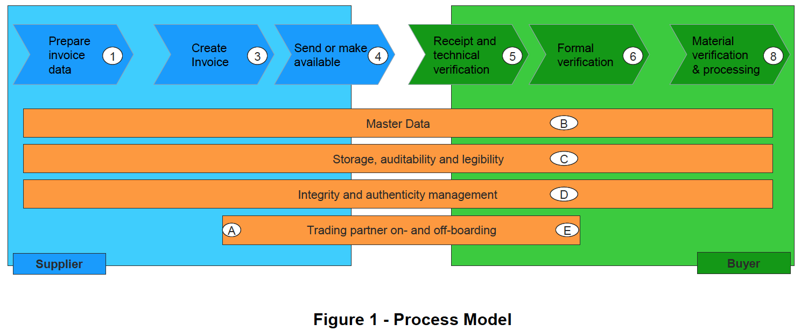

# CWA 16460:2012(E)  
## 優良事例：電子インボイス　コンプライアンス　ガイドライン　-　解説
翻訳：三分一　信之  
# 1. スコープ
## 1.1 一般
  

# 2. 導入  
## 2.1 全体の概要  
この箇条では、課税対象事業者と税務当局の両者がプロセスを費用対効果が高く期間対効果も高いい方法で構築し、相互に調整できる堅牢な規範的な基盤を維持することを目的として、EUにおける電子インボイスの送信、受信、および保存に関する主要な原則と推奨される手法を要約する。  
電子インボイスには、商品やサービスの実際に 提供された商品やサービスを正確に反映する必要がある。 これは、インボイスと 提供された商品やサービスを関連づける信頼性の高い監査証跡を確立するビジネスコントロールを通じて達成される。  
電子インボイスと 提供された商品やサービスを関連づける信頼できる監査証跡を確立するビジネスコントロールが電子インボイスの内容の発行元の真正性と完全性の要件も満たすこともある。
状況によっては、納税事業者が使用するビジネスコントロールでは、電子インボイスの発行元の真正性とその内容の完全性を証明するには不十分な場合がある。
電子インボイスの発行元の真正性と内容の完全性は、第233条（2）で言及されているような他の手段によって示される場合もある。  

## 2.2 コア原則
**法令遵守：** 
電子インボイス ソリューションは、関連する法律に準拠する必要がある。 
* 税務当局に支払うか、税務当局から還付されるVATの金額を裏付ける電子インボイス。
* 電子インボイスの真正性を証明する証拠。
* 電子インボイスの内容の完全性を証明する証拠。
* 電子インボイスの可読性を確保するための措置。  

**テクノロジーの中立性：**  
**監査能力：**  
**投資バランス：**  

## 2.3 真正性と完全性の確保
電子インボイスの「発行元の真正性」とは、電子インボイスの提供者または発行者の身元の保証を意味する。  
電子インボイスの「内容の完全性」とは、内容が変更されていないことを意味する。  

* 電子インボイスと商品またはサービスの提供との間に信頼できる監査証跡を作成するビジネスコントロール。
* 電子データ交換（EDI）。
* 適格な電子署名。 

**クラスA** - 電子インボイスと商品またはサービスの提供との間に信頼できる監査証跡を作成するビジネスコントロール。  
**クラスB** – データ交換プロセス、つまりEDIでのコントロール。  
**クラスC** – データレベルのコントロール、つまり高度な/認定された電子署名。  
**クラスD** – 封印された環境。  

真正性と完全性の確保  

| クラスA ビジネスコントロール | クラスB データ交換時のコントロール | クラスC データレベルのコントロール | クラスD 封印された環境  
| ---- | ---- | ---- | ----
| 真正性と完全性を実証するための証拠の保管。 例：提供してきた監査証跡の保管 |	真正性と完全性を実証するための証拠の保管。 例：EDIでのメッセージ交換と契約証拠の保管 |	真正性と完全性を実証するための証拠の保管。 例：電子署名とその検証能力 |	真正性と完全性を実証するための証拠の保管。 例：封印された環境の証拠
| 完全性を確保するための（必要とされるかもしれない）追加的なビジネスコントロール 
真正性を確保するための（必要とされるかもしれない）追加的なビジネスコントロール | データ保存期間中の真正性と完全性を確保するためのコントロール |	完全性を確保するための電子署名コントロール 
真正性を確保するための電子署名コントロール | 完全性を確保するための封印された環境のコントロール 
真正性を確保するための封印された環境のコントロール
| プロセス、コントロール、監査証跡を含む典型的なビジネスコントロール | コントロールされたメッセージ交換 真正性と完全性を確保するためのコントロール |	 |  

## 2.4 可読性の確保
  
# 3. 包括的なガイダンス
## 3.1 導入
## 3.2 プロセスモデル
図1は、サービスプロバイダーを含まないプロセスモデルを表す。 図2は、サービスプロバイダー（またはプロバイダー）の概念をモデルに導入したもの。 

  

  

### 3.2.1 プロセスモードのコンテキストでの目的
1. 電子インボイスを準備するとき   
2. 電子インボイスを作成するとき  
3. 電子インボイスを送信するとき、または利用可能にするとき  
4. 電子インボイスを受け取って処理するとき  
5. 電子インボイス保管するとき、および保管期間中  
6. 電子インボイス プロセス全体  

### 3.2.2（オンおよびオフ）ボーディングステップ
 A. 取引相手のオンボーディング  
 E. 取引相手のオフボーディング

### 3.2.3 処理ステップ
1. 電子インボイスデータの準備  
2. は、サービスプロバイダー固有のプロセスで後述  
3. 電子インボイスデータの作成  
4. 電子インボイスを送信または使用可能にする  
5. 電子インボイスの受領と技術的検証  
6. 電子インボイスの形式検証  
7. は、サービスプロバイダー固有のプロセスで後述
8. 内容の検証と処理  

### 3.2.4 サービスプロバイダー固有のプロセス
2.ファーストマイル  
7.ラストマイル  

### 3.2.5 ビジネスプロセスのサポート
 B. マスタデータ
 C. ストレージと監査能力
 D. 完全性、真正性、可読性の管理

## 3.3 ビジネス実装の分類
A）クラスAは、「電子インボイスと提供の間に信頼できる監査証跡を作成するビジネスコントロール」;  
B）取引相手間の電子インボイスの完全性と真正性を保証するために、制御されたデータ交換（EDIなど）によって強化されたビジネスソリューション;  
C）ライフサイクル全体にわたって電子インボイスの完全性と真正性を確保するために、データレベルの制御（認定電子署名など）によって強化されたビジネスソリューション;  
D）電子インボイスの完全なライフサイクル全体にわたって電子インボイスの完全性と真正性を保証するための電子インボイスの「安全な保管」によって強化されたビジネスソリューション;  

## 3.4　クラスA：　電子インボイスと提供の間で信頼できる監査証跡を作成するビジネスコントロール
### 3.4.1 定義
1. **ビジネスコントロール：** COSOモデルでは、「ビジネスコントロール」を次のように定義している。  
企業の取締役会、経営陣、およびその他の構成員によって実施されるプロセス。運用の有効性と効率性の目的の達成、財務報告の信頼性、および適用される法律と規制の遵守に関する合理的な保証を提供するように設計されている。
2. **監査証跡：** 監査証跡とは会計エントリを検証または無効化できる、トランザクションの履歴を段階的に文書化した紙および/または電子記録。 監査証跡のコンポーネントには、（i）源となるレコード、（ii）処理された一連のトランザクション、および（iii）トランザクションの源を参照可能とするトランザクションID。

### 3.4.2 導入
電子インボイスには、商品やサービスの実際の提供を正確に反映する必要がある。 

### 3.4.3 信頼できる監査証跡
1. ERP、またはそこで議論されるビジネス処理のタイプを提供するアプリケーションソフトウェア（電子インボイスシステム、調達システム、金融システムなど）によって作成された文書の監査証跡（以降、ERPという用語は これらすべてのシステムを表すために使用される）。
監査証跡文書間の相互参照の存在を想定している。
2. 上記のERP文書のライフサイクル中に行われた変更の監査ログ。
3. 請求処理中に参照されるERPマスターデータに加えられた変更の監査ログ。
4. ERPによって実行されたアクティビティの監査ログ（注文書と電子インボイスを照合する行為など）。
これらの監査証跡の目的は次のとおり
* 電子インボイスが実際の提供した商品についてのものであることを確認する。  
* 電子インボイスの真正性をERPでのその表現と独立して検証可能とする。  
* 電子インボイスの内容の完全性をERPでの表現と独立して検証可能とする。  
監査証跡を信頼できるものにするためには、主に2つの考慮事項がある。  
1. その中に含まれるデータと文書。 これらは、監査証跡が目的に適合していることを保証するのに十分に詳細である必要がある。 このCWAに関して、特定の目的は、真正性と完全性を保証することである。
2. 監査証跡内のデータの品質。 この品質　-　次のいずれかの方法で達成できる。
* 第三者の文書への参照。 銀行取引明細書など。
* 第三者の文書への参照。 注文または在庫移動の文書、両当事者によって署名された契約など。
* 監査証跡内の文書間の独立性を生み出す内部統制。 電子インボイスの受領に先立って作成される注文書などの職務の分離または手続き上の管理など。

### 3.4.4　典型的なビジネスプロセス
1. **販売プロセス**  
   - 発注から現金（商品）  
    これは、在庫商品の販売をサポートするプロセスを表す。通常は、  
      販売注文　→　商品発送通知　→　電子インボイス　→　領収書。
   - 発注から現金（サービス）  
    これは、提供されるサービスの請求をサポートするプロセスを表す。通常は、  
      サービス契約　→　請求スケジュール　→　電子インボイス　→　支払い領収書。
   - 電子インボイスから現金  
    これは、上記の例でカバーされていないサプライ品の請求をサポートするプロセスを表す。通常、  
      電子インボイス要求　→　電子インボイス　→　支払い領収書。  
      これらは、通常のサプライチェーンの外にあることがよくある。  

2. **購入プロセス**  
   - 調達から支払い（3ウェイマッチング）  
     これは、3ウェイマッチコントロールが実装されている商品またはサービスの購入をサポートするプロセスを表す。通常：  
       注文書　→　品目受領書/サービス受領書　→　電子インボイス　→　支払い。
   - 調達から支払い（2ウェイマッチング）  
    これは、2ウェイマッチコントロールが実装されている商品またはサービスの購入をサポートするプロセスを表す。通常、  
       注文書　→　電子インボイス　→　支払い。
   - 電子インボイス払い  
    これは、3ウェイマッチングも2ウェイマッチングも使用されないサプライ品の調達プロセスを表す。通常、  
      購入電子インボイス　→　支払い。

### 3.4.5 電子インボイスの真正性
### 3.4.6 電子インボイスの完全性
### 3.4.7 真正性と完全性の達成
### 3.4.8 販売プロセスでの真正性と完全性の達成
### 3.4.9 購入プロセスでの真正性と完全性の達成

### 3.4.10 ストレージ
電子インボイスの真正性と完全性は、そのライフサイクル全体を通じて保証する必要がある。 つまり、電子インボイスを保存するだけでなく、 真正性と完全性を保証するために参照されるドキュメントも、同等の期間に必要な任意の形式で保存する必要がある。  
1. 電子インボイスプロセス中に生成された内部ビジネスレコード（契約、販売申込書/注文書、品目受領書/品目発送書など）。  
2. 電子インボイスプロセス中に受け取った外部文書、つまり、注文書、品目発送書、銀行取引明細書。  
3. マスターデータ履歴。  
4. データ品質を保証するためのコントロールの証拠。  

### 3.4.11 表
  
## 3.5 クラスB：制御されたデータ交換
### 3.5.1 クラス B1: EDI
#### 3.5.1.1 モデル契約
#### 3.5.1.2 データの保護
  
### 3.5.2 クラスBn：その他の制御されたデータ交換
このような実装の例として、**PEPPOL**プロジェクトは、国境を越えた電子調達を可能にし、標準ベースのソリューションを通じてコミュニティを接続することを目的としている。  
  
### 3.6 クラスC：データレベルのコントロール
クラスCの実装は、電子インボイスに関連付けられた、または関連付けられたデータオブジェクト（「シール」）に依存して、これにより、ライフタイム全体で真正性と完全性を確保できる。  
1. 封印された電子インボイスから電子インボイスデータを抽出して、関連する処理に（事前のフォーマット変換の有無にかかわらず）提供するが、保管のために封印された電子インボイスを維持する。
2. 1つの電子インボイスまたはその他のタイプのドキュメントが電子的に封印され（たとえば、署名によって）、その内容（少なくとも必須の内容）と同じデータ（または少なくともそれらのサブセット）を保護する実装では、証拠目的で保存される封印された（つまり、署名された）電子インボイスに関連付けられたまま、自由に処理および変換できる構造に配置される。 (**ZUGFeRD**のPDFなど)  

### 3.6.1 クラスC1：適格な電子署名
  1. 適格な公開鍵証明書
  2. セキュア署名作成デバイス（SSCD）
  3. 署名フォーマット
  
### 3.6.2 クラスC2：高度なデジタル署名
### 3.6.3 クラスCn：その他のデータレベルコントロール

## 3.7 クラスD：アウトソーシングされた「安全な保管」
### 3.7.1 手動のWebベースの請求 - 真正性と完全性の問題
#### 3.7.1.1 サービスプロバイダーコントロール
#### 3.7.1.2 ユーザーコントロール

## 3.8 すべてのクラスに影響する問題
### 3.8.1 自己請求
#### 3.8.1.1 自己請求当事者間のVATの管理におけるリスク
### 3.8.2 受け取った請求書のスキャン
### 3.8.3 サービスプロバイダーの関与の性質
### 3.8.4 ストレージ
#### 3.8.4.1 アーカイブ関連の側面
考慮すべき主要なアーカイブ関連の問題の中で、重要な指標データは次のとおり。
1. すべてのアーカイブ情報から抽出され、
2. 後続の情報検索を可能にする方法で配置および管理され、
アーカイブされた情報は次のとおり
3. すべての保存期間中、適切に保管される。
4. 認可された依頼者が適時に利用できるようにする。

これらの項目は、文書作成の初期段階（特に項目1と2）から情報ライフサイクル全体を通して適切に対処する必要がある。 アーカイブ事項の範囲の例と同様に、ISO 14721（14）に示されている主要なトピックのいくつかについて言及するだけで十分である。  
* アーカイブへのデジタルデータソースの取り込み。
* アーカイブからのデジタルソースの配信。
* デジタルまたは物理データソースに関するデジタルメタデータのアーカイブへの提出。
* アーカイブ内のデジタルソースの識別。
* デジタルおよび物理データソースに関するメタデータ情報の検索および取得。
* メディアおよびフォーマット間での情報の移行。

#### 3.8.4.2 ストレージのセキュリティ対策
### 3.8.5 一般的な適切なセキュリティ慣行
#### 3.8.5.1 IT 一般コントロール (ITGC) & IT アプリケーションコントロール
#### 3.8.5.2 監査証跡
#### 3.8.5.3 高度な/修飾された電子署名 – 特定の認識
A. 電子署名の法的有効性  
B. EUの国境を越えた適格な法的認定  
C. 安全な署名作成デバイス  
D. 証明書の失効  
E. 信頼できるタイムスタンプの必要性  
F. 電子署名の形式  
G. 自動電子請求プロセスによって適用される署名  
H. 署名ポリシー  
#### 3.8.5.4 電子インボイスの悪意のあるコード
* a）オフィス文書やスプレッドシートなど、複雑なフォーマットや数式機能を備えた編集可能なフォーマットの使用は避ける。 
* b）XMLやPDFなどの形式は、乱用されにくい。 
* c）スタイルシートを使用してXMLコンテンツを人間が理解できるようにする場合、そのようなスタイルシートのソースを信頼する必要があ
#### 3.8.5.5 真正性と伝送の完全性
* a）通信されるデータの完全性を保護  
* b）データのソースを認証  
     * a）クライアントパスワードを使用したSSL/TLS )  
     * b) AS1, AS2 and AS3  
     * c）登録済みメール  
       * a) 「送信メールボックスの真正性」  
       * b）「送信メールボックスを担当する組織の真正性」  
       * c）「1つの特定のREMメールボックスが割り当てられた特定の個人の真正性」  
       * d）付加価値ネットワーク  
       * e）ハッシュの合計や調整の概要などの整合性測定  
       * f）サービスプロバイダー  
       * g）署名されていないドキュメント内の暗号化/署名されたデータフィールドの使用  
       * h）OFTP/OFTP2  