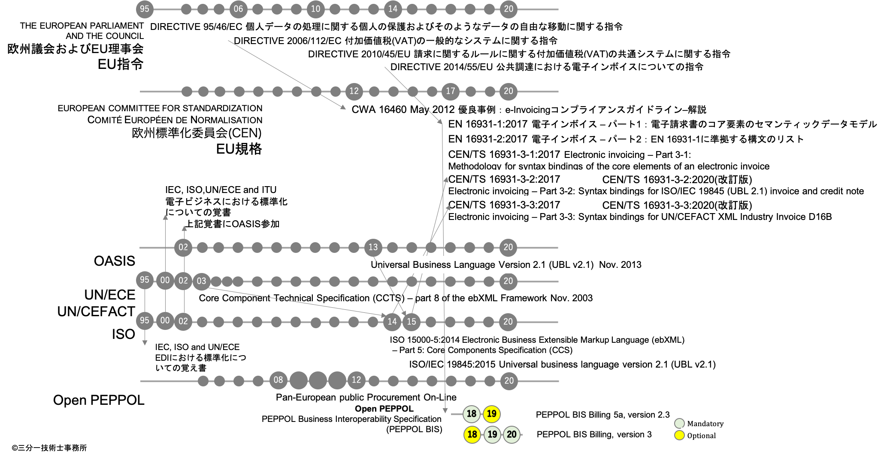

# 規格制定の歴史

# 資料
| 翻訳資料 | ファイル名
| ---- | ----
| CWA 16460（抜粋） | [CWA_16460_抜粋.md](CWA_16460_抜粋.md)
| CWA 16460（翻訳） | [CWA_16460_翻訳.md](CWA_16460_翻訳.md)
| CWA 16460（対訳） | [CWA_16460_対訳.md](CWA_16460_対訳.md)
| CWA 16460（英語） | Good Practice: e-Invoicing Compliance Guidelines - The Commentary [CWA_16460.pdf](CWA_16460.pdf)
| EU指令 2010/45/EU | 請求に関するルールに関する付加価値税の共通システムに関する指令 amending Directive 2006/112/EC on the common system of value added tax as regards the rules on invoicing [EU法令サイト EUR-Lex](https://eur-lex.europa.eu/legal-content/EN/TXT/PDF/?uri=CELEX:32010L0045&from=EN)
| EU指令 2014/55/EU | 公共調達における電子インボイスについての指令 on electronic invoicing in public procurement [EU法令サイト EUR-Lex](https://eur-lex.europa.eu/legal-content/EN/TXT/HTML/?uri=CELEX:32014L0055&from=EN)
| EU指令 2014/55/EU（一部翻訳） | EU指令_2014_55_EU.md 電子インボイスに関係するArticle 233 ( 233条 )のみ翻訳
