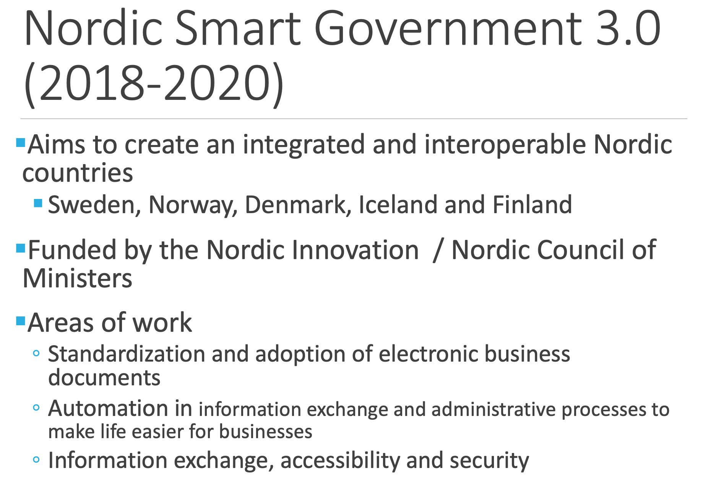
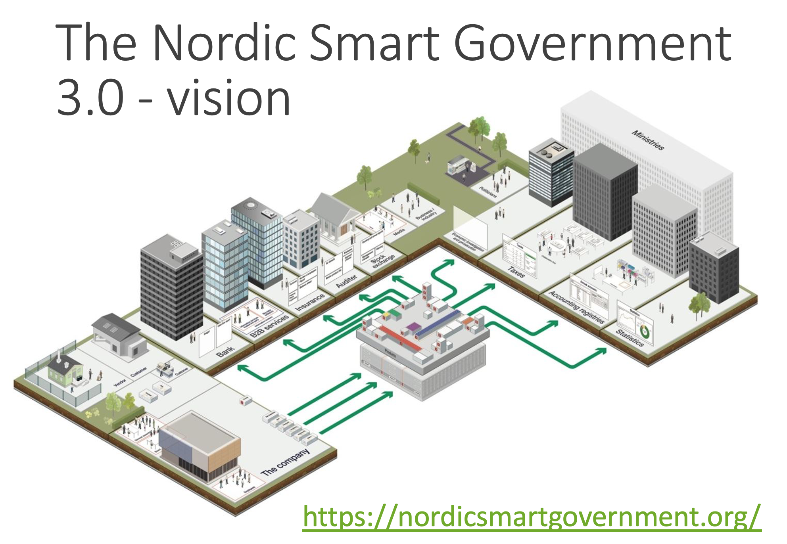

# プレゼンテーション
## スライド
### PDF文書　[Standards for exchanging business data](07092020_Koskentalo.pdf)  

# 参考資料
## スライド 4 Letting go of paper with stuctural data
[Real Time Economy (RTE) project](http://rte.fi/past-projects/)  
[YouTube](https://youtu.be/eMDJAwHg5qM)  

## スライド 21 Future roadmap in the Nordics
[EY 2017](https://nordicsmartgovernment.org/sites/default/files/2019-09/ey_-_business_case_for_nordic_smes.pdf)  
[roadmap introduction](https://nordicsmartgovernment.org/sites/default/files/2020-09/NSG_Roadmap_FINAL.pdf)  
[full NSG 3.0 list of deliverables documentation](https://docs.google.com/document/d/1mymnBR4eGDzQj-6pIMyjHRSqkCq6xFIMEiXTldpgAKQ/edit)  

## スライド 22 NSG reference implementation and showroom
[Read more](https://docs.google.com/document/d/12a1i9_e4s-zC_JH-KQeuvCy9taYPO0aLUDR6DEzobQM/edit?usp=sharing)  
[Showroom](https://nsg-dev.ew.r.appspot.com/#/dashboard)  

## スライド 23 Other follow-up projects
[Income Register](https://www.vero.fi/tulorekisteri/)  
[Real-time economy ecosystems and eReceipt](https://www.teknologiateollisuus.fi/fi/rteco)  
[Common data management / Yhteinen tiedon hallinta, YTI](https://vm.fi/yhteinen-tiedon-hallinta)  
[Mandates on eInvoicing](https://vm.fi/artikkeli/-/asset_publisher/lakiesitys-sahkoisesta-laskutuksesta-lausunnoille)  
[Reporting 3.0. (Estonia)](http://www.emta.ee/et/uudised/palga-ja-toojou-andmete-esitamine-muutub-2018-aasta-algusest-automaatseks)
