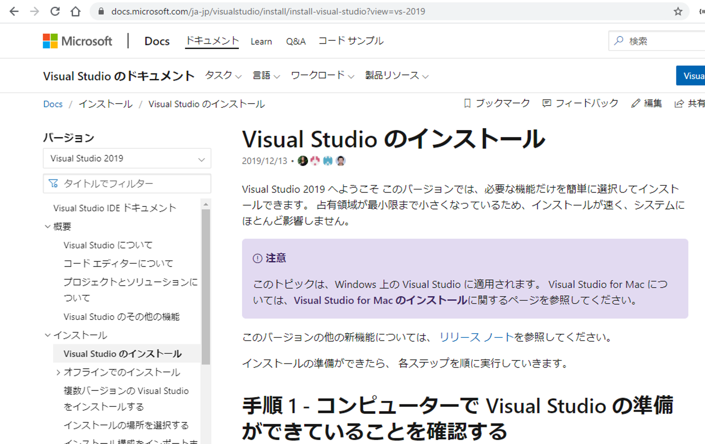
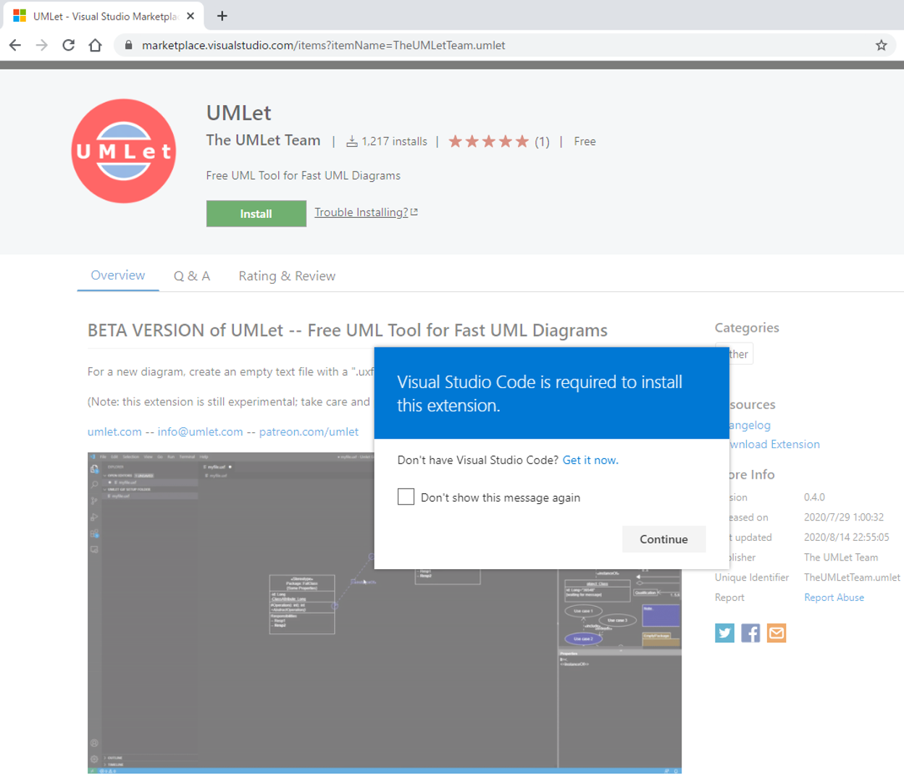
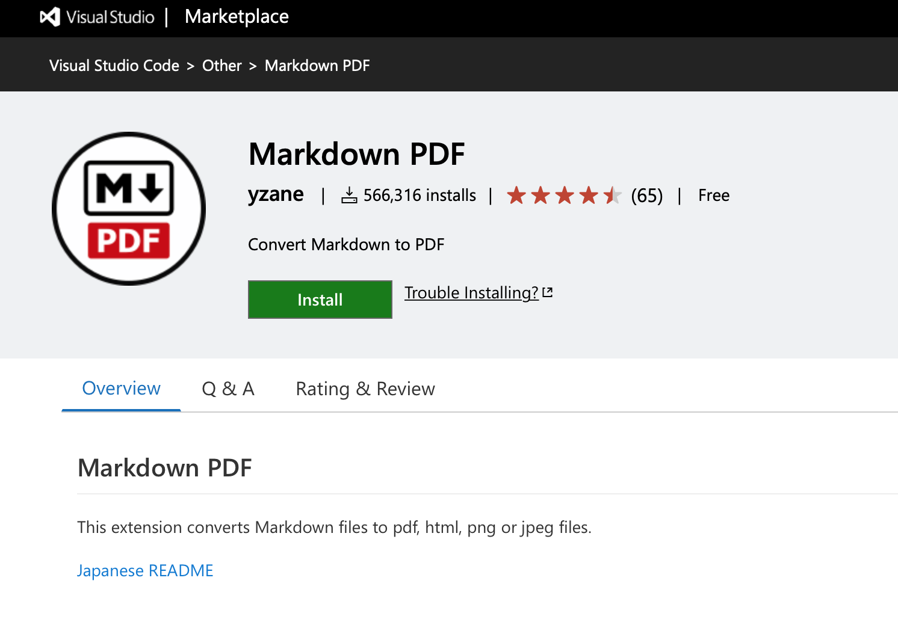
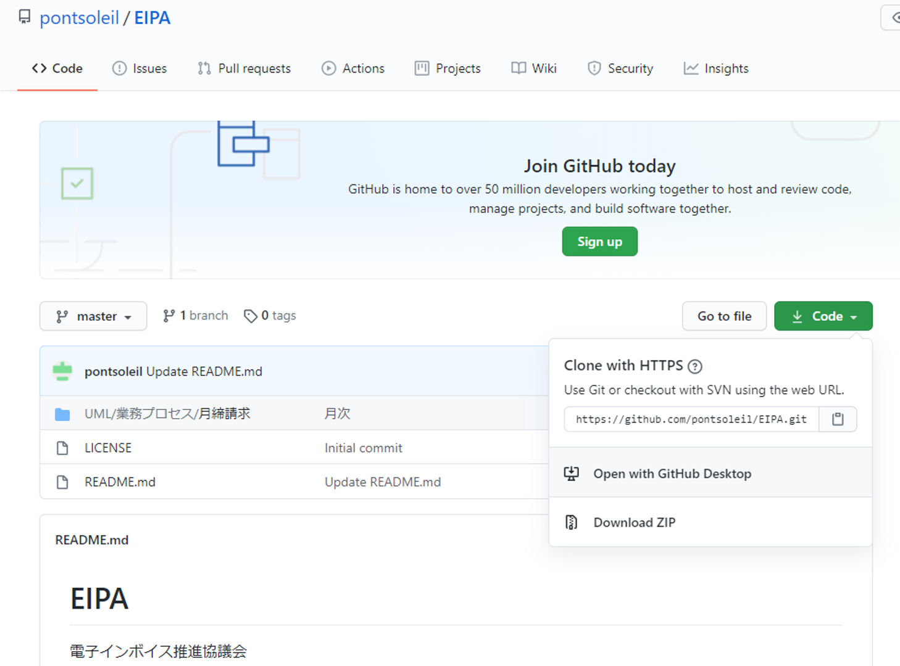
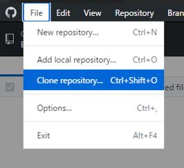
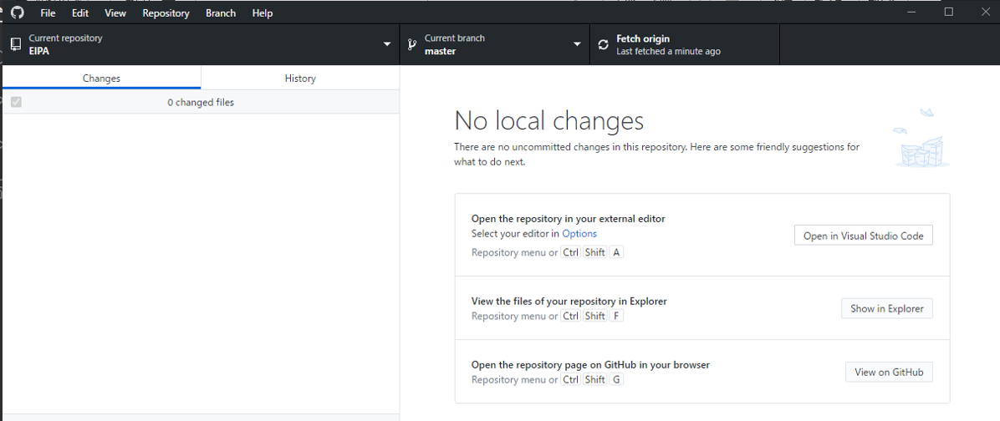
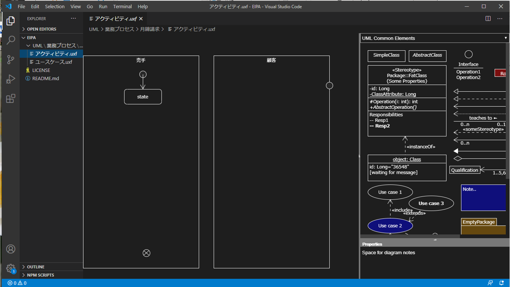

# ご参考
GitHubが初めての方は、次のサイトで概要をご確認ください。
[インストールから、プルリクまでの解説](https://employment.en-japan.com/engineerhub/entry/2017/01/31/110000)
[GithubアクセスからPushまでの解説](https://qiita.com/nnahito/items/565f8755e70c51532459)
[チートシートとしての活用や、問題発生時の参照記事。（(番外編)俺の開発中の主な流れ）](https://qiita.com/gold-kou/items/7f6a3b46e2781b0dd4a0#step1%E3%83%AA%E3%83%A2%E3%83%BC%E3%83%88%E3%83%AA%E3%83%9D%E3%82%B8%E3%83%88%E3%83%AA%E4%BD%9C%E6%88%90)
Gitクライアントをインストールすれば、コマンドでなく画面から操作できます。  

# Visual Studioのインストール
次のURLに記載されている手順でインストールします。

https://docs.microsoft.com/ja-jp/visualstudio/install/install-visual-studio?view=vs-2019

# UMLetのインストール
次のURLに記載されているページからインストールします。
UML図を作成するツールです。

https://marketplace.visualstudio.com/items?itemName=TheUMLetTeam.umlet

# Markdown PDFのインストール
次のURLに記載されているページからダウンロードしてインストールします。
Visual StudioでMarkdownを表示させるツールです。

https://marketplace.visualstudio.com/items?itemName=yzane.markdown-pdf

# GitHub Desktopのインストール
次のURLに記載されているページからダウンロードしてインストールします。
グラフィックユーザインタフェースでGitHubコマンド機能を実行します。

https://desktop.github.com/

# EIPAのGitHubページ
次のURLに記載されているページにアクセスします。
Codeボタンをクリックして[Clone with HTTPS]に表示されているURLをクリップボードにコピーします。

https://github.com/pontsoleil/EIPA

# GitHub Desktopを立ち上げてGitHubリポジトリをクローンします
Fileメニューからリポジトリをクローンします。

クリップボードにコピーしたURLを指定します。

# リポジトリをVisual Studioで開く
[Open in Visual Studio Code]をクリックするとVisual Studioを開いてリポジトリを表示します。S

