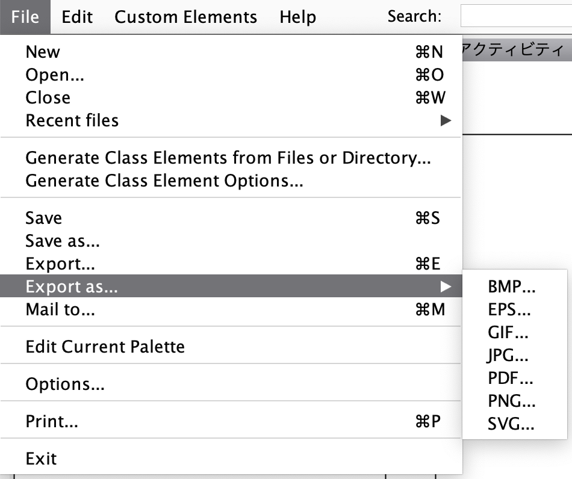

# 1. UMLet zipファイルをダウンロード(Mac OSの場合)

windowsでは、未確認です。

次のSOFTPEDIAを開き、UMLetの[DOWNLOAD NOW]ボタンをクリックします。 
https://www.softpedia.com/get/Programming/Other-Programming-Files/UMLet.shtml#download 
 
次の画面が開くので、広告の下の[External mirror 1]ボタンをクリックするとzipファイルのダウンロードが始まります。 
 
ダウンロードしたzipファイル umlet-standalone-14.3.0.zip を解凍します。 

# 2. ダウンロードファイルを解凍します

<code>
$ tree 
. 
├── LICENCE.txt 
├── Umlet.exe 
├── custom_elements 
│   ├── AutoResize1.java 
│   ├── AutoResize2.java 
│   ├── Default.java 
│   ├── RectangleRound.java 
│   └── WordWrap.java 
├── img 
│   └── umlet_logo.png 
├── lib 
│   ├── autocomplete-2.5.8.jar 
│   ├── batik-awt-util-1.8.jar 
│   ├── batik-dom-1.8.jar 
│   ├── batik-ext-1.8.jar 
│   ├── batik-svggen-1.8.jar 
│   ├── batik-util-1.8.jar 
│   ├── batik-xml-1.8.jar 
│   ├── bcel-5.2.jar 
│   ├── commons-io-2.4.jar 
│   ├── ecj-4.4.2.jar 
│   ├── itextpdf-5.4.1.jar 
│   ├── javaparser-core-2.3.0.jar 
│   ├── javax.mail-1.5.6.jar 
│   ├── jlibeps-0.1.jar 
│   ├── log4j-1.2.17.jar 
│   ├── rsyntaxtextarea-2.5.8.jar 
│   ├── slf4j-api-1.7.7.jar 
│   ├── slf4j-log4j12-1.7.13.jar 
│   ├── umlet-elements-14.3.0.jar 
│   └── umlet-swing-14.3.0.jar 
├── palettes 
│   ├── Custom\ Drawings.uxf 
│   ├── Deprecated\ UML\ Sequence\ -\ All\ in\ one.uxf 
│   ├── Generic\ Colors.uxf 
│   ├── Generic\ Layers.uxf 
│   ├── Generic\ Text\ and\ Alignment.uxf 
│   ├── Plots.uxf 
│   ├── UML\ Activity\ -\ All\ in\ one.uxf 
│   ├── UML\ Activity.uxf 
│   ├── UML\ Class.uxf 
│   ├── UML\ Common\ Elements.uxf 
│   ├── UML\ Composite\ Structure.uxf 
│   ├── UML\ Package.uxf 
│   ├── UML\ Sequence\ -\ All\ in\ one.uxf 
│   ├── UML\ Sequence.uxf 
│   ├── UML\ State\ Machine.uxf 
│   ├── UML\ Structure\ and\ Deployment.uxf 
│   ├── UML\ Timing\ Diagram.uxf 
│   └── UML\ Use\ Case.uxf 
├── umlet.desktop 
├── umlet.jar 
└── umlet.sh 
</code>
 
4 directories, 49 files 

# 3. umlet.jarに実行権限を与えて実行します

<code>
$ chmod +x umlet.jar
</code>
 
javaプログラムを起動するとUMLetの画面が開きます。 
<code>
$ java -jar ./umlet.jar
</code>

# 4. UMLetから画像ファイルをエキスポートする

バージョン14では、utfファイルを開いて画面にUML図が表示されている状態で[FILE/Export as.../SVG...]を実行するとSVGファイルをエキスポートできます。 
 

以上です。 
