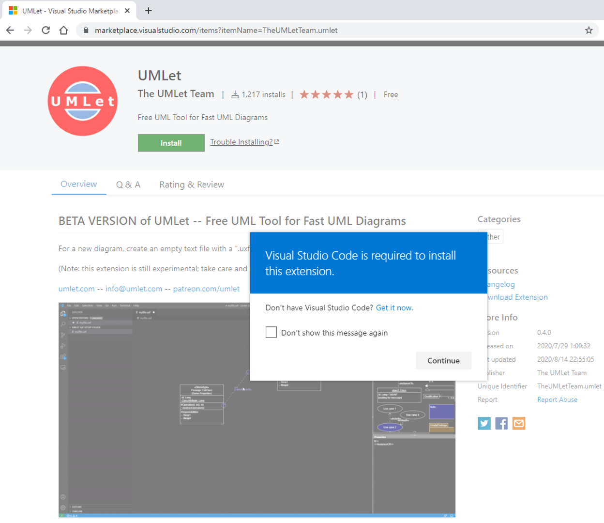
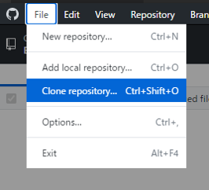

# Visual Studio のインストール
次のURLに記載されている手順でインストールします。

https://docs.microsoft.com/ja-jp/visualstudio/install/install-visual-studio?view=vs-2019

# UMLetのインストール
次のURLに記載されているページからインストールします。
UML図を作成するツールです。

https://marketplace.visualstudio.com/items?itemName=TheUMLetTeam.umlet

# Markdown PDF のインストール
次のURLに記載されているページからダウンロードしてインストールします。
Visual Study CodeでMarkdownを表示させるツールです。

https://marketplace.visualstudio.com/items?itemName=yzane.markdown-pdf

# GitHub Desktop のインストール
次のURLに記載されているページからダウンロードしてインストールします。
グラフィックユーザインタフェースでGitHubコマンド機能を実行します。

https://desktop.github.com/

# EIPA　GitHubページ
次のURLに記載されているページにアクセスします。
Codeボタンをクリックして[Clone with HTTPS]に表示されているURLをクリップボードにコピーします。

https://github.com/pontsoleil/EIPA

# GitHub Desktopを立ち上げてGitHubリポジトリをクローンします
Fileメニューからリポジトリをクローンします。

クリップボードにコピーしたURLを指定します。

# リポジトリをVisual Studio Codeで開く
[Open in Visual Studio Code]をクリックするとVisual Studio Codeを開いてリポジトリを表示します。S

